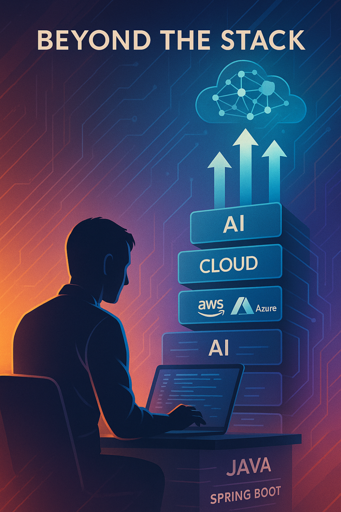

# Why ‘Beyond the Stack’? A Developer’s Journey From Code to Cloud to Intelligence

From writing **desktop applications** in Java during the early years (Java 1.3) to **debugging Spring Boot apps** and **fixing cloud infrastructure** — my journey has evolved far **Beyond the Stack**.

I’ve spent **21 years of my career working with Java**— from **developing desktop applications **using Java Swing & AWT (Java 1.3/1.4) to** diving into Java EE **with Struts, Servlets, and JSPs**. While these technologies may now seem outdated, they **laid the foundation** for everything that came after.

Along the way, I earned my **Java certification** during the release of **Java Tiger (aka Java 5)** , cementing my expertise in the language.

More recently, Java and Spring Boot became my go-to tools for **building scalable backend systems** . As the world transitioned to the Cloud, I followed suit, diving deep into **Cloud architecture and system design** . What once seemed like a complex challenge is now second nature — ***designing systems that are both robust and cost-efficient*** .

Then, AI came into the picture. As everything became smarter, I saw AI as the natural next step — a way to push the limits of what’s possible and shape the future of software development. The **journey from code to cloud to intelligence** has expanded the boundaries of what I can create, and this newsletter is my way of sharing those experiences with you.

Along the way, I also earned certifications in **Cloud Practitioner, Python, and AI** —each step reinforcing my commitment to continuous learning and staying ahead of the curve

" **Beyond the Stack** " is about going *beyond just the code* . It’s about how developers, engineers, and architects evolve and grow beyond their foundational tech stack.

This newsletter isn’t just for those who want to understand the "what" — it’s for those who want to dive into the "how" and "why" behind ***building smarter, scalable, and more intelligent systems.***

Here, you’ll gain practical insights into system design, development tips, and real-world applications of AI that are both actionable and impactful.

I hope this first edition of*Beyond the Stack*brings you the value and perspective you’re looking for. There’s a lot more to come—stay tuned for the next edition!

**Teaser for My Next Post in this Newsletter:**

In the next post: **How I scale Java + Spring Boot apps on the cloud with cost efficiency in mind** .

Follow the newsletter, leave a comment with what **tech transition** you’re navigating, and share it with someone who’s *stuck in the code-loop* .

#BeyondTheStack #JavaToAI #DeveloperJourney #SpringBoot #CloudComputing #ArtificialIntelligence #TechEvolution

[**Published Date**: April 17, 2025]
