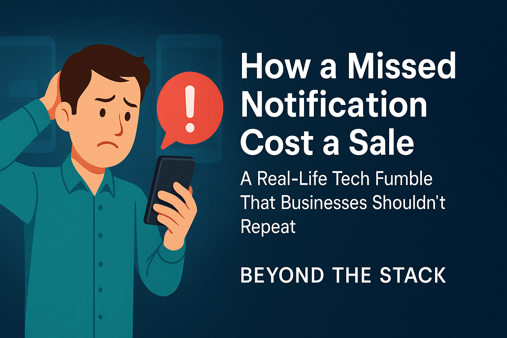
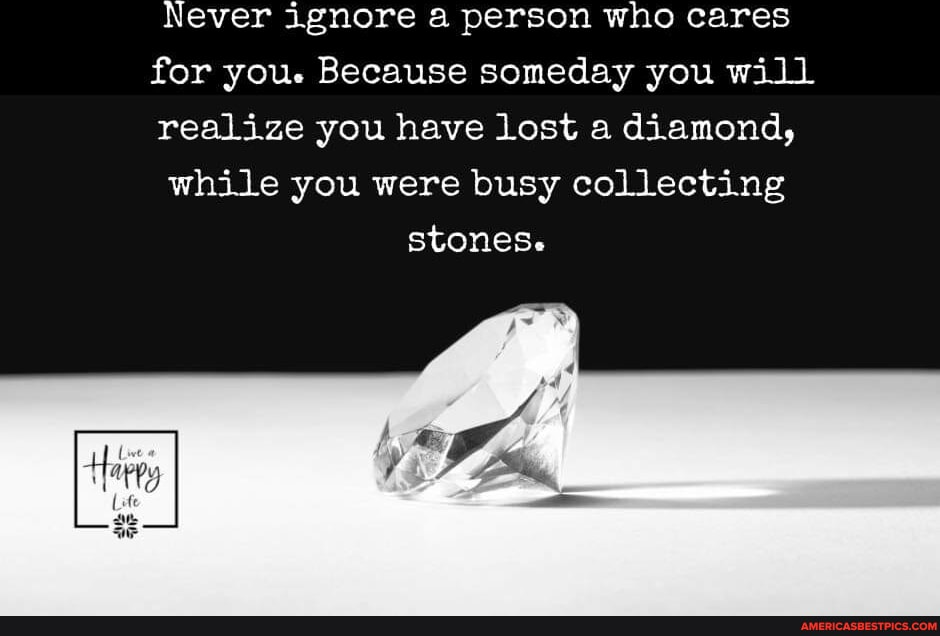
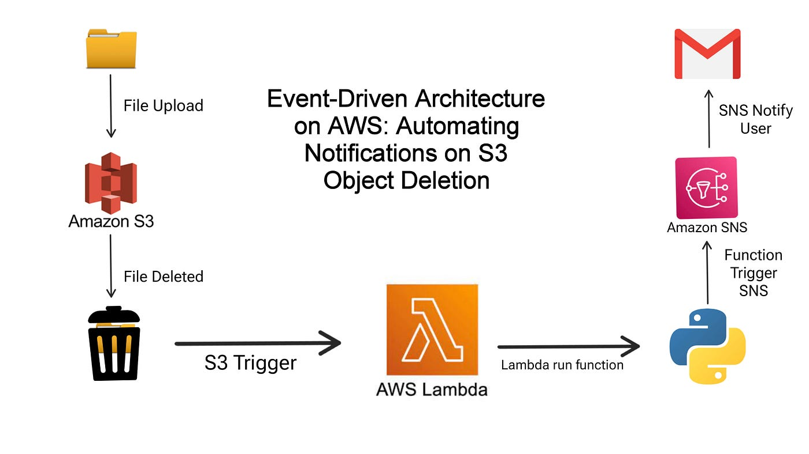
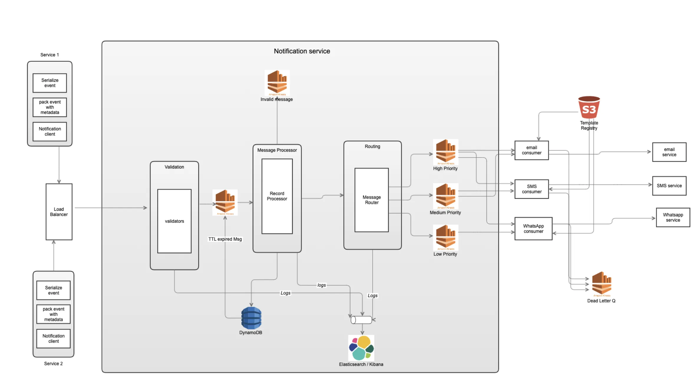

# 🔔 How a Missed Notification Caused a Sales Loss — Real Lessons from Everyday Experiences

Welcome to the tenth edition of Beyond the Stack — where we explore how technology, design, and user experience intersect to drive real business impact.

Today, I’m taking a slightly different turn. Instead of starting with code or cloud infrastructure, I'm starting with a story — actually, two stories. Both are personal. And both demonstrate how poor notification systems and ineffective follow-ups can directly lead to lost sales.

This isn’t about theory. It’s lived experience. And it's a reminder that in the age of distributed systems and digital-first experiences, *notifications and engagement workflows are just as critical as your product or service itself*.

---

## 📖 Incident #1: The Forgotten Taxi Booking

### 🔍 The Context:

In March this year, I planned a summer getaway to Coorg for May. Resort — booked. Next, I searched for intercity taxi services on Google and found a new vendor offering an attractive “Book Now, Pay Later” option.

Seemed convenient. I booked the cab and moved on with my schedule.

### 🧠 The Problem:

By April, I had completely forgotten about the booking. And guess what?

No SMS confirmation.

No email receipt.

No WhatsApp message.

No calendar reminder.

I searched everywhere but found nothing. Out of uncertainty, I booked another taxi through a more familiar provider.

### 📉 Impact:

The original vendor lost a sale not because of poor service, but because of a silent process. 

I finally received a call from their driver — just a day before the trip. But by then, **the trust (and sale)** was already lost.

---

## 📖 Incident #2: The Missing Summer Class Follow-Up

### 🔍 The Context:

This summer, I was exploring classes for my daughter. I visited a newly opened learning center nearby and left my contact number in their visitor log since the owner wasn’t available at the time.

I was quite impressed with their setup and mentally inclined to enroll.

### 🧠 The Problem:

Not a single call. 

No follow-up message. 

**Silence**.

I waited patiently for 3–4 days. Even called their number — no response. Eventually, I found another institute and moved forward with them.

### 📉 Impact:

Another lost opportunity — simply because the business didn’t have a reliable lead follow-up workflow in place.

---

## 🚨 The Real Takeaway: Notifications Aren’t Just UX — They’re Revenue Drivers

In a distributed, always-connected world, **notifications are your digital salespeople.** And just like sales reps, if they don’t reach the customer at the right moment with the right message — the lead goes cold.

💡 **An effective notification system does 3 things well:**

1. Confirms the action (order placed, interest recorded, booking confirmed)
2. Engages with timely nudges (reminders, updates, changes)
3. Closes the loop with context (driver assigned, class schedule, payment links, etc.)

And yet — so many businesses miss this critical workflow.

---

## 🛠️ Building the Ideal Notification & Follow-Up System: A Technical Breakdown

In this section, we go beyond theory and show how developers and architects can build notification systems that convert interest into engagement, and engagement into revenue.

Let’s unpack each element:

---

### ✅ Designing Multi-Channel Confirmation Flows — Email, SMS, Push

A good confirmation flow doesn’t just send a message — it builds trust from the very first interaction. To maximize reach and reliability, businesses must design a multi-channel confirmation strategy:

| Notification Medium                      | Pros                                                                                                                                                                                                                                                                                                                               | Cons                                                                                                                                                                                                                                                                                                                                                           | Existing Services                                              |
| ---------------------------------------- | ---------------------------------------------------------------------------------------------------------------------------------------------------------------------------------------------------------------------------------------------------------------------------------------------------------------------------------- | -------------------------------------------------------------------------------------------------------------------------------------------------------------------------------------------------------------------------------------------------------------------------------------------------------------------------------------------------------------- | -------------------------------------------------------------- |
| **Email**                          | **The most reliable and trackable channel** Ideal for booking confirmations, receipts, and detailed itinerary Supports **rich HTML templates, branding, and long-term archiving Easy integration **with most backend services                                                                                 | **Low open rates** (~20–25% industry average) Can land in spam/promotions tab **Slow delivery** for time-sensitive updates Requires users to check inbox regularly (**not real-time**)                                                                                                                                       | SendGrid, Mailgun, or Amazon SES                               |
| **SMS (Short Messaging Services)** | Traditional but still powerful — reaches even feature phones Higher open rates and Instant delivery Great for short, time-sensitive updates like OTPs or booking references                                                                                                                                            | **Costly at scale** , especially internationally **Character-limited** (usually 160 chars) Hard to brand or include visuals Often perceived as spam/scam by users No native threading like chat apps                                                                                                                           | Twilio, TextLocal, or Kaleyra                                  |
| **WhatsApp / Telegram**            | **Increasingly popular** in regions like India, SEA, LATAM Higher open rates and quicker engagement (**Real time Messaging**) **High engagement** via conversational UX **Supports rich text,** images, and even buttons (e.g., Confirm / Cancel) **End-to-end encrypted** (WhatsApp) | **User opt-in is mandatory** (especially on WhatsApp Business API) **Risk of overuse** = user blocking **Telegram bots** require users to initiate/start the conversation WhatsApp API can be **restrictive** (requires template approval, etc.) **Reliance on third-party provider** or business onboarding | WhatsApp Business API or Telegram Bot API for integration |

#### 🔁 Fallback Strategy

If none of the channels succeed:

Log the notification in a business database table

Attach metadata: userId, channelAttempted, status, failReason, and a followUpDate

Use this entry to trigger an Alert + Automatic Reminder for the manual follow-up or next automation retry

> 📌 Tip: Don’t assume one channel is enough. Build redundancy. And make sure it’s observable (i.e., track what was sent, opened, bounced, failed).

#### 🔧 Best Technology Practices

Use transactional messaging queues (like AWS SNS/SQS, Kafka, or RabbitMQ) to trigger notifications reliably.

Webhook triggers (e.g. from payment gateways or booking forms) should immediately fire confirmation events.

Build fallback logic: if none of the channels succeeded, drop the notification in DeadLetter Q for further retries, followups and handling.

> 🔐 Don’t forget DKIM, SPF, and DMARC for deliverability, and rate limits for transactional APIs.

---

### ✅ Smart Follow-Up Cadences That Don’t Spam but Nurture Interest

Follow-ups are often confused with spam. But smart cadences are about value, not volume. A well-designed cadence feels helpful — not pushy.

Here’s how businesses can make it count:

#### 📅 Timing Based on Context

After a booking, send trip planning ideas (like local sightseeing or packing checklists)

After an inquiry, send a product comparison or demo video within 24 hours

After no response, follow up once in 48–72 hours — not before

#### 🧠 Examples from Real Life:

🛻 Taxi Booking Flow (from my own experience)
After a customer books, but before the travel date:

1. Day 1: Send booking confirmation + Google Calendar event
2. Day 2–3: Suggest a blog or infographic — “Top 5 Tourist Places to Visit in Coorg”
3. Day 5: Send hotel-to-sightseeing cab options or special offers
4. Day before trip: Send driver assignment, live location tracking option

🎯 These messages build engagement, reduce cancellation chances, and increase the opportunity for upsells.

🎨 You can automate this with tools like:

Customer.io or MoEngage for drip campaigns

Firebase Cloud Functions for event-triggered follow-ups

CRM workflows in HubSpot or Zoho

📊 Log everything — including notification sends, delivery receipts, opens, and bounces — for observability and feedback loops.

> 💬 “As I always say: ***A follow-up that delivers value is never perceived as spam.*.**”

---

### ✅ Integrating CRMs, Firebase, or Third-Party Notification Services

#### 🔌 Integration ideas

Connect your CRM (e.g. Salesforce, Zoho, Freshsales) with messaging platforms through webhooks or Zapier.

Use Firebase Realtime Database or Firestore + Cloud Functions for lightweight, scalable notification engines.

Leverage segmenting and tagging in tools like OneSignal or Braze to personalize notification flows.

#### 🛠 Common design pattern

Trigger Event (e.g., form submit) → Pub/Sub System → Notifier Microservice → Notification Service APIs → User Channel (email/SMS/push)

> **📡 The core of scalable notification systems lies in event-driven architecture.**

---

### ✅ Real-World Notification Flow Architecture

Here’s how you might architect a production-grade notification system:

1. Event Emitter (Java/Spring Boot, Node.js, etc.)
   Triggers from booking/order system.
2. Queue (Kafka / SQS)
   Buffer events and decouple producers from consumers.
3. Notification Service (Microservice)
   Stateless service that listens to the queue and chooses the channel based on user preferences or fallback rules.
4. Message Broker / API Integrations
   Plugs into SendGrid, Twilio, Firebase, etc.
5. Storage & Auditing
   Save logs of all sent/delivered/failed notifications in a PostgreSQL or DynamoDB table.
6. Dashboard & Retry Queue
   Ops team can view failed messages, retry, or intervene manually.

---

### ✅ Open-source tools and platforms that help automate this process

🧰 Some amazing open-source tools you can use to build or prototype notification workflows:

Tool	Purpose

| Tool                           | Purpose                                                     |
| ------------------------------ | ----------------------------------------------------------- |
| Postal                         | Self-hosted mail server to send/manage transactional emails |
| Nodemailer                     | Node.js email sending library                               |
| Firebase Cloud Messaging (FCM) | Free cross-platform push notifications                      |
| Hasura + GraphQL Subscriptions | Event-driven triggers from DB changes                       |
| N8N / Apache NiFi              | Visual low-code automation pipelines                        |
| Bip.io / Huginn                | Create workflows similar to IFTTT, but self-hosted          |
| Courier                        | Notification API aggregator with visual templates           |

These tools help small startups and large-scale systems alike to test, scale, and evolve their notification architecture with minimal cost and effort.

---

## 💡 Final Thought

If a customer forgets you, that’s not their fault.
If a lead goes cold, it’s not because they weren’t interested — you just didn’t stay in touch.

Tech that reminds, nudges, and reassures at the right time — that’s the secret sauce of great products and great businesses.

---

## 📚 Further Reading & Resources

**For developers, architects, and product teams building scalable notification systems:**

### 🔔 Notification System Design

* **Notification System Design (Rajiv Srivastava – LinkedIn)**

[https://www.linkedin.com/pulse/notification-system-design-rajiv-srivastava](https://www.linkedin.com/pulse/notification-system-design-rajiv-srivastava)

* **Architecting the Right Notification Infrastructure**

[https://medium.com/@nikita_79236/architecting-the-right-notification-infrastructure-for-your-product-bf12dccbc3ec](https://medium.com/@nikita_79236/architecting-the-right-notification-infrastructure-for-your-product-bf12dccbc3ec)

* **Designing Scalable Notification Systems — A Medium Engineering Guide**

[https://medium.com/@saidivesh92/building-scalable-notification-systems-10be4795cff6](https://medium.com/@saidivesh92/building-scalable-notification-systems-10be4795cff6)

[https://adityagoel123.medium.com/designing-scalable-notification-system-79f83272755e](https://adityagoel123.medium.com/designing-scalable-notification-system-79f83272755e)

[https://53jk1.medium.com/designing-a-scalable-notification-system-endpoints-architecture-and-estimations-78420557f90e](https://53jk1.medium.com/designing-a-scalable-notification-system-endpoints-architecture-and-estimations-78420557f90e)

[https://blog.devops.dev/building-a-flexible-and-scalable-notification-system-design-and-implementation-eef601f22518](https://blog.devops.dev/building-a-flexible-and-scalable-notification-system-design-and-implementation-eef601f22518)

[https://medium.com/@natashkela/designing-scalable-systems-a-guide-for-engineers-18ecffcd2787](https://medium.com/@natashkela/designing-scalable-systems-a-guide-for-engineers-18ecffcd2787)

[https://medium.com/@tanushree2102/designing-a-scalable-notification-system-from-hld-to-lld-e2ed4b3fb348](https://medium.com/@tanushree2102/designing-a-scalable-notification-system-from-hld-to-lld-e2ed4b3fb348)

[How to build a Generic and Smart Notification Service!](https://medium.com/@surfd1001/system-design-notification-service-d7a47fdfcee3) - Medium post By Microsoft Engineering Leader

[Notification Service System Design](https://www.codekarle.com/system-design/Notification-system-design.html)

[Design Notification Services | System Design](https://www.geeksforgeeks.org/system-design/design-notification-services-system-design/) - Geeks For Geeks

[How we designed and integrated a notifications system into our infrastructure](https://blog.bitsrc.io/notifications-system-design-how-we-integrated-it-into-our-infrastructure-f93f279c18a0).

* **Building Notification Systems at Scale by Uber Engineering**

[https://www.uber.com/en-IN/blog/observability-at-scale/](https://www.uber.com/en-IN/blog/observability-at-scale/)

[https://blog.quastor.org/p/design-ubers-push-notification-system
](https://blog.quastor.org/p/design-ubers-push-notification-system)

---

### 🧠 Smart Follow-up & Retention Tactics

* **The Science of Email Cadence (HubSpot)**

  [https://blog.hubspot.com/marketing/email-cadence](https://blog.hubspot.com/marketing/email-cadence)
* **Re-engagement Tactics That Work (MoEngage)**

  [https://www.moengage.com/blog/email-deliverability/](https://www.moengage.com/blog/email-deliverability/)
* **Notification UX Principles (UX Collective)**

  [https://uxdesign.cc/anatomy-of-a-notification-c9ad2cb5b6d5](https://uxdesign.cc/anatomy-of-a-notification-c9ad2cb5b6d5)

---

## 📅 Coming Up in Future Editions:

How XML can be used to compile Java at runtime — power tools for workflow engines

How Observability plays a crucial role in Kubernetes clusters — learnings from KCD Bengaluru

🔁 Feel free to reply with stories where a simple notification (or the lack of one) made all the difference.

---

**Enjoyed this story?**

This is just one of the many insights I share in *Beyond the Stack* — my weekly newsletter that blends tech, product thinking, and real-world developer lessons.

 **Subscribe now** : [Beyond the Stack](https://www.linkedin.com/newsletters/beyond-the-stack-7318612377875161089)

 **Request exclusive subscriber-only content** : [Request Access](https://forms.gle/TQ6JxDCXBqeQZXDP6)

**Like. Repost. Comment. Let's discuss — How are YOU using notifications to retain users and build trust?**

#BeyondTheStack #DeveloperInsights #NotificationSystem #TechThatMatters #CustomerExperience #RealWorldTech
