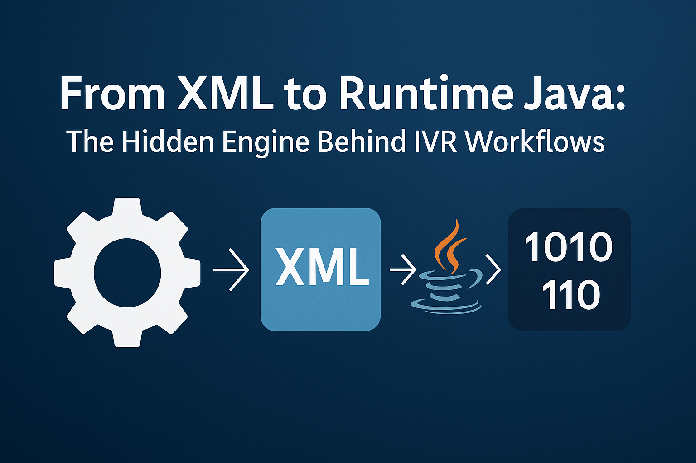
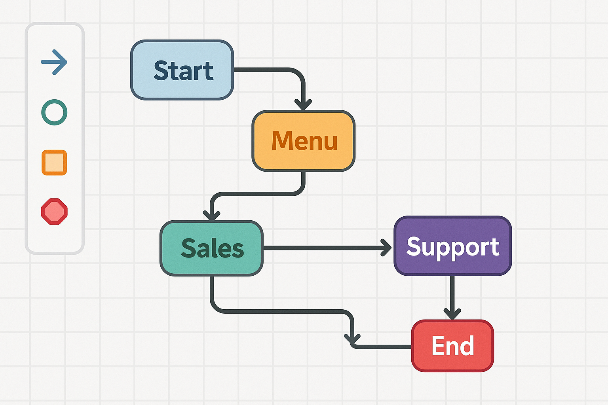

# From XML to Runtime Java: The Hidden Engine Behind IVR Workflows

## 📞 Press 1 for English. Press 2 for Hindi…

We’ve all experienced this—dialing customer care and navigating through those robotic options:

> *“Welcome to XYZ Telecom. Press 1 for prepaid. Press 2 for postpaid. Press 3 to talk to a representative…”*

But have you ever wondered:

**How is this entire flow executed automatically, without a human at the other end?**

Let’s take you behind the scenes—and  *beyond the stack* —into the inner workings of IVR systems, built with the kind of startup ingenuity that delivers serious engineering value.

---

## 🛠️ How XML Can Compile Java at Runtime — Power Tools for Workflow Engines

In the early days of my career, I was part of a **startup-style engineering team** building call center software solutions. One of our key innovations was a  **graphical IVR editor** —a drag-and-drop UI where users could design callflows without writing a line of code.

*Note: The image is just a representation of the IVR Callflow. The actual is much different from this.*

Each IVR flow—menus, options, branching—was saved in the backend as  **structured XML** . This XML wasn’t static data—it was a complete behavioral definition.

The magic happened in a component called the  **Campaign Executor** . Here’s how it worked:

1. Fetched a batch of customer phone numbers.
2. Retrieved the corresponding IVR XML definition.
3. **Parsed the XML into in-memory Java source code.**
4. **Compiled the Java code at runtime** using an embedded compiler.
5. Invoke Native Dialer to make the call
6. **Executed the compiled class** to drive the actual call interaction.

💡 The best part? The  **entire process—from XML to Java to bytecode—took just 2–5 seconds** . That meant **dynamic, real-time execution** of customized IVR flows— *without a single server restart* .

---

## 🧠 The Startup Mindset: Lean, Fast, and Smart

Back then, cloud-native or serverless wasn’t an option. And we didn’t have the luxury of embedding the heavy **Sun Java Compiler (javac)** in our distribution. So, like any good startup would, we got scrappy.

That’s when we found 💎  **IBM Jikes Compiler** —a  **fast, lightweight** , embeddable Java compiler.

🚀 It gave us the power to **ship a real-time compiler** as part of our product. We didn’t just deploy workflows—we enabled operations teams to create and execute them  *on demand* .

It was a perfect balance of **developer control** and  **non-developer configurability** .

---

### ⚡ Startup Engineering Playbook: Lessons from an IVR Engine

✅ **Leverage open-source** tools like Jikes to sidestep heavyweight dependencies.

✅  **Make your config executable** —XML isn’t just markup; it can drive runtime behavior.

✅  **Ship fast and adapt fast** —compile user logic on the fly without redeploys.

✅  **Think like a product** —we weren’t building code, we were building customization for non-coders.

### 💡 Where Else Can This Pattern Apply?

This approach isn’t limited to IVR. You can use similar patterns in:

* ✅ **BPMN platforms** like Camunda or Activiti
* ✅ **Business rule engines** like Drools
* ✅ **AI agent orchestrators** with dynamic flows
* ✅ **Low-code tools** interpreting DSL configs into runtime logic

---

## 📚 Curious to Learn More?

If this edition piqued your curiosity, here are some hand-picked resources to explore further:

1. **Java Compiler API (JSR 199) Overview**

   🔗 [https://docs.oracle.com/javase/8/docs/api/javax/tools/JavaCompiler.html](https://docs.oracle.com/javase/8/docs/api/javax/tools/JavaCompiler.html)
2. **IBM Jikes Compiler Project (Archived)**

   🔗 [https://jikes.sourceforge.net/]()
3. **Camunda BPMN Reference**

   🔗 [https://camunda.com/bpmn/reference/]()
4. **Drools Rule Engine**

   🔗 [https://www.drools.org/](https://www.drools.org/)
5. **Stack Overflow: Compile Java in Memory**

   🔗 [https://stackoverflow.com/questions/12173294/compile-code-fully-in-memory-with-javax-tools-javacompiler](https://stackoverflow.com/questions/12173294/compile-code-fully-in-memory-with-javax-tools-javacompiler)

---

## 🙏 **Thank You!**

We’re now a thriving community of  **550+ subscribers** ! I hope this edition gave you a peek into how early scrappy engineering laid the foundation for what we now call  *dynamic, configurable software systems* .

🙏 **A Note of Gratitude**

A heartfelt thank you to all my seniors and mentors from that time—without your  **vision, product direction, and relentless drive** , I wouldn’t have been able to deliver something so technically exciting and impactful. This edition is a small tribute to the early team spirit that made it all possible.

💬 Have you ever used runtime compilation or dynamic logic in your product? Let me know—I’d love to share more stories like this.

---

**Until next time—build like a startup, think globally, and keep creating  *Beyond the Stack* . 🚀**
