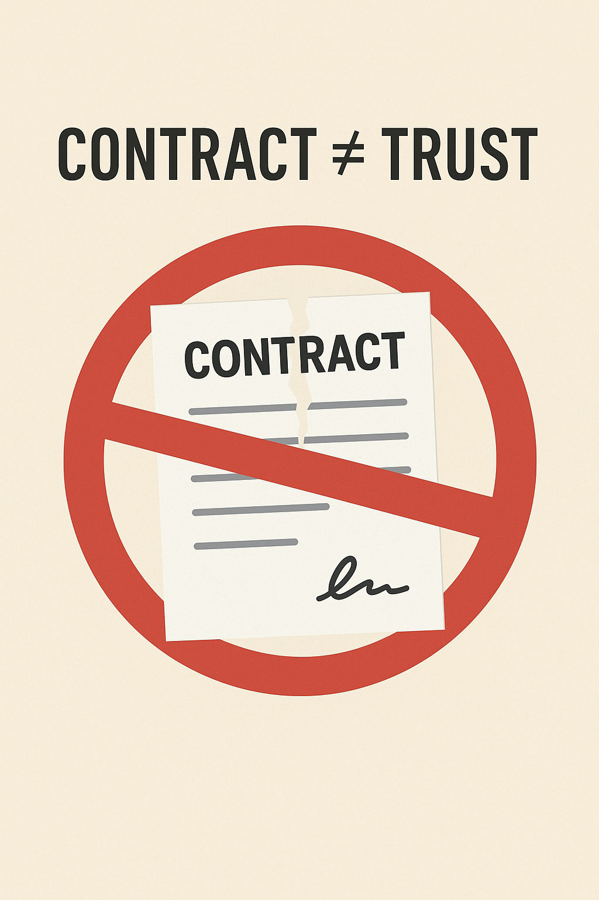
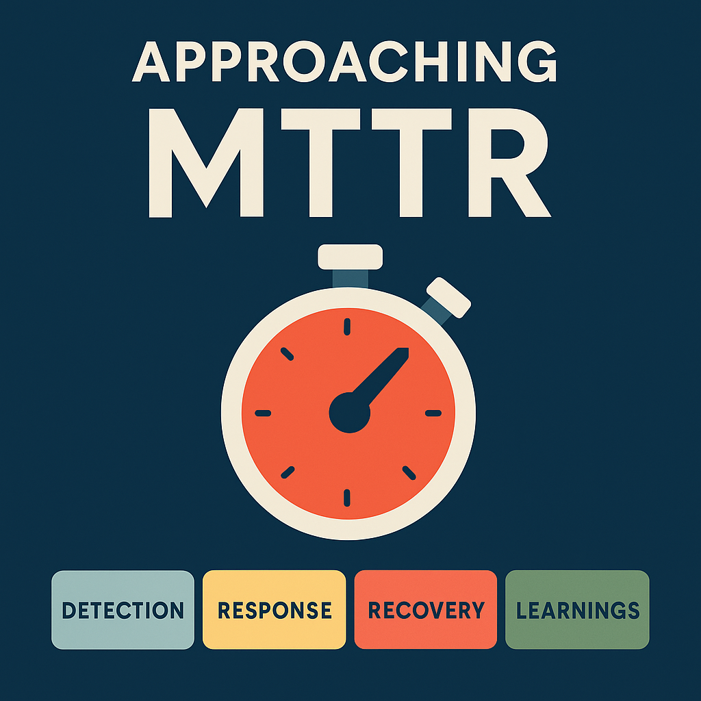

# The Null Heard Around the World: What Google’s Outage Teaches Us About Real-World Resilience

> On June 12, 2025, the internet held its breath.

> Google Cloud — the backbone of countless businesses — stuttered to a halt.
>
> The cause? A forgotten `null` check.
>
> Yes — **one of the world’s most sophisticated engineering organizations was brought down by a CS101 oversight**
>
> But this isn’t just about a bug — it was a resilience wake-up call every engineer should take to heart.

Welcome to the 12th edition of the Newsletter '*Beyond the Stack*' where we will unearth the **recent Google outage** and learn the **most important aspect of Software Engineering** - *Resilience & MTTR (Mean time to Recovery)*

**A Quick Note:**

Although this particular edition wasn’t on my original roadmap, this incident shook me deeply.

It served as a reminder that **even the most advanced systems can break from the basics** — and that’s exactly why we need to talk more about  **resilient system design** .

I felt compelled to include this in *Beyond The Stack* — not as a postmortem breakdown, but as a  **practical resilience wake-up call** .

---

## 🧩 **The Incident: When Smart Systems Break from Simple Gaps**

In what’s now called one of Google’s most ironic failures, a schema change introduced into a core service called *Service Control* skipped a basic null validation.

That missing check wasn’t caught in time — not in local tests, not in CI, not even during early rollout.

**The result?** A cascading outage that impacted not only Google services but also disrupted parts of the internet that rely on its cloud infrastructure.

---

## 🔬 **Root Cause? A Null Value — But Not Just That.**

The true failure wasn’t just technical — it was systemic:

* **Schema changed** — but validation pipelines didn’t evolve.
* **Tests passed** — but they didn’t cover null edge cases.
* **Deployment rolled out** — but the right canary protections weren’t enforced.
* **Code was reviewed** — but reviewers either assumed the field would never be null, or lacked schema-level validation context.

> 🧠 There’s growing speculation: was this really a missing null check — or a  **missing contract guarantee** ?
>
> That is, was the upstream contract implicitly saying “this will *never* be null”… yet it was?

This may point to a deeper integration failure: **a disconnect between schema guarantees and runtime behavior** — especially common in microservices where different teams own producers vs consumers.

---

### ⚠️ **Contract ≠ Trust**

**Integration Rule #1**: Just because your schema says it's non-null doesn't mean it *will* be.

* Upstream teams may deploy breaking changes without schema negotiation.
* Serialization frameworks might skip unset fields silently.
* Defaults may not be enforced at runtime.

**If your code assumes the contract will always hold — you're not resilient.**

Validate **defensively**, even when the spec looks airtight.

---

## 📓 Google’s Postmortem Philosophy: A Masterclass in Learning

What sets Google apart isn't immunity to bugs — it's  **how they respond** .

Here’s what their internal postmortem culture teaches us:

| Element                                       | Practice                                                              |
| --------------------------------------------- | --------------------------------------------------------------------- |
| 🔄**Blameless Reviews**                 | Focus on system failures, not people.                                 |
| 📈**Root Cause + Contributing Factors** | Timeline-based impact mapping.                                        |
| 🧪**"Where We Got Lucky"**              | Documenting flukes to avoid overconfidence.                           |
| ✅**Action Items**                      | Automating schema validation, integration guardrails, rollback plans. |

Their takeaways? Resilience isn’t luck. It’s **designed in** — or it fails.

### 🛠️ MTTR: The Real Test of Resilience

In massive distributed systems,  **failure is inevitable** . What sets great engineering orgs apart is how **fast** they recover.

Google’s approach to reducing **MTTR (Mean Time To Recovery)** is a blend of process, tooling, and culture:

🧭 1. **Always-On Observability**

* Fine-grained metrics, structured logs, and distributed tracing.
* Internal tooling like **Stackdriver** and **internal dashboards** allow teams to quickly pinpoint which service/regional tier is misbehaving.

🚨 2. **Automated Rollbacks**

* Canary and staged rollouts come with built-in rollback automation.
* If error rate, latency, or null dereference spikes are detected post-deploy, rollback can happen **in seconds** — without human intervention.

🧑‍🚒 3. **SRE On-Call Culture**

* Google SREs follow a  **24/7 paging model** .
* For critical systems, there's always a trained on-call engineer backed by a clear escalation policy.
* Runbooks, health dashboards, and “you build it, you run it” ensure fast action.

📄 4. **Runbooks & Incident Command**

* Every major service has  **predefined incident response runbooks** .
* During incidents, a designated **Incident Commander (IC)** manages coordination, freeing engineers to debug without cognitive overload.

📚 5. **Postmortem Feedback Loop**

* Learnings from every incident directly inform:
  * Better alerts
  * Faster runbook paths
  * Safer deploy templates
  * Improved observability

> 🧩 **Goal:** Shrink MTTR not just once — but *permanently* with every incident.
>
> Google’s approach to MTTR is well-documented in their [SRE Book](https://sre.google/sre-book/table-of-contents/) and postmortem culture articles.

---

### 🔄 From Reactive to Resilient

The null outage wasn’t about being *caught off guard* — it was about how quickly the system stabilized  **after the surprise** .

**MTTR isn’t a panic metric. It’s a design goal.**

If you're not designing for it — you're just waiting longer to recover.

> 📐 **System Design isn't just about scaling — it's about surviving failure gracefully and recover quickly.** And that starts with how we handle the basics.

---

## 🔐 Nulls Will Happen — Here's How to Resilience-Proof Your Stack

Null issues are deceptively simple — but  **your system's resilience hinges on handling them well** .

### ✅ **1. Schema-Aware Validation**

* Enforce strict schemas (e.g., JSON Schema, Protobuf) with non-null contracts.
* Block merges if validations fail on required fields.

### ✅ **2. Defensive Unit Testing**

* Always test:
  * Null inputs
  * Empty strings/arrays
  * Optional field absence
* Use parameterized tests for coverage.

### ✅ **3. Contract & Integration Tests**

* Use tools like Pact or Spring Cloud Contract to simulate cross-service behavior.
* Run them pre-merge for any schema or API change.

### ✅ **4. Safe Rollout Strategies**

* Wrap risky field access in feature flags.
* Deploy with staged rollouts and monitor null exceptions in logs/metrics.

### ✅ **5. Observability-Driven Defense**

* Alert on spike in null dereferences.
* Build dashboards that show schema version mismatches or incomplete payloads.

### ✅ **6. Cultural Resilience**

* Code as if every input can break.
* Review as if your system runs without you watching.

---

## 🚦 Resilience Is Not a Feature — It’s a Habit

Google’s null-check miss isn’t an outlier. It’s a  **reminder** .

In complex systems,  **failure often starts from the simplest assumption** :

*"That field will always be there."*

Your resilience doesn’t come from how smart your engineers are.

It comes from **how often you assume you’re wrong — and test for it.**

---

## 🛠️ 3 Things You Can Start Doing Tomorrow

Not all resilience improvements take weeks. Some can start today.

1. ✅ **Add a null test case** to your most-used DTO or service input.
2. ✅ **Review your schema evolution workflow** — does it prevent contract-breaking changes?
3. ✅ **Set up a log alert** for unexpected null values or schema mismatches.

> 💡 Small habits today. Massive resilience tomorrow.

---

## 📢 Final Thought

> You don’t need a billion users to build resilient systems.
>
> You just need a mindset that values **boring basics over brilliant complexity.**

📌 If this helped you re-think system design from a resilience lens, share it with a teammate.

And let me know:

🔁 Have you ever been bitten by a `null` you didn’t expect?

---

## 📚 Further Reading & Resources

* 🔗 **[Google’s Epic Fail — When the World’s Smartest Engineers Forgot Programming 101](https://levelup.gitconnected.com/googles-epic-fail-when-the-world-s-smartest-engineers-forgot-programming-101-67dbd100304e)**

  David Lee's detailed breakdown of the null-check outage and what went wrong.
* 🔗 **[Postmortems at Google: Culture of Blameless Learning](https://sre.google/workbook/postmortem-culture/)**

  A behind-the-scenes look into how Google approaches incidents through structured, blameless postmortems.
* 🔗 **[Using Java Optional Effectively to Avoid Nulls](https://www.baeldung.com/java-optional)**

  A hands-on guide to using `Optional` in Java to reduce null-related bugs — from Baeldung.
* 🔗 **[NullAway: A Tool for Avoiding NullPointerExceptions in Java](https://github.com/uber/NullAway)**

  Open-source static analysis tool developed by Uber, used to eliminate null errors at compile-time.
* 🔗 **[Testing for Resilience: A Guide from the ThoughtWorks Tech Radar](https://www.thoughtworks.com/radar/techniques)**

  Highlights the importance of testing under edge cases, chaos, and schema mismatches.
* 🔗 **[Contract Testing with Pact](https://docs.pact.io/)**

  A widely-used tool for consumer-driven contract testing between microservices.
* 🔗 **[Google SRE Book – Chapter on Monitoring Distributed Systems](https://sre.google/sre-book/table-of-contents/)**

  Key practices on observability and how it underpins MTTR reduction.
* 🔗 **[Incident Management at Google](https://sre.google/workbook/incident-response/)**

  Learn how Google coordinates and recovers from incidents using ICs, runbooks, and automation.
* 🔗 **[How Netflix Designs for Failure](https://medium.com/@shubhiagarwal_71149/how-netflix-fails-on-purpose-and-what-you-can-steal-from-it-ca0a7a348d1c)**

  Netflix's take on building resilient systems by expecting failure — and reducing MTTR.

### 🎓 Bonus Watchlist

* 📽️ **[Charity Majors – Observability: It’s Not Logging, It’s Understanding](https://www.youtube.com/watch?v=phUufNyg2QU)**

  A must-watch to understand modern observability and how it's different from traditional logging.
* 📽️ **[Reducing MTTR with Observability &amp; Incident Intelligence (Google Cloud Tech)](https://www.youtube.com/watch?v=Cxb7a8lTv8A)**

  How Google Cloud approaches real-time alerting and MTTR with built-in observability.
* 📽️ **[Dan North – Testing in the World of Microservices](https://www.youtube.com/watch?v=VD51AkG8EZw)**

  Covers distributed testing patterns, contract validation, and real-world microservices pitfalls.

---

## 📅 Coming Up in Future Editions:

1. How Observability plays a crucial role in Kubernetes clusters — learnings from KCD Bengaluru
2. Taming Threads and Scaling Smarter  — The Art of Managing Concurrency
3. Stop Logging Everything - Kafka already has the Truth

## 💬 **Your Turn: Share the Scar**

Every system has a battle story — and so does every engineer.

If this edition reminded you of a bug, outage, or incident you’ve faced (maybe even a forgotten `null` check 👀)…

**I’d love to hear your story.**

→ How did you bounce back?

→ What helped you reduce *your* MTTR?

→ What did you change in your system, team, or mindset?

If this edition helped you rethink resilience, tag a teammate or comment below.

**Let’s learn from each other — one scar story at a time.** — because **when we share scars, we build stronger systems.**

**Enjoyed this story?**

This is just one of the many insights I share in *Beyond the Stack* — my weekly newsletter that blends tech, product thinking, and real-world developer lessons.

 **Subscribe now** : [Beyond the Stack](https://www.linkedin.com/newsletters/beyond-the-stack-7318612377875161089)

 **Like. Repost. Comment. Let's discuss — How are YOU making your application resilient?**

#BeyondTheStack #DeveloperInsights #NotificationSystem #TechThatMatters #CustomerExperience #RealWorldTech
