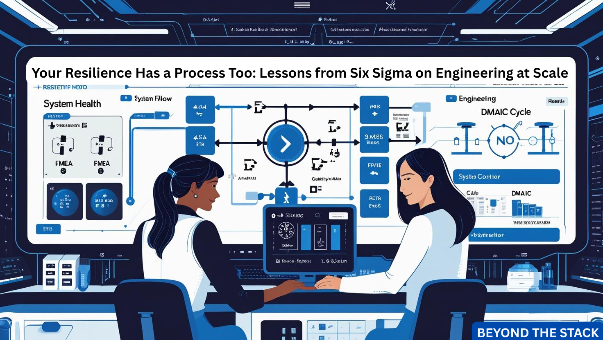
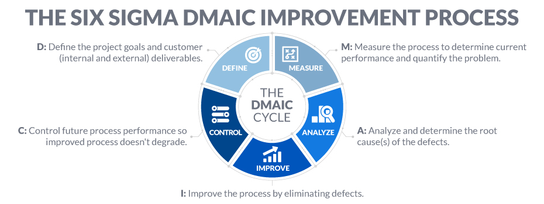
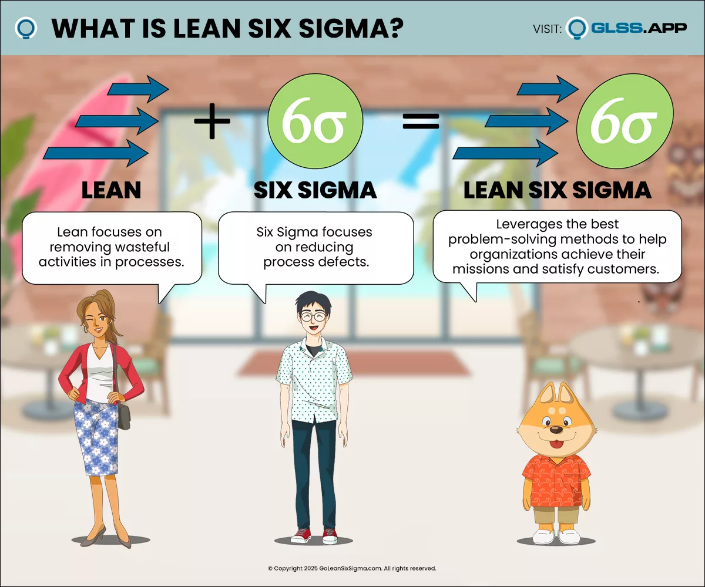
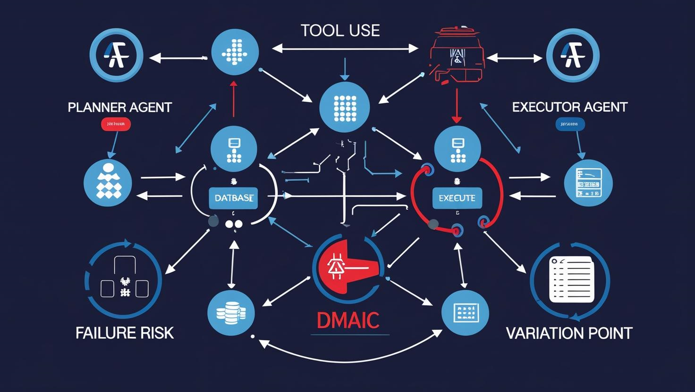

# **🛡️Resilience Has a Process Too — What Six Sigma Still Teaches Us About Engineering at Scale**

When Google Cloud stumbled due to a missing null check, the internet paused. But the deeper issue wasn’t the check itself. It was the **absence of guardrails**.

This wasn’t a one-off error. It was a  **process failure** .

And that made me reflect: Have we drifted too far from the structured disciplines we once relied on? Think *Six Sigma, FMEA, root cause analysis* — approaches born in manufacturing but deeply relevant to software and cloud engineering.

They weren’t just for factories. They were — and still are —  **blueprints for resilience** .

---

## 🧩Blueprints of a Resilient System

In today’s SRE playbook, we obsess over MTTR, chaos testing, and auto-remediation. But in high-stakes systems, the best incident is the one that never happens.

Just like in healthcare, **“prevention is better than cure”** applies to systems too.

That’s where structured frameworks like Six Sigma come in. They help teams:

* **Measure quality upfront**
* **Predict failure points before they occur**
* **Build safeguards into design and deployment**

---

**2. What Six Sigma Can Still Teach Cloud Engineers**

Six Sigma aimed to reduce defects and variation. That goal hasn’t changed — just the domain has.

Let’s draw a modern mapping:

| Six Sigma Concept                                  | Modern Cloud Equivalent          |
| -------------------------------------------------- | -------------------------------- |
| *Defects per million ops*                        | Error budgets & SLO breaches     |
| *Statistical process control*                    | Real-time monitoring + alerting  |
| *DMAIC (Define-Measure-Analyze-Improve-Control)* | Incident lifecycle + postmortems |

Where we once measured factory widgets, we now track latency, uptime, and release quality.

**Continuous improvement** remains the common thread.

---

**3. FMEA (Failure Mode & Effects Analysis) Isn’t Outdated — It’s Underused.**

FMEA (Failure Mode and Effects Analysis) asks the hard questions **before** things break:

* What might fail?
* How would we detect it?
* What’s the customer impact?
* How severe and controllable is the risk?

Even running FMEA just for **core APIs** or **shared services** can reveal vulnerabilities before code reaches prod.

---

**4. Root Cause vs True Cause: Why 5 Whys Still Work**

After Google’s incident, many said, *“They missed a null check.”* But the real questions are:

* **Why** did null slip through?
* **Why** didn’t validation catch it?
* **Why** didn't peer review catch it?
* **Why** wasn’t rollback automatic?
* **Why** wasn't the failure considered critical by default?

**True root cause analysis** doesn't blame bugs — it fixes the processes that let them escape.

And the humble “**5 Whys**”? Still one of the sharpest tools we have — if we use it with discipline.

---

**5. Modernizing the Process Mindset**

Here’s how you can apply process thinking in today’s fast-paced engineering teams:

* 🔍 Run FMEA in design reviews
* 🚦 Tie error budgets to release criteria
* 📄 Embed RCA templates in postmortems
* ✅ Add release gates based on change failure rates
* 📊 Monitor key metrics like latency and availability through dashboards

You don’t need Six Sigma belts or control charts — just a **culture that values learning loops.**

---

## 🎓 My Takeaways from Advanced Lean Six Sigma AI Yellow Belt

During my Yellow Belt certification, I realized something powerful — Six Sigma isn’t stuck in manufacturing. It’s  **industry-agnostic** , and surprisingly relevant to  **software engineering** ,  **DevOps** , and  **cloud infrastructure** .

A few key learnings stood out:

* **Lean** originated at Toyota (Japan), and **Six Sigma** at Motorola (USA).

  Together, they form an Operational Excellence Methodology (OEM) focused on  **efficiency + quality** .
* Every customer expects  **QCDS** :

  * **Quality**
  * **Cost**
  * **Delivery**
  * **Service**

  And every business must evolve to meet these through:

  * Better process capability
  * Alignment of product and customer needs
  * Responsiveness to tech and market changes
* In Six Sigma, the Greek letter **σ (sigma)** represents **standard deviation** — i.e., variation.

  **Less variation = Fewer defects = More reliability.**

### 📌 What Six Sigma Still Emphasizes (and Why It Matters)

Six Sigma is built around one mission:  **Reduce variation to improve reliability** .

Its core problem-solving framework — **DMAIC** — is still one of the best universal tools:

> **D**efine → **M**easure → **A**nalyze → **I**mprove → **C**ontrol

It’s focused on:

* Performance consistency
* Process stability
* Driving down defect rates
* Delivering a target of **3.4 defects per million opportunities**

And here’s the kicker:

**Six Sigma isn’t outdated — it’s just underutilized in software.**

---

## 🤖 Applying Six Sigma & FMEA to AI and Agentic Systems

AI, particularly generative models, often produces  **non-deterministic outputs** . Variability is expected — but **uncontrolled variation** leads to hallucinations, bias, and degraded trust.

Six Sigma helps bring structure to this uncertainty:

* Treat **hallucination rates, latency spikes, or bias drift** as “defects per million outputs”
* Use **DMAIC cycles** to continuously tune LLM pipelines, human-in-the-loop loops, and feedback strategies
* Build performance baselines and define tolerances for quality, reliability, and safety

### ⚙️ FMEA in Agentic Systems — Where and Why It Matters

Agentic systems involve:

* Multiple autonomous agents
* Tool usage (API calls, code execution)
* Decision loops based on partial or generative inputs

Every layer introduces a  **failure surface** :

* What if a planner agent selects the wrong tool?
* What if an executor agent relies on hallucinated context?
* What if no one validates feedback before taking action?

**FMEA** helps expose and mitigate these risks early:

* What can go wrong in each decision loop?
* How severe is the outcome?
* How likely is detection?
* What guardrails can we introduce?

### ✅ Where to Begin

* Define thresholds for acceptable variation (accuracy, latency, token cost)
* Use FMEA to map agent workflows — especially cross-agent dependencies
* Run DMAIC cycles on your agent pipelines and prompt strategies

**Bottom line:** Even the most intelligent agents need a disciplined process to stay aligned and safe.

---

## 💼 Why Startups (Especially Fintech) Need Process as a Moat

In startups, speed often takes the front seat. But in  **Fintech** , **trust is the currency** — and trust can’t be compromised.

You're not just shipping code. You're handling:

* **Financial data**
* **Transaction integrity**
* **Regulatory obligations**

And in this context, even a small glitch can trigger **irreversible damage** — to customers, compliance, and credibility.

That’s where Six Sigma and FMEA create leverage:

* Bring **repeatability** to rapid iterations
* Offer **risk visibility** to engineering teams and leadership
* Provide **confidence** to investors and regulators

Too often, early-stage companies skip process in favor of speed. But in  **Fintech** , your process *is* your moat.

Investing in structured frameworks early doesn’t slow you down — it  **builds a foundation that scales with confidence** .

---

## 🏢 Who’s Using Process Discipline in Modern Engineering?

You might wonder — are Six Sigma, Lean, and FMEA still relevant today?

The answer is a clear **yes** — across both tech giants and high-growth startups:

### 💼 Big Tech

* **Google** : Blameless postmortems, FMEA-style risk reviews, and SLO-driven releases (ref: [SRE Workbook](https://sre.google/workbook/))
* **Amazon** : Deep Six Sigma roots in both software and logistics; metrics-first engineering culture
* **Microsoft & IBM** : Long-standing adoption of Lean Six Sigma for software delivery and operational excellence

### 🚀 Startups & Fintech

* **Stripe** : Prioritizes reliability and compliance through disciplined process reviews
* **Plaid** : Applies FMEA-like checks to secure, reliable API delivery
* **Razorpay** (India): Operates with release rigor and audit-focused engineering practices
* **N26 & Nubank** : Embed scalable process controls early in fast-moving fintech environments

### 🏦Global Banks

* **JP Morgan Chase**: One of the **early adopters of Six Sigma** in operations, application development, and internal automation
* **Morgan Stanley**: Applies **structured RCA and FMEA** in software quality and infrastructure risk assessments
* **Goldman Sachs**: Known for a strong **engineering culture** with metrics, monitoring, and structured improvement.
* **Citibank**: Has formal **Lean Six Sigma practices** across operations and technology groups.

### 📏 How Success is Measured

Process discipline isn’t about red tape — it’s about measurable outcomes:

* 📉 **Lower Defect Rates** — Track “defects per million deployments”
* ⏱️ **Improved MTTR & Release Stability**
* ✅ **FMEA Coverage** — % of services with pre-release risk mapping
* 🔁 **First-Time Quality** — % changes that pass without rework
* 📊 **Adoption Rate** — How many teams use postmortems, RCA templates, or process gates

🔎 These firms prove that **process discipline is not a bottleneck — it’s a backbone** for building trusted, secure, and scalable software.

## 💡 Practical Takeaways — For Cloud, AI, and Startup Systems

Bring structure to your engineering culture — no matter the scale:

1. **Run lightweight FMEA sessions**

   → Focus on shared services, agent interactions, or high-risk fintech operations.
2. **Add “5 Whys” to your postmortem templates**

   → Especially useful for uncovering silent failures in AI pipelines or production outages.
3. **Define a “first-time quality” metric**

   → Use for API contracts, LLM prompts, or compliance-critical flows.
4. **Map agent workflows using FMEA**

   → Helps preempt failures in tool use, decision loops, or agent communication.
5. **Use DMAIC to iterate AI pipelines or prompt engineering strategies**

   → Treat hallucinations and model drift as quality defects.

---

## 📢 Final Thought

Resilience isn’t just about how fast you detect and recover — it’s about how **rarely** you need to.

Six Sigma and other structured frameworks aren’t outdated. They’re the **missing layer** in many engineering orgs.

Whether you're building scalable cloud systems, launching a fintech startup, or engineering autonomous agents — **resilience starts with repeatability.**

Structured thinking doesn’t slow you down. It  **makes your speed sustainable** .

Because when your systems power millions, **craft isn't optional — it's foundational.**

---

### 🧭 Dive Deeper — Learn, Apply, Evolve

#### 🔹 **Six Sigma & Lean Principles**

* [DMAIC Explained with Examples – iSixSigma](https://www.isixsigma.com/dmaic-methodology/what-dmaic/)
* [What is Lean Six Sigma? – GoLeanSixSigma](https://goleansixsigma.com/what-is-lean-six-sigma/)
* [FMEA (Failure Mode and Effects Analysis) Explained – ASQ](https://asq.org/quality-resources/fmea)

#### 🔹 **Six Sigma in Tech and DevOps**

* [Six Sigma in Software Engineering – Medium](https://medium.com/@neviarrawlinson/agile-lean-six-sigma-bridging-two-powerful-methodologies-10e1cdf8f96b)
* [Connection Between Lean, Agile, DevOps, Six-Sigma, ITSM, Scrum](https://worldofagile.com/blog/connection-between-lean-agile-devops-six-sigma-itsm-scrum/)
* [DevOps Delight: Mastering Lean and Six Sigma for Epic Efficiency!](https://magedelgamal.medium.com/devops-delight-mastering-lean-and-six-sigma-for-epic-efficiency-35f4f3ea1295)

#### 🔹 **Root Cause & Resilience Engineering**

* [Blameless Postmortems – Google SRE Workbook](https://sre.google/workbook/postmortem-culture/)
* [5 Whys Technique – MindTools Guide](https://www.mindtools.com/a3mi00v/5-whys)

#### 🔹 Six Sigma for AI & Autonomous Systems

* [AI Insights - How to address failures in the fairness of AI systems?](https://indiaai.gov.in/article/how-to-address-failures-in-the-fairness-of-ai-systems)
* [Beyond &#34;Human in the Loop&#34;: Reliable AI in Enterprise Workflows](https://www.linkedin.com/pulse/beyond-human-loop-reliable-ai-enterprise-workflows-gianni-giacomelli-kzahf/)
* [Responsible AI Practices – Google](https://ai.google/principles/#our-ai-principles-in-action)

#### 🔹Lean, Six Sigma & FMEA in Banking and Financial Engineering

* [Lean Six Sigma success stories in the Financial Services industry](https://goleansixsigma.com/lean-six-sigma-success-stories-in-the-financial-services-industry/)
* [Six Sigma: The Methodology That Elevates Software Quality to a New Level](https://kwan.com/blog/six-sigma-the-methodology-that-elevates-software-quality-to-a-new-level/)
* [Lean Six Sigma at JPMorgan Chase ](https://insights.sei.cmu.edu/documents/3108/2005_017_001_23313.pdf)
* [FMEA in Finance – ASQ Case Study](https://asq.org/quality-resources/fmea)
* [The financial giant strives for perfect processes to satisfy customers. - Citibank](https://www.qualitydigest.com/static/magazine/dec99/html/citibank.html)

---

## 📅 Coming Up in Future Editions:

1. **How Observability plays a crucial role in Kubernetes clusters** — learnings from KCD Bengaluru
2. **Taming Threads and Scaling Smarter**  — The Art of Managing Concurrency
3. **Stop Logging Everything** - Kafka already has the Truth
4. **When Abstractions Become the Problem** — Knowing When to Scale Down

---

## 🙏 **Thank You!**

A heartfelt thank you to all my readers and friends of  *Beyond the Stack* .

Whether you're scaling cloud systems, building AI pipelines, or shipping products at fintech speed — this edition is a reminder:  **resilience isn't reactive; it's engineered** .

And it starts with process.

This edition was inspired by a thoughtful comment from a fellow reader — someone who reflected on the importance of **process-driven resilience** and encouraged me to explore how frameworks like Six Sigma still hold value in modern engineering.

That’s the power of this community: turning everyday observations into  **shared learning and better systems** .

💬 I’d love to hear from you:

🧠 **Have you applied FMEA or DMAIC in your engineering org?** *I’d love to hear what worked (or didn’t). Drop a comment or message me — let’s exchange lessons* *and* *keep learning* *together*.

Until then, keep loving *Beyond the Stack* — Practical insights and real-world takeaways on *Java, Spring Boot, Cloud Engineering, and AI* for curious developers.

---

#BeyondTheStack #SystemDesign #ResilienceEngineering #SixSigma #CloudOps #SRE
