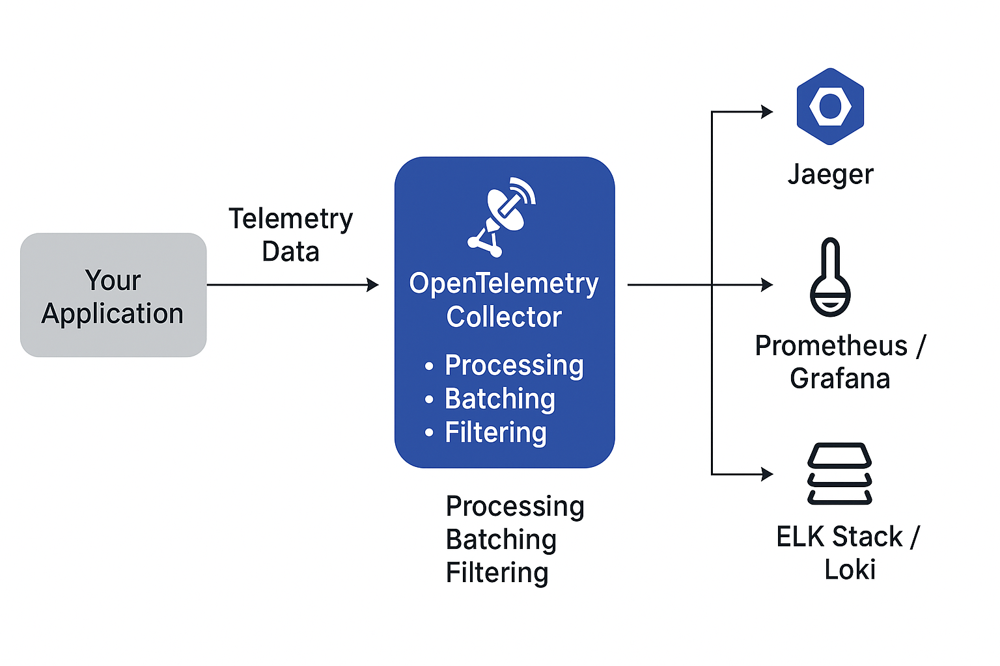
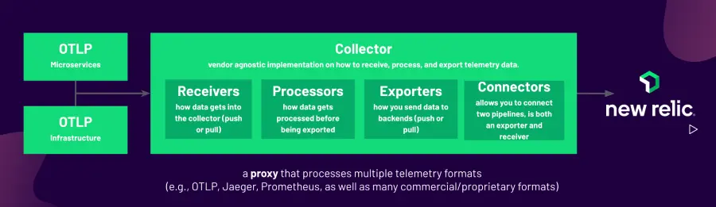

# 🧭 The Missing Map: Why Your Systems Are Failing Silently

*This edition was sparked by my recent experience at Kubernetes Community Day in Bangalore — where the hottest hallway conversations weren’t about scale or cost, but something far deeper:  **observability** .*

From Cloudflare’s high-traffic edge scenarios to Dynatrace’s AI-driven telemetry, and Randoli’s innovative service maps — one theme was loud and clear:

> 👉 **You can’t fix what you can’t see.**

That’s when I took a deeper look at  **OpenTelemetry**, the open standard that’s quietly becoming the nervous system for modern distributed systems.

Let me take you into a real-world incident that could’ve been avoided — had this system only been observable.

## 📉 The 3 AM Latency Mystery

Let me take you into a familiar scene.

> **Time:** 3:07 AM
>
> **Alert:** “*Checkout API latency exceeded threshold*”
>
> **Severity:** P1
>
> **Slack thread:** On fire

The engineering team at a fast-growing e-commerce startup scrambles to diagnose a sudden latency spike affecting the checkout flow. Panic sets in.

**CPU?** Normal.

**Memory?** Steady.

**Database?** Healthy.

**Logs?** Clean. Not a single error.

**Metrics?** Flat lines. Latency just… crept up.

Everything *looks* fine. But users are stuck on the checkout page for  **12 seconds** , and no one knows why.

## 🕵️‍♂️ Trial, Error, and Exhaustion

After nearly two hours of frantic digging and multiple false leads, someone thinks to check the logs from the payment gateway.

And there it is — buried in a sea of timestamps:

> The third-party payment API is responding in **9–10 seconds** per call.

Not failing.

Not timing out.

Just slow. Silently slow.

This wasn’t visible in logs or metrics.

There was no single dashboard to connect the dots.

The postmortem takeaway?

> *“We had all the data. But we didn’t have the map.”*

## 🧭 OpenTelemetry — The Missing Map

Modern systems are not single machines — they’re distributed webs of services, APIs, and third-party integrations.

And traditional tooling gives us only fragmented glimpses.

That’s where **OpenTelemetry (OTel)** changes everything.

It’s not just a tool — it’s a **standardized framework** for collecting, correlating, and exporting:

* **Traces** : Request lifecycles across services
* **Metrics** : Performance indicators over time
* **Logs** : Context-rich records linked to the same request

And it works across any stack — exporting to tools like Prometheus, Jaeger, Grafana, New Relic, and more.

---

### 🎯 Real Power: Distributed Tracing

> *If only they had a full trace view… the outcome could have been dramatically different. This is where distributed tracing steps in.*

With OpenTelemetry enabled, that 3 AM incident could’ve played out differently.

* The user places an order → generates a **trace ID**
* That trace spans:
  * Checkout Service
  * Pricing Engine
  * Inventory Check
  * Payment Gateway

Each component adds its own **span** to the trace - including timing, errors, and contextual metadata.

Within seconds, you’d spot:

> 💡 “The payment gateway span is taking 9.3 seconds. Everything else is under 100ms.”

Problem isolated. Fix in motion.

**MTTR** (Mean Time to Resolution) cut from 2 hours to 2 minutes.

---

### 📊 Unified Logs + Metrics + Traces

Here’s the game-changer:

* Logs can be tied to **trace IDs**
* Metrics spikes can be traced back to **spans** that caused them
* Dashboards become **narratives**, not just numbers

Example:

Your metrics show a latency spike.

OpenTelemetry lets you drill down and say:

> “This spike came from 17 requests, 14 of which hit a degraded Redis instance.”

---

### 📦 Observability in Kubernetes with OpenTelemetry

Kubernetes fundamentally redefines how applications run — no longer tied to static hosts, but to dynamic, ephemeral **pods** that can scale, restart, and migrate across nodes. This shift renders traditional host-centric monitoring insufficient.

Kubernetes itself emits a rich stream of telemetry: logs, events, and metrics — not just from the workloads you deploy, but also from its own internal components like the API server, kubelet, scheduler, etcd, and more. However, capturing and correlating this data meaningfully is the key to unlocking **end-to-end visibility** across your cluster.

This is precisely where **OpenTelemetry integrated with Kubernetes** excels.

#### 🛠 Deployment Patterns for OpenTelemetry Collector

The OpenTelemetry Collector acts as a telemetry processing pipeline — receiving, enriching, and exporting telemetry data. When deploying it within Kubernetes, you typically choose one of the following patterns:

##### 1. **No Collector**

Telemetry data is exported **directly from the application SDK** to the backend (e.g., Jaeger, Tempo, or a commercial observability platform). This keeps things simple but may lack centralized processing capabilities.

##### 2. **Agent Mode (DaemonSet)**

In this setup, the Collector runs as a  **DaemonSet**, deploying one instance per node. It collects:

* **Logs**, **metrics**, and **traces** emitted by applications
* **Node-level and container-level metrics**
* Kubelet and container runtime metrics

This pattern is ideal for low-latency collection and enriched context, especially for sidecar-less architectures.

##### 3. **Gateway Mode (Deployment)**

Here, the Collector is deployed as a  **standalone service**, often per cluster or region. It receives telemetry data forwarded by agents or SDKs, performs batch processing, filtering, and enrichment, and then routes it to the appropriate backends.

This mode is powerful for handling high throughput, centralized control, and multi-tenant scenarios.

#### 📊 Why OpenTelemetry Matters for Kubernetes Observability

Monitoring Kubernetes with OpenTelemetry enables **multi-layered observability** by collecting signals from:

* Applications
* Nodes and pods
* Control plane components (e.g., etcd, kube-apiserver)
* Network and storage layers

It not only helps visualize system behavior through dashboards, but also supports:

* Proactive alerting
* Rapid root cause analysis
* Performance optimization
* SLO/SLA tracking

#### 📈 Key Kubernetes Metrics to Monitor

To ensure the health, performance, and reliability of your Kubernetes clusters, consider tracking these essential metrics:

1. **CPU Utilization** – Helps manage pod resource limits and node provisioning.
2. **Memory Utilization** – Detects memory leaks or improper requests/limits settings.
3. **Network Throughput** – Monitors inter-pod or service-to-service communication performance.
4. **Disk I/O** – Assesses persistent volume performance and storage bottlenecks.
5. **etcd Metrics** – Critical for monitoring the health of the Kubernetes control plane’s data store.
6. **Node Health** – Tracks node availability, readiness, and taints.
7. **Pod Health** – Ensures application-level SLIs are being met through readiness/liveness probes and restart counts.

> ✅ *With OpenTelemetry in Kubernetes, you gain not just metrics — you gain  **context** . And with context, comes **clarity**.*

---

## 🧠 When Should You Start?

If you're building or scaling microservices, *yesterday* is the right time. But today will do.

Start small:

1. Identify critical user journeys (checkout, login, onboarding)
2. Add basic tracing with OpenTelemetry SDKs (Java, Node.js, Python, etc.)
3. Export to a visualization tool like Jaeger or Grafana Tempo
4. Correlate logs with trace context

Don't wait for the next outage to realize you’re flying blind.

---

## 💬 Lessons from the Community

> *Just like I saw in sessions from Cloudflare, Dynatrace, and Randoli — the future is in self-aware, self-reporting systems.*

At Kubernetes Community Day Bangalore, **observability (o11y)** was *the* word of the day.

From:

* **Cloudflare’s real-time network visibility**
* To **Dynatrace’s AI-powered root cause analysis**
* To **Randoli’s trace visualizations across services**

It was clear:

**The future belongs to systems that can observe themselves.**

---

## 💡 Final Thought

> Observability isn’t a dashboard.
>
> It’s your system’s  *sense of self* .

OpenTelemetry is how we give our systems the ability to **see, reason, and recover** — even when we can’t.

So the next time a mysterious outage happens… ask yourself:

🧭 *Do I have the map? Or just a flashlight in the fog?*

---

## 📚 Further Reading & Resources

1. 🌐 **OpenTelemetry Official Docs (Kubernetes setup)**

   [https://opentelemetry.io/docs/platforms/kubernetes/](https://opentelemetry.io/docs/platforms/kubernetes/)
2. 📘 **Spring Boot + OpenTelemetry (GitHub demo)**

   [https://github.com/sivaprasadreddy/spring-boot-opentelemetry-demo](https://github.com/sivaprasadreddy/spring-boot-opentelemetry-demo)
3. 📙 **Observability in Kubernetes with OTel Collector (Medium)**

   [https://medium.com/cloud-native-daily/kubernetes-monitoring-d0ab5563f10f](https://medium.com/cloud-native-daily/kubernetes-monitoring-d0ab5563f10f)
4. 🎥 **YouTube: CNCF Webinar – Production Observability with OpenTelemetry**

   [https://www.youtube.com/watch?v=c6L0_mJoa48](https://www.youtube.com/watch?v=c6L0_mJoa48)
5. 🧰 **Prometheus + Grafana + OTel for K8s Monitoring (Hands-on Guide)**

   [https://grafana.com/blog/2023/07/20/a-practical-guide-to-data-collection-with-opentelemetry-and-prometheus/](https://grafana.com/blog/2023/07/20/a-practical-guide-to-data-collection-with-opentelemetry-and-prometheus/)
6. 🗺️ **Jaeger Tracing UI Basics (Getting Started)**

   [https://www.jaegertracing.io/docs/1.50/](https://www.jaegertracing.io/docs/1.50/)
7. 📊 **Dynatrace – Observability for Developers and Automatic Root Cause with OpenTelemetry**

   [https://www.dynatrace.com/news/blog/dynatrace-observability-for-developers-saves-time-with-real-time-data/](https://www.dynatrace.com/news/blog/dynatrace-observability-for-developers-saves-time-with-real-time-data/)
8. 📙**Monitoring K8s with Otel**

   [https://newrelic.com/blog/how-to-relic/monitor-kubernetes-with-opentelemetry
   ](https://newrelic.com/blog/how-to-relic/monitor-kubernetes-with-opentelemetry)

---

## 📅 Coming Up in Future Editions:

1. What’s Your Message Really Riding On?
2. Taming Threads and Scaling Smarter  — The Art of Managing Concurrency
3. Stop Logging Everything — Kafka Already Has the Truth

---

📩 Want more real-world architecture insights like this?

👉*Loved this breakdown? Subscribe to **Beyond the Stack** *for deep dives on distributed systems, observability, and real-world architecture lessons.*[Subscribe Now](https://www.linkedin.com/newsletters/7318612377875161089/)
