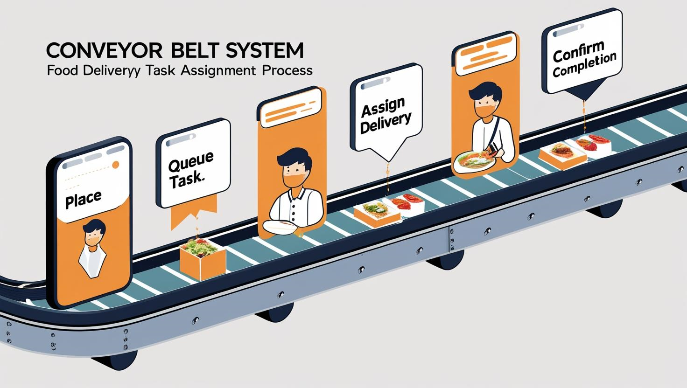
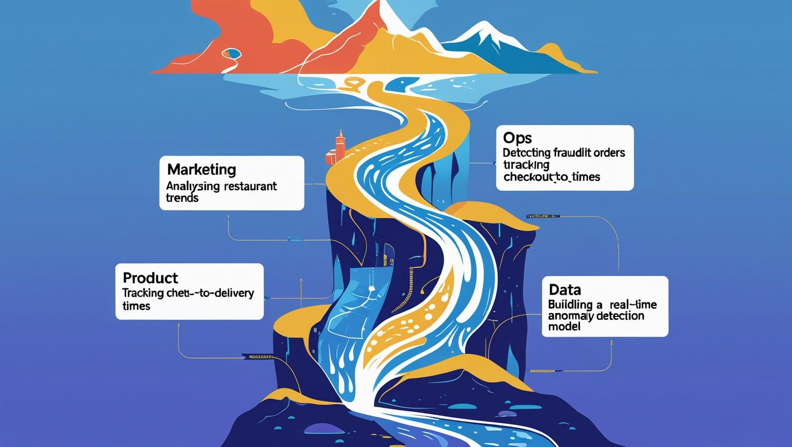
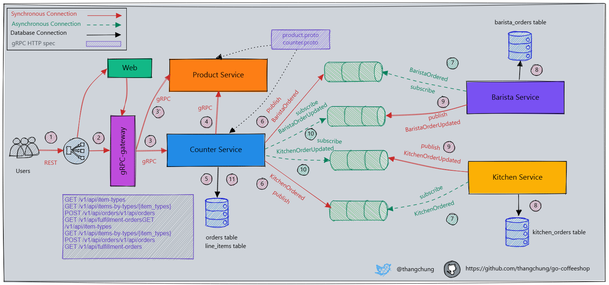
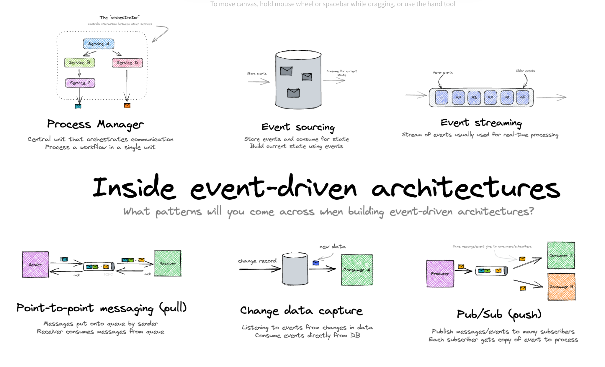

# 📨 What’s Your Message Really Riding On?

> **Is it a conveyor belt or a flowing river?**

The way your messages travel speaks volumes about your system’s intent.

👋 **Welcome to the 15th Edition of *Beyond the Stack***

Thank you for being part of this growing community.

What started as a niche corner for architecture nerds has now evolved into a vibrant space where developers, engineers, and tech leads dive deep into what truly powers modern systems.

Each edition, we peel back a layer — not just of code, but of  *intent, design, and long-term thinking* .

Let’s keep building, learning, and pushing boundaries — together.

Now, let’s unpack the journey your messages take — and what that reveals about your architecture’s intent.

## 🚚 Same Payload, Different Journeys

Imagine this:

Two identical trucks leave a warehouse.

* One delivers individual packages to specific addresses, making sure each recipient signs upon delivery.
* The other dumps a steady stream of boxes into a river, where downstream sensors capture and log each one.

Both are moving  ***data***.

Both are fulfilling ***business* needs**.

But their delivery mechanisms couldn’t be more different.

That’s the subtle yet defining difference between **message queues** and  **event streams** .

---

## 🍱The Real-World Story: When a Food Delivery App Hit a Wall

Let me take you inside a scaling startup I once advised as a friend.

What started as a small scrappy MVP quickly grew to serve  **10,000+ daily orders across multiple cities** .

In the early days, a **message queue** handled task assignment:

```
Place order → enqueue task → assign to delivery partner → mark complete.
```



It was simple, effective, and reliable — the  *perfect conveyor belt* .

Every task mattered. No task could be missed.

But as growth hit, so did complexity.

Suddenly, new teams wanted access to the  **same data** , but for  **different reasons** :

* 📈 **Marketing**: “What are the top 10 trending restaurants this hour?”
* ⚠️ **Operations**: “Detect fraud when the same phone number is used for 5 COD orders.”
* 📊 **Product**: “How long does checkout → delivery take by location?”
* 🧠 **Data**: “Can we build a real-time anomaly detection model?”

**The queue started groaning under a weight it was never designed to carry.**

Why? Because it wasn’t built for **parallelism**, **observability**, or **multiple consumer workloads**.

The architecture needed to evolve.

They had been riding a conveyor belt…

…but now they needed a  **river** .



---

## 🧠 Event-Driven Architecture: The Bigger Picture

**Event-driven architecture (EDA)** is a software design paradigm where loosely coupled applications and services communicate and react to events in real time.

An **event** is a record signifying the change in the state of a system, such as a user signed up, an order is placed by a customer or a sensor triggered.



In an EDA, there are three primary components:

* **Event producers (or publishers):** These generate and send events, but are unaware of which consumers will receive them.
* **Event routers (or brokers):** These act as intermediaries, decoupling producers and consumers. They receive events, filter and route them to relevant consumers.
* **Event consumers (or subscribers):** These receive events and react by processing them, updating a database, or triggering further actions.

The communication is asynchronous, allowing components to operate independently and respond to events as they occur.

Unlike traditional request-response systems, EDA systems are **non-blocking** and  **highly scalable** , making them ideal for distributed architectures.

## 🧭 Choosing Between Queues vs Streams

### 🎯 Message Queues — Reliable, Targeted Delivery (The Conveyor Belt)

**Think:** RabbitMQ, AWS SQS, ActiveMQ

**Goal**: Simple **deliver a message once to one consumer.**

✅ Ideal when:

* You need **exactly-once** or **at-least-once** task handling
* You care about  **acknowledgement, retries** , and **ordering**
* You’re building  **job queues** ,  **batch pipelines** , or **command handlers**

🚫 Avoid when:

* Multiple teams need **parallel reads**
* You want to **replay** past events
* You need **real-time observability**

---

### 🌊 Event Streams – Broadcast, Observe, React (The Flowing River)

**Think:** Apache Kafka, Pulsar, Redpanda, 60East AMPS

**Goal**: designed for **durable, ordered logs** that can be replayed, partitioned, and tapped into by multiple consumers.

✅ Ideal when:

* You want a **source of truth** that multiple systems can subscribe to
* You need  **auditability** ,  **analytics** , or **time-based replay**
* Consumers may join **anytime** and need access to historical data
* Different teams want to consume the same data independently

🚫 Avoid when:

* You only need **one-time task execution**
* Guaranteed **once-only delivery** is required without idempotency
* Downstream services can't handle **eventual consistency** or **deduplication**

> 💬 **“The truth is the log.”**
>
> — *Pat Helland, “Immutability Changes Everything,” 2015*

This single line captures why event streams exist: not just to move data, but to **record truth** — as it happened, when it happened.

---

## 🤔So… What’s Your Message *Really* Riding On?

Let’s reframe the conversation.

It’s not about RabbitMQ vs Kafka.

It’s not about queues vs streams.

It’s about  **system intent** :

* If your goal is to **get work done** (e.g., confirm an order, send an OTP) → you need a  **queue** .
* If your goal is to **tell others what happened** (e.g., track cart additions, user logins, page views) → you need a  **stream** .

> 🎯 **The transport reflects the intent, the systems's purpose.**

---

## 🧠 Event-Driven Architecture: Patterns

Whether you're using a queue, a stream, or a hybrid approach — you’re ultimately building around  **events** .

There are 3 foundational EDA Patterns:



### 1️⃣ **Point-to-Point (Queue)**

> *Pull work by a single consumer.*

* **Pattern:** Producer pushes → Message Queue → ***pulls by* **Single Consumer
* **Example:** Place order → Notify fulfillment service
* **Tech:** RabbitMQ, SQS, ActiveMQ
* **Reliability:** High — supports retries, dead-letter queues

### 2️⃣ **Publish-Subscribe (Push to Many)**

> *One producer, many independent consumers.*

* **Pattern:** Publisher → Topic → Broker **Pushes to** [Consumer A, B, C]
* **Example:** User signs up → Notify Email + Analytics + Fraud engine
* **Tech:** Kafka topics, Google Pub/Sub, Redis Streams, NATS
* **Challenge:** Consumers must be **decoupled** and **idempotent**

### 3️⃣ **Change Data Capture (CDC)**

> *Let the DB tell the story.*

* **Pattern:** Capture low-level DB changes → emit events
* **Example:** Update in `orders` table → publish order.status.updated
* **Tech:** Debezium, Maxwell, Striim
* **Great for:** Legacy systems where you can’t modify app logic

---

## 💡Final Thought

As your platform evolves, so does the number of teams, tools, and systems that want to  *listen* ,  *analyze* , or *act* on messages flowing through it.

Build for **flexibility**, not just functionality.

Design with purpose for **observability**, not just operation

And always ask:

> **What’s your message really riding on — a conveyor belt, a flowing river, or a broadcasting tower?**

> 📣 Build with  **intent** . Design for  **decoupling** , *Let events lead the way.*

---

## 📚 Further Exploration

Whether you're choosing between queues and streams, designing a Pub/Sub system, or exploring EDA patterns, these resources go deeper into the architectural decisions behind modern distributed messaging:

### 🧠 Core Concepts & Comparisons

1. 🖼️ **Queues vs Streams vs Pub/Sub (Visual Guide)**

   [https://eda-visuals.boyney.io/visuals/queues-vs-streams-vs-pubsub](https://eda-visuals.boyney.io/visuals/queues-vs-streams-vs-pubsub)

   *A clean, intuitive visual reference comparing delivery semantics.*
2. ✍️ **Message Queues vs Event Streams: Understanding the Differences**

   [https://learningdaily.dev/message-queues-vs-event-streams-understanding-the-differences-25d27b8f20af](https://learningdaily.dev/message-queues-vs-event-streams-understanding-the-differences-25d27b8f20af)

   *A developer-friendly breakdown with practical analogies.*
3. 📖 **Designing Event-Driven Systems (O’Reilly Book – Free PDF)**

   [https://www.oreilly.com/library/view/designing-event-driven-systems/9781492038252/](https://www.oreilly.com/library/view/designing-event-driven-systems/9781492038252/)

   *Covers architecture patterns, producers/consumers, and stream processing.*
4. 📄 **“Immutability Changes Everything” by Pat Helland (ACM)**

   [https://dl.acm.org/doi/pdf/10.1145/2844112](https://dl.acm.org/doi/pdf/10.1145/2844112)

   *A foundational read on immutable logs, state reconstruction, and system reliability.*

---

### 🧰 Tools & Implementation

5. 🧪 **Kafka vs RabbitMQ: When to Use Which? (Confluent Blog)**

[https://www.confluent.io/blog/kafka-fastest-messaging-system/](https://www.confluent.io/blog/kafka-fastest-messaging-system/)

*Great insights into throughput, durability, and replay capabilities.*

6. 📡 **Understanding Change Data Capture (CDC) with Debezium**

[https://debezium.io/documentation/reference/3.2/index.html](https://debezium.io/documentation/reference/3.2/index.html)

*Explore how to stream DB changes as events without modifying app code.*

7. 📦 **Google Cloud Pub/Sub Concepts & Patterns**

[https://cloud.google.com/pubsub/docs/overview](https://cloud.google.com/pubsub/docs/overview)

*Great reference for understanding managed pub/sub at scale.*

8. 🧱 **Microsoft Architecture Guide: Asynchronous Messaging Patterns**

[https://learn.microsoft.com/en-us/dotnet/architecture/microservices/architect-microservice-container-applications/asynchronous-message-based-communication](https://learn.microsoft.com/en-us/dotnet/architecture/microservices/architect-microservice-container-applications/asynchronous-message-based-communication)

*Detailed explanations of queue-based and pub-sub messaging models.*

---

## 📅 Coming Up in Future Editions:

Here’s a peek into what’s brewing in the upcoming issues — each exploring a crucial facet of modern system design:

* **🧵 Taming Threads and Scaling Smarter**

  *The Art of Managing Concurrency in the Age of Multicores and Microservices*
* **📉 Stop Logging Everything — Kafka Already Has the Truth**

  *Designing Event-First Systems with Immutable Audit Trails*
* **📏 SLAs, SLOs, and the True Measure of Client Experience**

  *How to Set, Measure, and Align Reliability Goals Across Teams*
* **🎨 Designing for Delight — UX at the Infrastructure Layer**

  *Why Developer Experience (DX) Matters as Much as UX*
* **🛠️ Self-Healing Systems**

  *Building Systems That Monitor, Repair, and Recover Autonomously*
* **🔐 Security by Design — Embedding Trust Into Your Architecture**

  *Proactive Defense from the First Commit to Production*

## 📣 Stay Ahead of the Curve

✉️ Like deep dives like this?

🧵 Follow **Beyond the Stack** for real-world architectural insights.

🧠 Learn how to build systems that scale, fail gracefully, and deliver value — one event at a time.

👉 [Subscribe Now](#)
