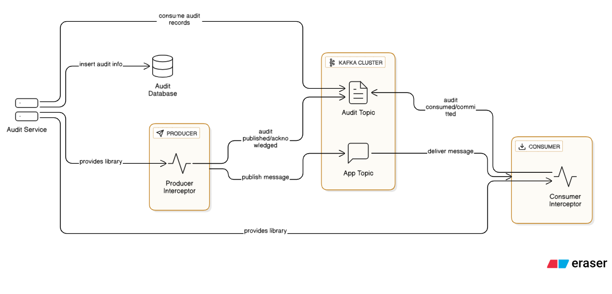

# 🛑Stop Logging Everything — Kafka Already Has the Truth

Hey Builders,

It’s been a few weeks since my last edition — I’ve been buried in both office work and personal commitments (yes, life does happen between Kafka topics 😅). But I’m back, and this one’s worth the wait.

Today, we’re tackling a problem that *every* team working with Kafka eventually faces — **tracking the complete lifecycle of a Kafka message without turning your codebase into a logging graveyard.**

Track the complete lifecycle of Kafka messages — from publish to process — using only Kafka-native features. No code changes. No shared schemas. Just clean observability.

## 🧩 The Problem: Tracking Messages the Old Way

Kafka is the beating heart of many modern systems — connecting microservices, streaming events, and moving data in real time.

But once your flows become even slightly complex, the questions start:

> ❓“Where did the message go?”
>
> ❓“Was it published? Was it processed? Who consumed it?”

To answer that, teams often:

* Create logging around publish/consume events.
* Maintain `msg_status` tables in producer and consumer databases.
* Share message schemas across services.
* Manually join logs or databases to debug failures.

It works — But it’s  **fragile** ,  **redundant** , and distracts teams from their actual job — building and scaling their services.

## 🚧 Why This Breaks in a Modern Microservices World

Here’s the kicker:

In a microservices architecture, your producer and consumer might be:

* Written in different programming languages.
* Owned by different teams.
* Deployed on different stacks.
* Not sharing any database at all.

That makes “just log it” or “share a DB table” not just messy — sometimes outright impossible.

## 🎯 The Goal: Full Lifecycle Message Tracking, Without Touching Services

What if you could track every Kafka message’s journey like this:

| Stage      | Status  | How to Detect                                 |
| ---------- | ------- | --------------------------------------------- |
| Produced   | `PUB` | Message appears in Kafka topic                |
| Broker ACK | `ACK` | Log append timestamp (`record.timestamp()`) |
| Consumed   | `CON` | Consumer reads the message                    |
| Processed  | `PRC` | Offset committed to Kafka by the consumer     |

And you could do it:

* **Without modifying producer/consumer logic**
* **Without forcing all services to share a database**
* **Using only Kafka metadata and internal topics**

---

## 💡The Insight:  The Kafka-Native Way

Kafka doesn’t just move messages — it *remembers* what happened to every one of them:

* When a message was appended to a topic
* Which consumer groups read it
* When those consumer groups committed their offsets

It’s all there. You just need to listen.

Now, imagine this:

Two teams — Producer Team and Consumer Team — work independently.

Neither wants to touch their business logic to add message tracking.

And you get a new requirement:

**“We need to track the full lifecycle of every Kafka message between them… without touching their code.”**

Sounds like a trick question, right?

It’s not. Kafka already has the answer.

## 🛠️ The Architecture: Kafka-Powered Audit Service

Here’s what a **decoupled audit tracker** looks like:

  

## 🧰 What the Audit Tracker Does

### 🎯 Enter: Interceptors + Audit Topics

We (the Audit Team) introduced a simple but powerful pattern:

1. **Create an internal Kafka topic** — e.g., `audit-internal-topic`.
2. **Attach ProducerInterceptor** to the producer service.
   * It creates an *audit record* whenever a message is published.
   * Sends this record to the `audit-internal-topic`.
3. **Attach ConsumerInterceptor** to the consumer service.
   * It creates an audit record whenever a message is received or processed.
   * Sends this record to the same `audit-internal-topic`.
4. **Have an Audit Service consume from `audit-internal-topic`** .

* Persists audit records into a database for analytics, metrics, and monitoring.

---

✅ **No change to the producer/consumer’s main code.**

✅ **Works across teams, languages, and deployments.**

✅ **Scales with your Kafka cluster.**

---

## 📊 Bonus: What You Unlock With This Approach

* 🔍 **End-to-End Message Visibility**

  Know exactly where each message is and what happened to it.
* 🔔 **Latency Metrics**

  Measure time from `PUB` to `PRC` across consumers.
* 🧯 **Dead Message Detection**

  Alert on messages stuck in `PUB` or `CON` state for too long.
* 📉 **Eliminate Redundant Logs**

  Services don’t need to log Kafka metadata or insert into shared tracking tables.

## ✍️ Closing Thoughts

Logging *everything* might feel safe… until you’re drowning in gigabytes of “message sent” lines and still can’t answer “what happened to message ID 12345?”

Kafka isn't just a message bus — it's a living, breathing audit log.

Kafka’s native features let you track the truth at the platform level — cleanly, scalably, and without disrupting the teams building the actual business logic.

Because the real win isn’t just knowing where a message went…

It’s doing it  **without slowing anyone else down** .

If you’re building distributed systems and struggling with tracking, logging, and monitoring — stop chasing messages manually. Start listening to what Kafka already knows.

💬 **Your turn:**

How does your team track Kafka message lifecycles today?

Are you still in the “log everything” phase, or have you tried platform-native tracking?

If this sparked ideas, share it with your team — and let’s stop logging ourselves into chaos.

## 📚Further Reading

## 📅 Coming Up in Future Editions:

Here’s a peek into what’s brewing in the upcoming issues — each exploring a crucial facet of modern system design:

* **🧵 Taming Threads and Scaling Smarter**

  *The Art of Managing Concurrency in the Age of Multicores and Microservices*
* **📏 SLAs, SLOs, and the True Measure of Client Experience**
* *How to Set, Measure, and Align Reliability Goals Across Teams*
* **🎨 Designing for Delight — UX at the Infrastructure Layer**

  *Why Developer Experience (DX) Matters as Much as UX*
* **🛠️ Self-Healing Systems**

  *Building Systems That Monitor, Repair, and Recover Autonomously*
* **🔐 Security by Design — Embedding Trust Into Your Architecture**

  *Proactive Defense from the First Commit to Production*

### 🔗 Want the Code?

I’ve shared a working implementation with interceptors, audit topic consumers, and DB persistence here:

👉 [GitHub: kafka-msg-audit](https://github.com/pradeepngupta/kafka-msg-audit)

This repo demonstrates how you can plug this into your architecture *today* without rewriting your services.

Until next time,

**Stay curious, go beyond the stack.**
