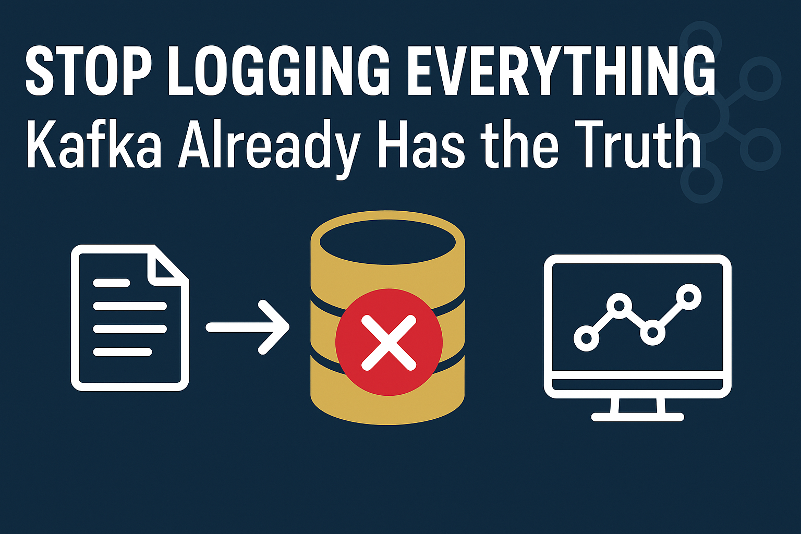

# 🛑Stop Logging Everything — Kafka Already Has the Truth

**Hey Beyond the Stack Community Builders,**

It’s been a few weeks since my last edition — I’ve been balancing both demanding office projects and personal obligations — the realities of life between Kafka topics, as always 😅. I’m excited to be back with an edition that delivers genuine value.

Today, I’m focusing on a technological challenge that every team working with Kafka encounters sooner or later: **how to reliably track the complete lifecycle of every Kafka message — without drowning in massive log files or creating a maintenance nightmare.**

You can achieve full message traceability, from publication to processing, using Kafka’s native features alone — **no invasive code changes, no forced schema sharing, just clear, scalable observability.**

**I’m deeply grateful to all of you for your patience and for waiting for me to return.**

---

## 🧩 The Problem: Tracking Messages the Old Way

**Kafka** is the beating heart of many modern systems — connecting microservices, streaming events, and moving data in real time.

But once your flows become even slightly complex, the questions start:

> ❓“Where did the message go?”
>
> ❓“Was it published? Was it processed? Who consumed it?”

To answer that, teams often:

* Create logging around publish/consume events.
* Maintain `msg_status` tables in producer and consumer databases.
* Share message schemas across services.
* Manually join logs or databases to debug failures.

It works — But it’s  **fragile** ,  **redundant** , and distracts teams from their actual job — building and scaling their services.

## 🚧 Why This Breaks in a Modern Microservices World

Here’s the kicker:

In a microservices architecture, your producer and consumer might be:

* Written in different programming languages.
* Owned by different teams.
* Deployed on different stacks.
* Not sharing any database at all.

That makes “just log it” or “share a DB table” not just messy — sometimes outright impossible.

## 🎯 The Goal: Full Lifecycle Message Tracking, Without Touching Services

What if you could track every Kafka message’s journey like this:

| Stage      | Status  | How to Detect                                 |
| ---------- | ------- | --------------------------------------------- |
| Produced   | `PUB` | Message appears in Kafka topic                |
| Broker ACK | `ACK` | Log append timestamp (`record.timestamp()`) |
| Consumed   | `CON` | Consumer reads the message                    |
| Processed  | `PRC` | Offset committed to Kafka by the consumer     |

And you could do it:

* Without modifying producer/consumer logic
* Without forcing all services to share a database
* Using only Kafka metadata and internal topics

---

## 💡The Insight:  The Kafka-Native Way

Kafka doesn’t just move messages — it *remembers* what happened to every one of them:

* When a message was appended to a topic
* Which consumer groups read it
* When those consumer groups committed their offsets

It’s all there. You just need to listen.

Now, imagine this:

Two teams — Producer Team and Consumer Team — work independently.

Neither wants to touch their business logic to add message tracking.

And you get a new requirement:

> **“We need to track the full lifecycle of every Kafka message between them… without touching their code.”**

Sounds like a trick question, right?

It’s not. Kafka already has the answer.

---

## 🛠️ The Architecture: Kafka-Powered Audit Service

Here’s what a **decoupled audit tracker** looks like:

  

## 🧰 What the Audit Tracker Does

### 🎯 Enter: Interceptors + Audit Topics

We (the Audit Team) introduced a simple but powerful pattern:

1. **Create an internal Kafka topic** — e.g., `audit-internal-topic`.
2. **Attach ProducerInterceptor** to the producer service.
   * It creates an *audit record* whenever a message is published.
   * Sends this record to the `audit-internal-topic`.
3. **Attach ConsumerInterceptor** to the consumer service.
   * It creates an audit record whenever a message is received or processed.
   * Sends this record to the same `audit-internal-topic`.
4. **Have an Audit Service consume from `audit-internal-topic`** .

* Persists audit records into a database for analytics, metrics, and monitoring.

---

✅ No change to the producer/consumer’s main code.

✅ Works across teams, languages, and deployments.

✅ Scales with your Kafka cluster**.**

---

## 📊 Bonus: What You Unlock With This Approach

* 🔍 **End-to-End Message Visibility**

  Know exactly where each message is and what happened to it.
* 🔔 **Latency Metrics**

  Measure time from `PUB` to `PRC` across consumers.
* 🧯 **Dead Message Detection**

  Alert on messages stuck in `PUB` or `CON` state for too long.
* 📉 **Eliminate Redundant Logs**

  Services don’t need to log Kafka metadata or insert into shared tracking tables.

> By leaning on Kafka’s native capabilities instead of sprinkling custom tracking code across services, you not only reduce engineering effort but also cut down on operational noise. This means faster troubleshooting, cleaner observability, and a design that naturally scales as your message volume and consumer count grow—without rewriting a single line of business logic.

## ✍️ Closing Thoughts

Logging *everything* might feel safe… until you’re drowning in gigabytes of “message sent” lines and still can’t answer “what happened to message ID 12345?”

Kafka isn't just a message bus — it's a living, breathing audit log.

Kafka’s native features let you track the truth at the platform level — cleanly, scalably, and without disrupting the teams building the actual business logic.

Because the real win isn’t just knowing where a message went…

It’s doing it  **without slowing anyone else down** .

If you’re building distributed systems and struggling with tracking, logging, and monitoring — stop chasing messages manually. Start listening to what Kafka already knows.

💬 **Your turn:**

How does your team track Kafka message lifecycles today?

Are you still in the “log everything” phase, or have you tried platform-native tracking?

If this sparked ideas, share it with your team — and let’s stop logging ourselves into chaos.

## 📚Further Reading

### 🛠 **Core Concepts & Official Docs**

How producer & consumer interceptors work, and how to plug them into your pipeline.

* 📄 [Apache Kafka — Producer Interceptors](https://kafka.apache.org/documentation/#producerconfigs_interceptor.classes)
* [📄Apache Kafka - Consumer Interceptor](https://kafka.apache.org/documentation/#consumerconfigs_interceptor.classes)
* 📄 [**Audit Logs in Confluent Platform**]()

*Understand how Confluent captures key security and operational events directly in Kafka topics.*

---

### Deep Dives: Interceptors & Observability

* [**Interceptors for librdkafka** (Platformatory)](https://platformatory.io/blog/librdkafka-interceptors/)

  *Learn how to build C-based interceptors for librdkafka, plugin patterns, and “gotchas” like read-only limitations.* [platformatory.io](https://platformatory.io/blog/librdkafka-interceptors/?utm_source=chatgpt.com)
* [**Kafka Producer-Advance** (Narayan Kumar)](https://mail-narayank.medium.com/kafka-producer-advance-3b47f77af4bc)

  *Explains how interceptors enrich messages (headers, onSend, onAcknowledge), idempotent producers, batching, and more.* [Medium](https://mail-narayank.medium.com/kafka-producer-advance-3b47f77af4bc)
* [**Some Cool Kafka Features You May Not Know About** (Zenika)](https://medium.zenika.com/some-cool-features-you-may-not-know-about-apache-kafka-953a601f5af5)

  *Covers custom metric reporters, JMX extensions, and other advanced Kafka client features.* [Zenika](https://medium.zenika.com/some-cool-features-you-may-not-know-about-apache-kafka-953a601f5af5)

---

### Observability & Instrumentation

* [Instrumenting Kafka Clients with OpenTelemetry](https://opentelemetry.io/blog/2022/instrument-kafka-clients/)

*Step-by-step guide for adding OpenTelemetry tracing to Kafka clients for end-to-end observability.* [OpenTelemetry](https://opentelemetry.io/blog/2022/instrument-kafka-clients/)

* 📄 [**Tracing Data Flow in Kafka Ecosystems** (LinkedIn Engineering)
  ](https://www.linkedin.com/pulse/tracing-data-flow-kafka-ecosystems-brindha-jeyaraman-jyp9c/)

*How LinkedIn tracks and debugs Kafka message flows at massive scale.*

* 📄 [**Kafka End-to-End Monitoring** (Spoud)]()

*Use synthetic producers/consumers to validate your Kafka health in real time.*

---

### 🔍 **Tracking & Monitoring at Scale**

* 📄 [**Configure Kafka to Minimize Latency** (Confluent)]()

  *Producer and broker settings that affect end-to-end latency.*
* 📄 [**The Kafka Monitoring Blog Post to End Most Posts** (Confluent)]()

  *Key metrics, alerting strategies, and Control Center dashboards.*
* 📄 [**Comprehensive Guide to Kafka Monitoring** (RisingWave)]()

  *Best practices for throughput, lag, and error monitoring in production.*

---

### 📦 **Keeping Messages Consistent**

* 📄 [Confluent Schema Registry Docs](https://docs.confluent.io/platform/current/schema-registry/index.html)

  *If you need consistent message formats for your audit service, this is essential.*

---

### 💻 **Hands-On Code Samples**

* 💻 [GitHub — kafka-msg-audit](https://github.com/pradeepngupta/kafka-msg-audit) *(My Implementation)*

  *ProducerInterceptor + ConsumerInterceptor + Audit Consumer in action.*
* 💻 [GitHub — Kafka Interceptor Example](https://github.com/GuillaumeWaignier/kafka-tracing-interceptors/tree/master)

  *Minimal example of interceptor registration and usage.*

---

### 📈 **Operational Best Practices**

* 📄 [Confluent — Monitoring Kafka Performance]()

  *Key metrics & alerts to keep your Kafka audit service healthy.*

---

## 📅 Coming Up in Future Editions:

Here’s a peek into what’s brewing in the upcoming issues — each exploring a crucial facet of modern system design:

* **🧵 Taming Threads and Scaling Smarter**

  *The Art of Managing Concurrency in the Age of Multicores and Microservices*
* **📏 SLAs, SLOs, and the True Measure of Client Experience**
* *How to Set, Measure, and Align Reliability Goals Across Teams*
* **🎨 Designing for Delight — UX at the Infrastructure Layer**

  *Why Developer Experience (DX) Matters as Much as UX*
* **🛠️ Self-Healing Systems**

  *Building Systems That Monitor, Repair, and Recover Autonomously*
* **🔐 Security by Design — Embedding Trust Into Your Architecture**

  *Proactive Defense from the First Commit to Production*

---

## 🛠 Ready to Try It Yourself?

I’ve put together a fully working example featuring  **Producer/Consumer Interceptors** , an  **Audit Topic** , and **Database Persistence** using an embedded Kafka provided by **spring-kafka-test** and the  **H2 database** . The project is tested with **JUnit 5** and structured as a multi-module Maven repository, which can also be converted into separate deployable microservices.

👉 **GitHub:** [kafka-msg-audit](https://github.com/pradeepngupta/kafka-msg-audit)

Clone it, run it, and explore how Kafka’s native capabilities can give you end-to-end message traceability—cleanly, scalably, and without the logging chaos. All this without touching your core business logic.

Until next time,
**Stay curious. Keep building. Go beyond the stack.**
