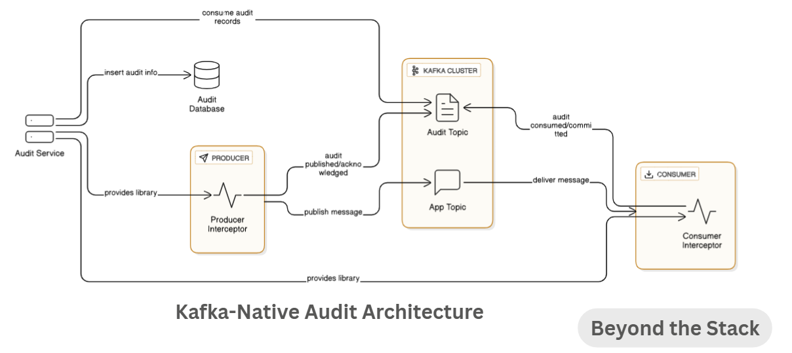
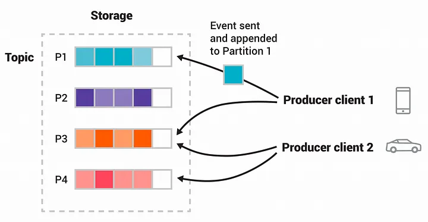
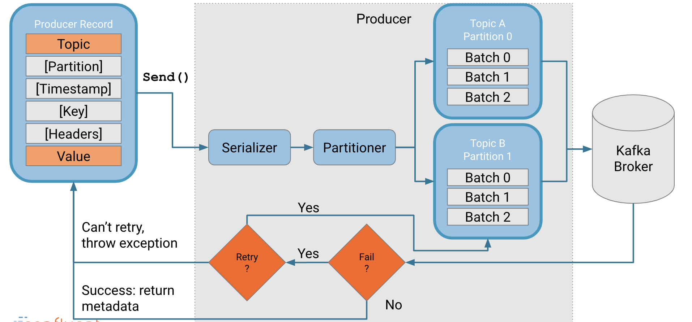
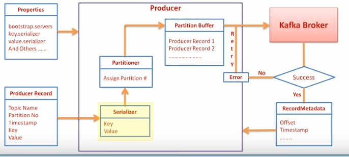
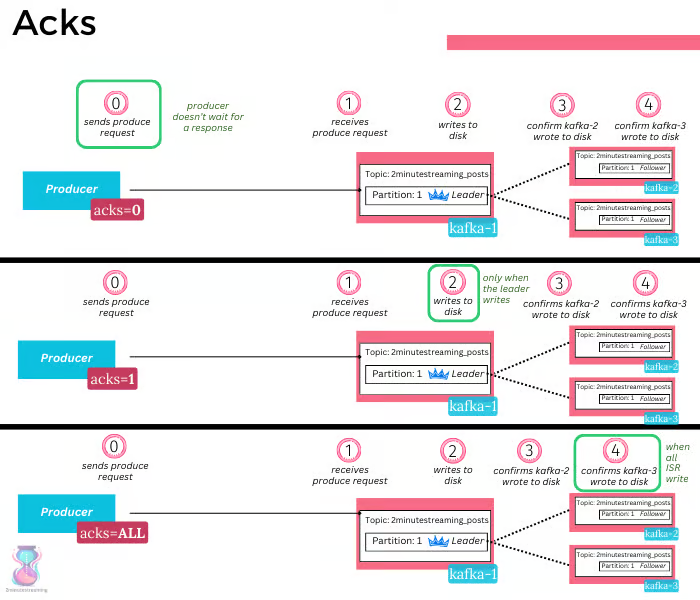
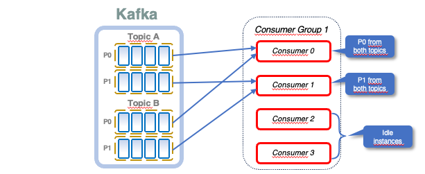
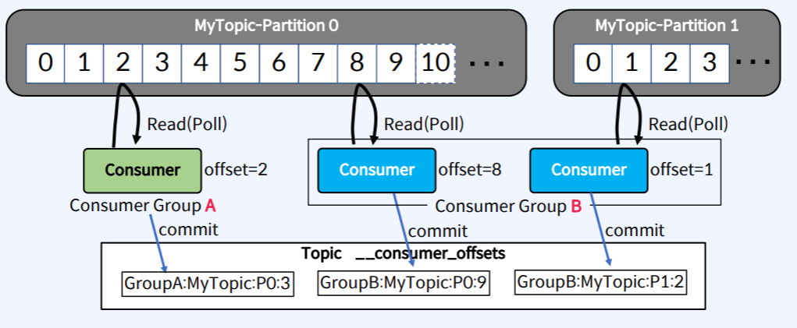
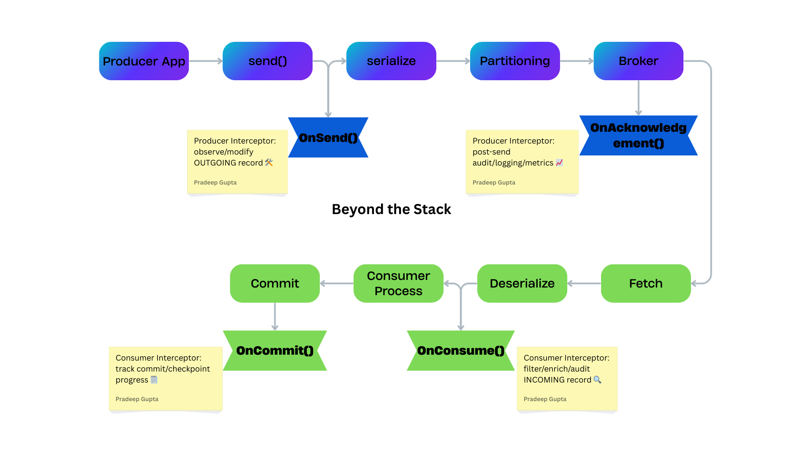

# **Kafka Interceptors — The Power Tool Most Devs Overlook (Lifecycle, Patterns & Real-World Use Cases)**

**Ever needed to log every Kafka message, mask confidential data on the fly, or inject chaos without upending your application code?**

99% of Kafka guides focus on brokers, offsets, consumers…
But few mention the hidden levers — *Kafka Interceptors* — that unlock new superpowers for your data pipeline:

* **Enrich outgoing events with trace IDs, user info, or tenant metadata automatically**
* **Mask sensitive fields for PCI-DSS or GDPR right inside your producer/consumer**
* **Track delivery, audit, or debug messaging flows without touching primary business logic**
* **Simulate failures or retries for chaos testing, all via configuration**

In this technical breakdown, you’ll get:

* **Lifecycle diagrams** for producer & consumer interceptors (when each method triggers, threading impacts)
* **6 concrete interceptor patterns** battle-tested by data teams (including code tips & gotchas)
* **Do’s, don’ts, and best practices** — so you avoid the performance traps most guides miss

If you’ve worked with Kafka producers and consumers for any length of time, chances are **99% of your attention** has gone to *topics, partitions, offsets, and brokers*.

But **hidden between your application code and Kafka** lies a secret weapon — ***Kafka Interceptors*** — that can *save you from messy logging, hard-to-trace bugs, and scattered auditing logic*.

And they can make your life *way* easier… if you know how to use them.

**TL;DR:**
Kafka interceptors aren’t just callbacks — they’re the ultimate “glue code” for seamless logging, compliance, routing, and resilience at scale.

👉 **If Kafka observability or compliance is on your roadmap, follow this newsletter and never miss out on deep dives—next week: Kafka In-Sync Replicas demystified!**

👇 **What’s the coolest Kafka interceptor hack you’ve pulled off?** Drop your story in the comments — feature spot open for next edition!

Welcome to the Edition 17 of **Beyond the Stack** and the 2nd part on Apache Kafka where we will be diving deep into the Kafka Native Architecture.

If you have not gone into Part 1, you can visit [here](https://www.linkedin.com/pulse/stop-logging-everything-kafka-already-has-truth-pradeep-gupta-mu2gc/)

---

## **Recap — **What Kafka Interceptors Really Do (and Why They’re Underused)****

Kafka interceptors are **client-side hooks** that allow you to **observe, modify, or monitor** messages **before they’re sent** (producer) or **before your application consumes them** (consumer).

Think of interceptors as **middleware hooks** in Kafka’s client library.

They let you run custom logic **before** and **after** sending a message (Producer side) or receiving a message (Consumer side) — without changing your main business logic.

They’re the perfect place for:

* **Message enrichment (add metadata, trace IDs)**
* **Logging/auditing**
* **Filtering unwanted messages**
* **Metrics collection**

In Part 1 we have gone through the Kafka Native Audit Architecture. And also seen the [sample code](https://github.com/pradeepngupta/kafka-msg-audit) in my Github.

---

## **How to Control Kafka’s Message Flow with Producer Interceptors?**

Before diving into the methods, let’s set the stage.

In Kafka:

* **Messages** are grouped by  **topics** .
* **Producers** publish messages to topics.
* **Consumers** subscribe to topics to consume messages.

Each topic is split into **partitions** (Topic-Partitions).

* A **partition** belongs to a single topic and is an **ordered, immutable sequence** of messages.
* Kafka uses **replication** to improve fault tolerance: each partition has one **leader replica** and one or more  **follower replicas** .
* The leader handles  **reads and writes** ; followers  **sync data from the leader** .
* If the leader fails, Kafka elects a follower as the new leader to keep the service running.

This replication mechanism doesn’t just affect durability — it also changes when certain interceptor methods, like `onAcknowledgement()`, are triggered.

**Interface:**

<pre class="overflow-visible!" data-start="1260" data-end="1331">

<code class="whitespace-pre! language-java">org.apache.kafka.clients.producer.ProducerInterceptor<K, V>
</code>

</pre>

---

### **`onSend(ProducerRecord<K,V> record)`**

* **When called** : Immediately after the producer publishes the message into the Kafka client pipeline, but  **before serialization and partition assignment** .
* **Purpose** : Modify, enrich, validate the outgoing record.
* **Example** : Adding trace IDs, tagging environment metadata, schema validation.
* **Thread context** : Runs in the **application thread** that called `send()`.
* **Impact** : The serializer and partitioner work on the record returned from this method.

---

### **`onAcknowledgement(RecordMetadata metadata, Exception exception)`**

* **When called** : After the broker **writes the message to the leader partition and synchronizes with follower replicas** (based on the `acks` setting).
* `acks=0` → Called as soon as the message is buffered locally.
* `acks=1` → Called after leader writes the message.
* `acks=all` → Called after all in-sync replicas confirm the write.
* **Purpose** : Audit delivery success/failure, measure produce latency, update metrics.
* **Thread context** : Runs in  **I/O thread** , so it won’t block your main producer flow.

> 💡 acks (acknowledgements) is a producer client config denoting the number of brokers that acknowledge receipt of a record before the producer considers the write as successful.

> It supports three values - 0, 1 and all.

* ***acks=0*** - the producer won’t even wait for a response from the broker, it immediately considers the write successful once sent.
* ***acks=1*** - the producer considers the write successful  ***when the leader acknowledges the record*** . The leader broker will know to respond the moment it persists the record to disk.
* ***acks=all*** - the producer considers it successful when all of the ***in-sync*** replicas persist the record. The leader broker will respond once all the in-sync replicas persist the record.

---

### **`configure(Map<String, ?> configs)`**

* Loads interceptor configuration during instantiation.

---

### **`close()`**

* Cleans up resources on producer shutdown.

---

## How Consumer Interceptors Hook into Kafka’s Message Flow

Before we get into the interceptor methods, let’s recall  **how Kafka consumers read data** .

In Kafka:

* A **consumer group** is a set of consumers that work together to consume messages from a topic.
* Each **partition** in a topic is consumed by exactly one consumer in the group at any time.
  
* Messages in a partition are identified by an **offset** — a monotonically increasing number representing the message’s position.
* Consumers maintain their **current position** in each partition by committing offsets.

Offset management can be:

* **Automatic** (`enable.auto.commit=true`) — Kafka commits offsets at regular intervals in the background.
* **Manual** — The application explicitly commits offsets after processing messages, giving finer control.

This **offset commit** event is where the `onCommit()` interceptor hook comes into play.

**Interface:**

<pre class="overflow-visible!" data-start="2413" data-end="2484">

<code class="whitespace-pre! language-java">org.apache.kafka.clients.consumer.ConsumerInterceptor<K, V>
</code>

</pre>

### **`onConsume(ConsumerRecords<K,V> records)`**

* **When called** : After the consumer fetches messages from the broker and deserializes them, but  **before returning them to your application** .
* **Purpose** : Filter, mask, enrich, or audit incoming messages.
* **Example** : Dropping invalid messages, masking PII, adding processing metadata.
* **Thread context** : Runs in the **consumer poll thread** — blocking here will delay further polling and may trigger `max.poll.interval.ms` timeouts.
* **Config impact** :
* `max.poll.records` controls batch size passed here.
* Filtering in this method does **not** change committed offsets unless you drop messages before committing.

---

### **`onCommit(Map<TopicPartition, OffsetAndMetadata> offsets)`**

* **When called** : Just before offsets are committed to the broker.
* **Purpose** : Track consumption progress, build commit logs, integrate with external checkpoint systems.
* **Example** : Auditing consumption lag, debugging exactly-once delivery flows.
* **Thread context** : Runs in the same thread as the commit action.
* **Config impact** :
* If `enable.auto.commit=true`, this may be called periodically in the background.
* If manual commits are used, it’s called only when the application explicitly commits.

---

### **`configure(Map<String,?> configs)`**

* Reads consumer configs — can pass audit flags, filter criteria, etc.

---

### **`close()`**

* Cleanup before consumer shutdown.

---

## **Kafka Pipeline with Interceptor Hooks**

Here’s how interceptors fit into Kafka’s  **end-to-end message path** :

---

**Producer Flow**

`App → onSend() → Serializer → Partitioner → Broker Send → Broker Ack → onAcknowledgement() → App Callback`

**Consumer Flow**

`Broker → Fetch → Deserializer → onConsume() → App → Commit → onCommit()`

> *💡 If you find these interceptor tips useful, hit ‘Follow’ so you don’t miss my upcoming Kafka Storage deep dive.*

---

## **5 **Tips to Write High-Performance Interceptors****

* Keep interceptors **stateless** — easier to chain and test.
* Keep interceptors **lightweight —** Avoid blocking calls — remember, interceptors live in  **hot paths** .
* Use multiple interceptors for **separation of concerns** (logging vs filtering).
* Always handle exceptions gracefully — a bad interceptor should not bring down the client.
* Use **headers** for metadata instead of mutating the value.

> If these interceptor flows help you imagine new use cases — follow me for  **Part 3: Advanced Kafka Architecture Deep Dive** .

---

## **When You Should NOT Use Interceptors (and What to Use Instead)**

❌ For business-critical transformations — use Kafka Streams or Flink.

❌ For persistence — do it in your main application logic.

❌ For heavy analytics — push it to an async processing stage.

---

## 🏭 6 **Real-World Interceptor Patterns You Can Steal**

### **1. Data Enrichment Interceptor**

**Use Case:** Adding metadata before sending messages.

**Example:**

* An e-commerce order service enriches each outgoing event with `tenantId`, `correlationId`, and `requestSource` before publishing.
* This makes downstream processing simpler—consumers don’t have to guess where the data came from.

> 💡 *Pattern Tip:* Keep enrichment lightweight to avoid blocking the send process.

---

### **2. Compliance & Masking Interceptor**

**Use Case:** Automatically redacting sensitive fields like PAN numbers, credit card info, or personal IDs.

**Example:**

* A payments processor uses a producer interceptor to mask all but the last 4 digits of credit cards before sending to Kafka.
* Helps meet **PCI-DSS** compliance without burdening every producer with masking logic.

---

### **3. Monitoring & Audit Interceptor**

**Use Case:** Tracking and logging message metadata for observability.

**Example:**

* A bank’s Kafka pipeline uses a consumer interceptor that logs message offsets, partition IDs, and timestamps into an audit topic.
* This enables quick forensic analysis if a transaction is disputed.

---

### **4. Retry & Backoff Interceptor**

**Use Case:** Adding a retry mechanism for transient send failures.

**Example:**

* A logistics company wraps the Kafka producer send call in an interceptor that retries failed sends up to 3 times with exponential backoff.
* Avoids implementing retry logic in every producer microservice.

---

### **5. Chaos Testing Interceptor**

**Use Case:** Injecting faults for resilience testing.

**Example:**

* A streaming analytics team uses a producer interceptor that randomly delays or drops 1% of messages in staging to test consumer resilience.
* Helps simulate network jitter and ensures services are fault-tolerant.

---

### **6. Multi-Tenant Routing Interceptor**

**Use Case:** Routing messages dynamically to different topics based on tenant or region.

**Example:**

* A SaaS analytics platform uses an interceptor to rewrite the topic name based on the message’s `regionCode` before publishing.
* This enables regional isolation without modifying producer code.

> *What’s the most underrated interceptor hack you’ve used in production?*

---

## **📚 References**

### **Kafka Architecture & Core Concepts**

* [Understanding Kafka Architecture](https://www.sobyte.net/post/2022-02/kafka-architecture/)
* [Understanding Kafka Topics &amp; Partitions (StackOverflow)](https://stackoverflow.com/questions/38024514/understanding-kafka-topics-and-partitions)
* [Kafka — A Peek into Internals](https://medium.com/@sutanu3011/kafka-a-peek-into-internals-b47b9dc6fd0f)

---

### **Kafka Interceptors**

* [librdkafka Interceptors Overview](https://platformatory.io/blog/librdkafka-interceptors/)
* [GDPR in Kafka with Vault](https://bitrock.it/blog/technology/gdpr-in-kafka-with-vault.html)
* [Kafka Producer API — Jacek Laskowski GitBook](https://jaceklaskowski.gitbooks.io/apache-kafka/content/kafka-producer-KafkaProducer.html)
* [Kafka OTT Signature Interceptor Example](https://platformv.sbertech.ru/docs/public/EVD/2.4.0/EVTD/2.4.0/documents/developer-guide/instructions_interceptors_kafka-ott-signature-interceptor.html)

---

### **Kafka Reliability & Acknowledgements**

* [Kafka acks &amp; min.insync.replicas Explained](https://blog.2minutestreaming.com/p/kafka-acks-min-insync-replicas-explained)

---

### **Kafka Producers**

* [Producer’s Apache Kafka Producer API](https://sbolligorla.wordpress.com/producers-apache-kafka-producer-api/)

---

### **Kafka Consumers**

* [Kafka Consumer Group Protocol — Confluent](https://developer.confluent.io/courses/architecture/consumer-group-protocol/)
* [Kafka Consumer Deep Dive](https://medium.com/@jorgesnz/kafka-consumer-deep-dive-120129079fde)
* [Apache Kafka Consumer (Velog)](https://velog.io/@hyun6ik/Apache-Kafka-Consumer)
* [Kafka Consumer Lag — Performance Guide](https://www.redpanda.com/guides/kafka-performance-kafka-consumer-lag)

---

### **Kafka Transactions**

* [Exploring Kafka Transactions — Part 1](https://suryateja9618.medium.com/exploring-kafka-transactions-part-1-4eb7c3fbec5c)
* [Kafka Internals — espossible.tistory](https://espossible.tistory.com/82)

---

## 📅 Coming Up in Future Editions

Here’s a sneak peek at what’s brewing in upcoming issues — each exploring a critical facet of modern system design and streaming architecture:

* **🧵 Taming Threads and Scaling Smarter**

  *The art of managing concurrency in the age of multicores and microservices*
* **📏 SLAs, SLOs, and the True Measure of Client Experience**

  *How to set, measure, and align reliability goals across teams*
* **🎨 Designing for Delight — UX at the Infrastructure Layer**

  *Why Developer Experience (DX) matters as much as UX*
* **🛠️ Self-Healing Systems**

  *Building systems that monitor, repair, and recover autonomously*
* **🔐 Security by Design — Embedding Trust Into Your Architecture**

  *Proactive defense from the first commit to production*
* **The Couch Potato and the Bouncy Bunny — A System Design Story**

  A fun, story-driven analogy that explains lazy evaluation vs. eager execution in large-scale systems.
* **Java 21 Virtual Threads — Dude, Where’s My Lock?**

  Demystifying concurrency bottlenecks and showing how virtual threads change the game for scaling Java apps.
* **Kafka Deep Dives Sessions:**

  * **Kafka Storage with In-Sync Replicas (ISR) Explained** — *How ISR ensures data durability and high availability in Kafka clusters*
  * **Kafka Consumer Group Protocol Explained** — *The mechanism that keeps consumers coordinated, balanced, and fault-tolerant*
  * ***Kafka Consumer Lag Explained** — *What lag really means, why it matters, and how to keep it under control**
  * **Why LinkedIn Created NorthGuard?** — Limitations in Kafka Architecture led LinkedIn to create another System NorthGuard

Which one should I cover first? Tell me in the comments or DM me your vote.

---

## **Closing Thoughts**

Interceptors aren’t just convenience callbacks — they are  **deeply wired into Kafka’s client architecture** , influenced by broker responses, configs, and threading models.

Mastering interceptors means you can **inject intelligence directly into the Kafka pipeline** — no rewrites, no intrusive changes, just pure architectural leverage.

> TL;DR: Kafka interceptors aren’t just callbacks — they’re the ultimate “glue code” for seamless logging, compliance, routing, and resilience at scale.

> What’s the most clever interceptor trick you’ve pulled off? Drop it below — I might feature it in the next edition.

> ✅ Follow for weekly system design breakdowns—from Kafka to concurrency and beyond.
> Next up: [‘Kafka Storage with In-Sync Replicas Explained’—vote for what you want to see!]

I’ve put together a fully working example featuring  **Producer/Consumer Interceptors** , an  **Audit Topic** , and **Database Persistence** using an embedded Kafka provided by **spring-kafka-test** and the  **H2 database.** The project is tested with **JUnit 5** and structured as a multi-module Maven repository, which can also be converted into separate deployable microservices.

👉 **GitHub:** [kafka-msg-audit](https://github.com/pradeepngupta/kafka-msg-audit)

🚀 Clone the GitHub repo (link above) to get hands-on with the patterns—no signup, just open source goodness.

Until next time,

**Stay curious. Keep building. Go beyond the stack.**

`#ApacheKafka #KafkaInterceptors #DataEngineering #StreamingData #DistributedSystems #Microservices #DevNewsletter`
