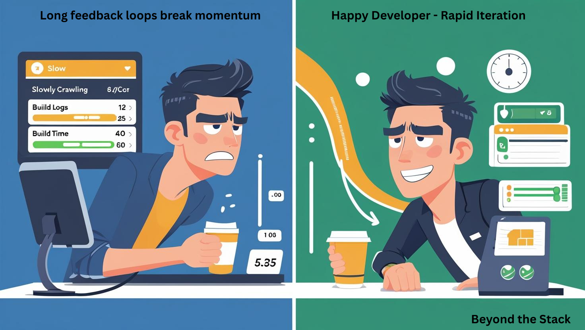
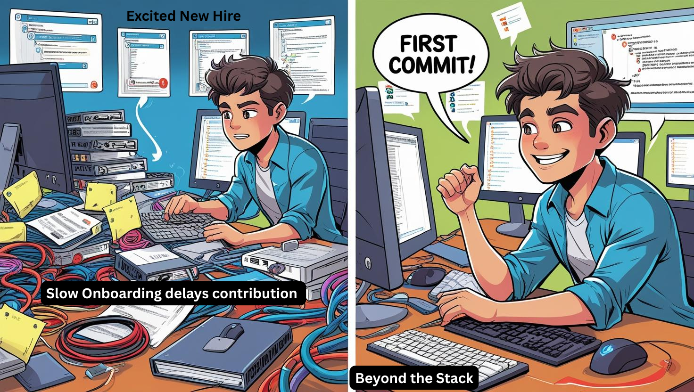
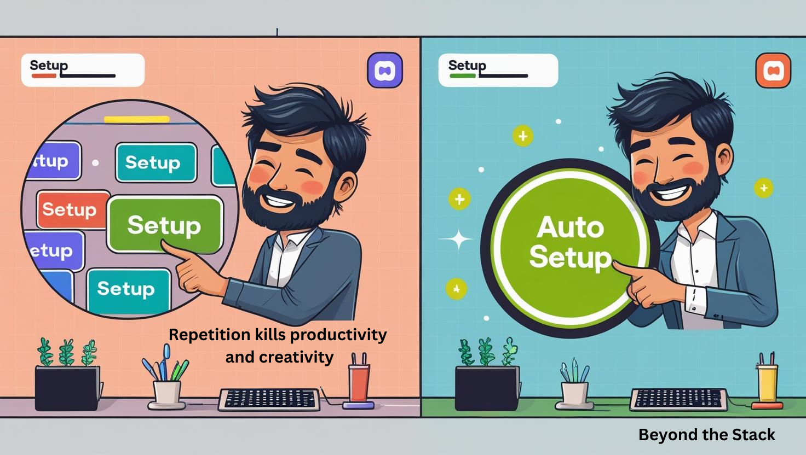

# 🎨 Designing for Delight — UX at the Infrastructure & Code Layer

**Why Developer Experience (DX) Matters as Much as UX**

> Bad DX is the tax you pay on every line of code — and it compounds daily.

In a startup, speed is survival.

In Big Tech, scale is the battlefield.

In the world of product, we obsess over end-user delight. But for the builders of those products — your engineers — the **developer experience** **is just as critical.**

Whether you’re a lean 5-person squad hustling in a co-working space or a sprawling FAANG org churning out code at scale, **bad DX is the silently** **erodes velocity**.

It’s the difference between a “2-week feature” and a 6-week slog.
It’s why talented engineers burn out and why projects pile up instead of ship.

So how do tech giants turn DX pain points into power-ups? And what can startups steal ***today***?

Let’s break down **5 common developer experience bottlenecks — with proven fixes (and a dash of AI) straight from the big leagues.**

**Note**: All Images are created using Canva AI

## 🚧 1. Slow Build & Test Cycles

**The Pain:**

You’re pumped, you push a change, you hit “Run Tests”… and now **you’re staring at a spinning progress bar for 30 minutes** . By the time CI finishes, you’ve lost your flow, opened Slack, and ended up in a dog-meme thread.

**Why It’s a DX Killer:**

Long feedback loops kill iteration. **Developers start batching risky changes just to avoid waiting** — leading to bigger merges, more conflicts, and scarier rollbacks.

**How Big Tech Squashes It:**

* **Test parallelization & sharding** — Spread tests across hundreds of CI runners for lightning-fast feedback..
* **Incremental builds** — Only rebuild what’s changed; cache dependencies to avoid painful re-installs.
* **Hermetic build systems —** Guarantee repeatable builds (e.g., Bazel).
* **AI-powered test selection:** Let intelligent agents predict the riskiest tests based on code changes — and run those first, shaving valuable time from every PR.

**Result:**

Feedback time drops from 30+ minutes to under 5. **A 10-person team gains back ~10 hours/week — an entire sprint every quarter**.

---

## 🖥 2. “It Works on My Machine”

**The Pain:**

You demo your feature to the team. It works like magic. You push. CI explodes. Staging breaks. The PM’s eyebrow twitches.

**Why It’s a DX Killer:**

Debugging environment drift is a productivity black hole. Local configs, hidden dependencies, and OS quirks waste hours.

**How Big Tech Squashes It:**

* **Containerized environments:** Docker everywhere so local == staging == prod.
* **Immutable infrastructure:** Every tool version locked; no “it worked for me.”
* **Infrastructure as code:** Spin up identical environment every time, automatically.
* **AI config linting:** Smart bots now scan Dockerfiles, YAML, and infra scripts for hidden mismatches **before** they hit CI.

**Result:**

If it works locally, it works everywhere. Less firefighting. Better sleep, more builds.

---

## 🧶 3. Large Monorepo Complexity

**The Pain:**

You search for a method. The codebase opens like an ancient labyrinth. Imports loop like Escher stairs. Your IDE fan spins up like a jet engine.

**Why It’s a DX Killer:**

Navigation and builds slow to a crawl. New code risks introducing subtle breakages.

**How Big Tech Squashes It:**

* **Smart dependency graphs:** Rebuild only the affected modules, not the world.
* **Semantic code search:** Instantly find usages and references across millions of lines (see: Meta Sapling, Google Code Search).
* **Automated code standards:** Linters and formatters enforces consistency pre-review..
* **AI-powered code assistants:** Ask “What uses this method?” or “How does this module work?” and get semantic answers, instantly.

**Result:**

Builds drop from hours to minutes. Devs work in their slice of the monorepo without drowning in noise.

---

## 🆕 4. Onboarding New Engineers

**The Pain:**

Your new hire is excited… but spends their first week installing SDKs, fixing PATH variables, and hunting for that “one magic script” no one documented.

**Why It’s a DX Killer:**

Slow onboarding kills early momentum and morale.

**How Big Tech Squashes It:**

* **Zero-setup dev environments:** Tools like Codespaces/Gitpod offer cloud IDEs, ready in minutes.
* **Interactive IDE onboarding:** Guided flows inside their editor.
* **Preloaded sample data:** No more “how do I seed this DB?”
* **AI onboarding buddies:** Chatbots answer “Where’s the repo for X?” or “How do I run Y?” instantly.

**Result:**

First commit on Day 1. Confidence soars. Faster ramp-up, happier hires.

---

## 🔁 5. Repetitive Dev Tasks

**The Pain:**

You’ve copy-pasted the same boilerplate into 4 services this week. Renamed the same config key 3 times. Clicked through the same “setup” wizard until you can do it blindfolded.

**Why It’s a DX Killer:**

Repetition kills creativity and slows delivery.

**How Big Tech Squashes It:**

* **Internal dev platforms:** Scaffold whole projects in one command.
* **Golden-path templates:** Pre-built blueprints for common architectures.
* **Self-service infra APIs:** Spin up resources without tickets.
* **AI code generators:** Prompts driven CRUD, configs, or pipelines without manual toil.

**Result:**

70–90% less time wasted on setup, far more time on meaningful work.

---

## 🏎 The Startup Power-Up: 3 Quick Wins for This Week

1. **Enable caching in CI** — cut dependency download time immediately.
2. **Add pre-commit hooks with lint + tests** — catch issues before CI.
3. **Spin up a zero-setup dev env** — use Gitpod or Codespaces.

**Small moves now = big velocity later.**

**In startup land, that’s survival. 
**

---

## ✍️ Closing Thoughts

🚀 **Don’t let bad DX slow you down —** pick one fix and implement it  *today* **. Your future velocity will thank you.**

**So, what will you implement first?** Pick one DX fix from above and put it in play—today**. Momentum is your moat, and it’s yours for the taking.**

**Have you already leveled up your DX?** Don’t keep it a secret — share your wins with the world and **inspire the next wave of high‑velocity teams.** 🚀

---

## 📚 References

* [Google’s Bazel Build System](https://bazel.build/) - A fast, scalable, multi-language and extensible build system.
* [Meta Engineering Productivity](https://engineering.fb.com/category/developer-tools/) - DevInfra at Meta
* [Netflix Tech Blog — Developer Tools](https://netflixtechblog.com/) - Dev tools at Netflix
* [GitHub Codespaces](https://github.com/features/codespaces) - Secure Development made Simple
* [Gitpod — Instant Dev Environments](https://www.gitpod.io/) - AI Devs helping team to clean backlog

---

## 📅 Coming Up in Future Editions:

Here’s a peek into what’s brewing in the upcoming issues — each exploring a crucial facet of modern system design:

* **🧵 Taming Threads and Scaling Smarter**

  *The Art of Managing Concurrency in the Age of Multicores and Microservices*
* **📏 SLAs, SLOs, and the True Measure of Client Experience**
* *How to Set, Measure, and Align Reliability Goals Across Teams*
* **🛠️ Self-Healing Systems**
* *Building Systems That Monitor, Repair, and Recover Autonomously*
* **🔐 Security by Design — Embedding Trust Into Your Architecture**

  *Proactive Defense from the First Commit to Production*

---

## 📣 Stay Ahead of the Curve

✉️ Like deep dives like this?

🧵 Follow **Beyond the Stack** for real-world architectural insights.

🧠 Learn how to build systems that scale, fail gracefully, and deliver value — one event at a time.

👉 [Subscribe Now](#)
