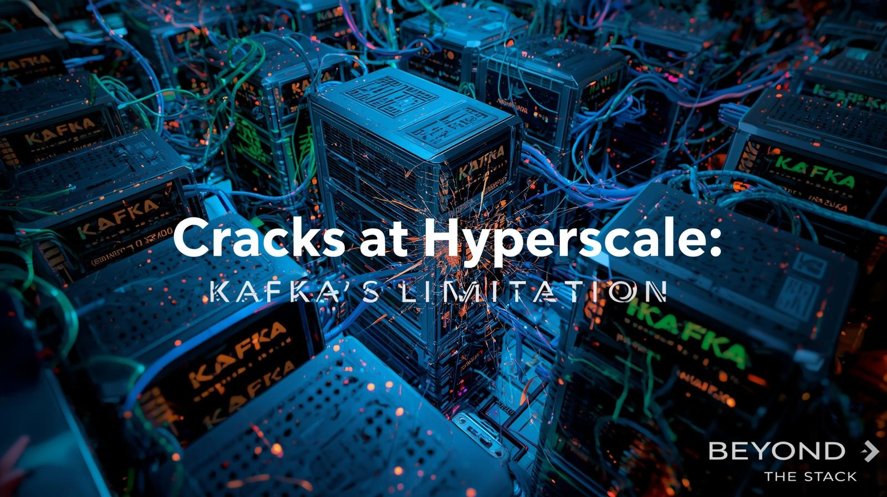
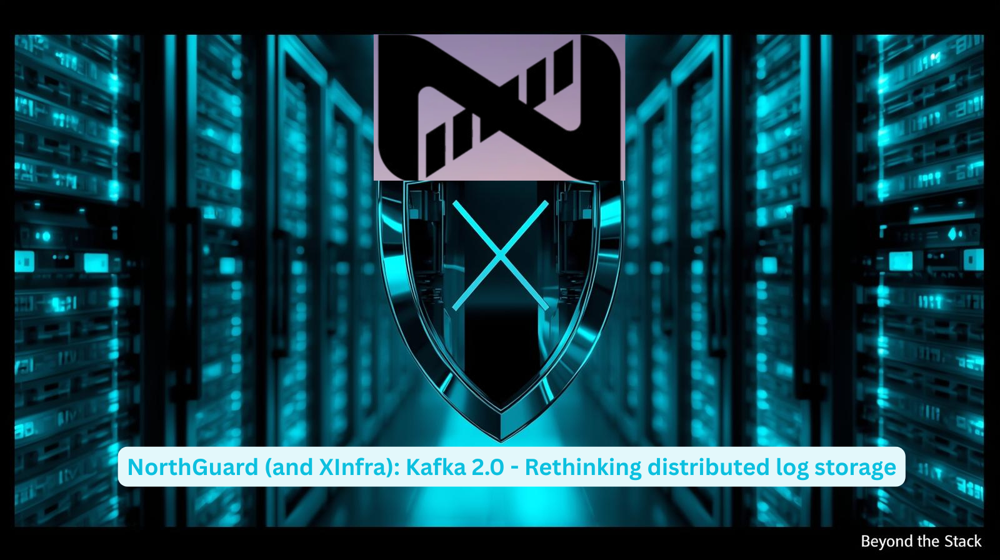
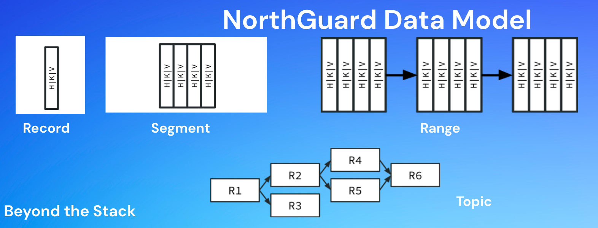
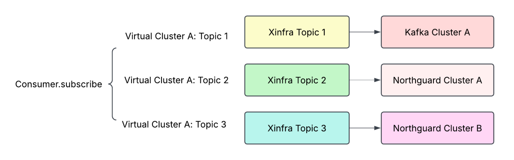

**Beyond the Stack – Edition - 18 #BeyondTheStack**

# Why LinkedIn Created Kafka – And Why It’s Moving to NorthGuard

This edition dives into a question many of you have been asking in the **Beyond the Stack community**: 

**Why did LinkedIn **—** the birthplace of Kafka **—** feel the need to build NorthGuard?**

**How did a LinkedIn hack for brittle XML pipelines spark a global streaming revolution — and what comes next now that even LinkedIn is outgrowing Kafka?**

Before we get started, a **big thank you** for the incredible engagement on my last edition. Your comments, shares, and DMs show how deeply this community values exploring the ‘**why**’ behind the systems we use every day.

Drop a comment below with how you or your company is using Kafka—best stories will get a shout-out in the next edition.

---

## **From the Vault: Past Editions Worth Checking Out**

If you’re new here or want to catch up, here’s a quick peek at some past editions from the journey so far:

* Curious about **who’s behind this**? Check out my [very first edition](https://www.linkedin.com/pulse/why-beyond-stack-developers-journey-from-code-cloud-pradeep-gupta-1z7pc) where I share my 21-year developer journey and what led me here.
* Got **a thing for startups**? The[ 4th edition ](https://www.linkedin.com/pulse/from-scripts-startup-story-behind-touchless-billing-solution-gupta-eg7rc/)dives into my experience building a digital receipts startup—spoiler: it’s a wild ride!
* **Into AI?** My [8th edition](https://www.linkedin.com/pulse/origination-agentic-ai-systems-new-era-modular-composable-gupta-mkvic/) explores the exciting evolution to agentic AI and what that means for tech’s future.
* And **for the Kafka fans** out there, don’t miss the previous two editions ([here ](https://www.linkedin.com/pulse/stop-logging-everything-kafka-already-has-truth-pradeep-gupta-mu2gc/)and [here](https://www.linkedin.com/pulse/kafka-interceptors-power-tool-most-devs-overlook-lifecycle-gupta-fsdzc/)) that go deep into Kafka’s architecture and key technical insights.

Feel free to give these a read, and if you haven’t already, hit **subscribe** so you don’t miss what’s coming next!

Now let’s unpack the story—starting with **How Linkedin solved its Data Chaos 15 years ago!**

---

## Why Kafka Was Born: Solving LinkedIn’s Data Chaos

Back in the early 2010s, LinkedIn’s data systems were bursting at the seams. **Batch XML pipelines** were brittle and slow, and real-time monitoring lived in isolated silos. This “data chaos” meant insights were delayed, systems couldn’t talk to each other, and teams were stuck waiting for centralized data teams to process requests.

The pain points were everywhere:

* Dozens of brittle XML schemas impossible to scale
* Long delays before data was available
* Siloed systems that couldn’t be combined for richer insights
* A centralized data team became a bottleneck.

LinkedIn needed a **real-time, scalable, and durable backbone**—a flexible solution that could handle data at massive scale while allowing any system to publish or consume data independently.

That’s how **Kafka came to life**: designed to unify batch and stream data into one highly reliable system.

And along with the above, LinkedIn developed Kafka to:

* Deliver **durability**, **horizontal scalability**, **real-time streaming** through log abstraction.
* Enable **decoupling** of producers and consumers with retention-based buffering.
* Support **high fan-out**, real-time data availability.
* Enable **schema-driven development** (Avro, schema registry, versioning), ensuring seamless integration across platforms

With log abstraction for durability, Avro + Schema Registry for schema governance, and retention buffering for replay, Kafka unified LinkedIn’s batch and stream worlds becoming the **central nervous system of LinkedIn** — and eventually, the world.

---

## Where Kafka Hits the Wall

Fast-forward to today, LinkedIn runs Kafka at an unimaginable scale: 

* **32 trillion records/day**
* **17 PB/day throughput**
* **~400,000 topics across 150 clusters**
* **10,000+ machines**

And At this scale, **Kafka’s original design assumptions were tested like never before** — forcing LinkedIn to rewrite the rules.

### **Key Limitations of Kafka at LinkedIn Scale**

* **Scalability Hits** : Metadata growth and cluster fragmentation meant Kafka couldn't manage cluster scaling without manual sharding and spinning up new clusters
* **Operational Complexity** : Load balancing, broker placement, and cluster operations became overwhelming. LinkedIn needed an entire ecosystem just to manage Kafka clusters
* **Partition-Based Constraints** : Partitions were heavy units for replication, limiting flexibility for rebalancing, increasing downtime, and constraining availability and consistency
* **Durability & Consistency** : Kafka’s eventual consistency and replication approach weren’t robust enough for critical workloads at hyperscale

In short: **Kafka worked wonders**, but at LinkedIn’s hyperscale, its design was showing limits.

---

## NorthGuard: A Bold New Blueprint - Kafka 2.0 - Rethinking distributed log storage

To break **Kafka’s ceiling,** LinkedIn built **NorthGuard**—an evolved system inspired by Kafka but reimagined for modern scale.

**NorthGuard** replaces heavy partitions with lightweight segments and ranges, enabling automatic sharding, self-balancing clusters, and much stronger consistency guarantees that mission-critical systems demand.

**NorthGuard** is a new internally built log storage system, accompanied by **XInfra** , a **Cross Infrastructure Virtualization Layer** to ease migration and compatibility

**NorthGuard represents a fundamental architectural departure from Kafka** .

### Overcoming Kafka’s Limitations with NorthGuard

#### 📌 **Partitioning**

* **Kafka:** Kafka relies on partition-based scaling, where partition counts are pre-decided and rebalancing is heavyweight.
* **NorthGuard:** In contrast, NorthGuard introduces **automatic sharding** that handles both data and metadata, removing the burden of manual configuration.

#### ⚙️ **Cluster Management**

* **Kafka:** Scaling a Kafka cluster requires careful planning and manual intervention — adding brokers, triggering rebalances, and monitoring skewed partitions.
* **NorthGuard:** NorthGuard shines here with **self-balancing and self-healing** capabilities. It adapts to changing loads and failures without human intervention.

#### 💾 **Storage Model**

* **Kafka:** Kafka uses log segments per partition. While effective, it can lead to uneven disk usage and maintenance challenges over time.
* **NorthGuard:** Instead of isolated log segments, NorthGuard employs **log striping across disks** , optimizing performance and capacity utilization.

#### 🔄 **Consistency**

* **Kafka:** Kafka replication ensures durability, but gaps can occur until followers fully sync—insufficient for some mission-critical workloads.
* **NorthGuard:** provides **stronger consistency** guarantees ideal for mission-critical uses.

#### ⚡**Workload Tolerance**

* **Kafka:** Hotspots (overloaded partitions or brokers) are usually resolved manually, often leading to delays or service degradation.
* **NorthGuard:** Designed to prevent hotspots entirely through **adaptive workload distribution** , ensuring better throughput and efficiency.

### NorthGuard's Data Model

One of the biggest shifts in NorthGuard is its data model.

Kafka relies on **partitions** as the core unit of scaling and replication—powerful, but heavyweight and painful to rebalance at hyperscale.

NorthGuard takes a different path. It breaks data into **smaller, flexible segments** that are grouped into ranges. These ranges can be split or merged dynamically, giving NorthGuard far more agility in balancing load and scaling capacity.

In short:

* **Kafka = partitions (heavy, rigid)**
* **NorthGuard = segments + ranges (lightweight, flexible)**

This change under the hood is what enables NorthGuard’s stronger consistency, self-balancing operations, and “lights-out” scalability.

## XInfra - A Virtualization Layer

Behind the scenes, LinkedIn didn’t want to disrupt thousands of apps overnight. That’s why they developed **XInfra**, a Cross Infrastructure Virtualization Layer that seamlessly bridges Kafka and NorthGuard.

With XInfra, LinkedIn maintains backwards compatibility, enables dual-writes for safe migrations, and keeps apps running smoothly through infrastructure transitions.

XInfra provides:

* **Virtual Topics** – Apps don’t care if data is on Kafka or NorthGuard.
* **Dual-Writes** – Safe, ordered migration with rollback capability.
* **Zero App Changes** – Over 90% of LinkedIn apps already run on XInfra clients.

---

## Summary

Here’s a summary table of where Kafka hit bottlenecks at hyperscale—and how NorthGuard addresses them.

| Area                   | Original Kafka Design at LinkedIn               | Limitations Observed Over Time                                 | NorthGuard & XInfra Enhancements                              |
| ---------------------- | ----------------------------------------------- | -------------------------------------------------------------- | ------------------------------------------------------------- |
| Motivation             | Batch & real-time pipelines too manual/isolated | Scalability, consistency, schema issues, operations complexity | Segment-based, schema-driven, decoupled pipelines             |
| Replication Unit       | Partitions                                      | Heavyweight, inflexible, tedious rebalances                    | Segments (~1GB/hour), lightweight replication, auto balancing |
| Metadata Handling      | Single controller                               | Bottlenecks at hyperscale                                      | Sharded metadata via vnodes + Raft                            |
| Consistency/Durability | Eventual consistency                            | Insufficient for critical systems                              | Strong fsync guarantees, robust replication                   |
| Operations             | Manual scaling & cluster management             | High operational burden                                        | Self-balancing, lights-out ops, high throughput/low latency   |
| Migration              | No easy upgrade path                            | Hard to migrate systems without downtime                       | XInfra virtualization with dual-writes, transparent migration |

## Lessons for Every Engineering Team

Kafka was created to unify batch and stream data pipelines. NorthGuard was created to solve Kafka’s limits at extreme scale. Together, they tell a powerful story:

* **Every abstraction has limits** —at a certain scale, new primitives are needed.
* **Durability and consistency matter more at scale** —eventual consistency isn’t always enough.
* **Virtualization layers (like XInfra) ease disruptive migrations** —a playbook worth remembering.

For most organizations, **Kafka remains more than enough** . But LinkedIn’s journey shows us how systems evolve when scale forces a rethink of the fundamentals.

---

## What Should You Do If You’re Not LinkedIn?

### A Practical Streaming Playbook for Every Team

* **If You’re Handling <100M Events/Day:**
  **Stick with Apache Kafka**. It’s proven, robust, and more than enough for most organizations with modest real-time/data streaming needs. **Focus on clarity in schema management and solid monitoring**.
* **If You’re Growing Fast (100M–1B Events/Day):**
  **Start investing in automation for Kafka operations**—partition management, failover, and self-service tooling. **Document your scaling pain points**. If you notice frequent manual rebalancing or lag, it’s time to explore new patterns.
* **If You’re Hitting Partition or Metadata Pain:**
  **Investigate segment-based or sharded architectures**, even if you’re staying on Kafka. **Pay close attention to hot spots and uneven loads**—a signal you may need finer-grained or more flexible data distribution.
* **Planning a Migration or Big Upgrade?**
  **Consider building or adopting a “virtualization layer”** (like LinkedIn’s XInfra) that allows dual writes or seamless migration between streaming systems, so you can upgrade infrastructure with minimal application changes and risk.
* **If Always-On Consistency and Self-Healing Are Critical:**
  **Evaluate next-gen solutions** focused on automatic balancing, strong consistency, and operational simplicity. **Think beyond partitions**—ask if your biggest pain could be eliminated with new scaling or storage primitives.

> Remember: It’s not about following LinkedIn immediately—it’s about knowing what problems to expect as you scale, and adopting the right ideas before they become emergencies.
>
> Even small teams can borrow NorthGuard’s best lessons: **automation, flexibility, and simplicity win at every stage.**

---

## 📚 Further Reading

Want to dive deeper into Kafka’s origins and LinkedIn’s evolution toward NorthGuard? Here are some curated references:

### 📖 Background on Kafka’s Creation

* [Why Was Apache Kafka Created? – Stanislav Kozlovski](https://share.google/6KhlCNpbXvKh87FUS)

  Explains why LinkedIn built Kafka in the first place—solving brittle XML pipelines, schema chaos, and batch + real-time silos.

### 📰 LinkedIn Engineering Blog

* [Introducing NorthGuard and XInfra – LinkedIn Blog](https://www.linkedin.com/blog/engineering/infrastructure/introducing-northguard-and-xinfra)

  The official post from LinkedIn engineers, detailing NorthGuard’s design and XInfra’s role in seamless migration.

### 🧩 Technical Deep Dives

* [LinkedIn Introduces NorthGuard and XInfra – InfoQ](https://www.infoq.com/news/2025/06/linkedin-northguard-xinfra/)

  Covers segment-level replication, Raft-backed metadata, and migration mechanisms.
* [LinkedIn Infrastructure Revolution: NorthGuard and XInfra – WebMobix](https://webmobix.com/blog/linkedin-infrastructure-revolution-northguard-and-xinfra/)

  Explains how NorthGuard fixes Kafka’s scaling limits with log striping, sharded metadata, and self-balancing operations.

### 📰 Industry Media Coverage

* [LinkedIn Created Kafka but It Is Ditching It for Something Better – Analytics India Mag](https://analyticsindiamag.com/global-tech/linkedin-created-kafka-but-it-is-ditching-it-for-something-better/)

  A broader industry view on why LinkedIn needed to move beyond Kafka.
* [LinkedIn Introduces NorthGuard and XInfra to Replace Kafka – SiliconANGLE](https://siliconangle.com/2025/06/25/linkedin-introduces-northguard-xinfra-replace-kafka-scalable-log-storage/)

  Highlights scale numbers and strategic importance of NorthGuard.
* [Goodbye Kafka: LinkedIn’s NorthGuard Ushers in the Future of Stream Processing – Medium (Sonal Sadafal)](https://medium.com/@sonal.sadafal/goodbye-kafka-linkedins-northguard-ushers-in-the-future-of-stream-processing-5208fd0688a4)

  A narrative-style explanation of how NorthGuard improves durability, scalability, and developer experience.

## 📅 Coming Up in Future Editions

Here’s a preview of upcoming editions, each tackling a critical facet of modern system design

* **🧵 Taming Threads and Scaling Smarter**

  *The art of managing concurrency in the age of multicores and microservices*
* **📏 SLAs, SLOs, and the True Measure of Client Experience**

  *How to set, measure, and align reliability goals across teams*
* **🎨 Designing for Delight — UX at the Infrastructure Layer**

  *Why Developer Experience (DX) matters as much as UX*
* **🛠️ Self-Healing Systems**

  *Building systems that monitor, repair, and recover autonomously*
* **🔐 Security by Design — Embedding Trust Into Your Architecture**

  *Proactive defense from the first commit to production*
* **The Couch Potato and the Bouncy Bunny — A System Design Story**

  A fun, story-driven analogy that explains lazy evaluation vs. eager execution in large-scale systems.
* **Java 21 Virtual Threads — Dude, Where’s My Lock?**

  Demystifying concurrency bottlenecks and showing how virtual threads change the game for scaling Java apps.
* **Kafka Deep Dives Sessions:**

  * **Kafka Storage with In-Sync Replicas (ISR) Explained** — *How ISR ensures data durability and high availability in Kafka clusters*
  * **Kafka Consumer Group Protocol Explained** — *The mechanism that keeps consumers coordinated, balanced, and fault-tolerant*
  * ***Kafka Consumer Lag Explained** — *What lag really means, why it matters, and how to keep it under control**

Enjoyed this explainer? Hit Subscribe—next edition dives into making your stack self-healing.

Share this edition if you know someone facing Kafka pain-points.

---

## 🔔 Closing Thought

What started as a simple fix for brittle XML pipelines grew into **Kafka—the backbone of modern data streaming**.

Now, LinkedIn is evolving again with **NorthGuard**. The key lesson? **Infrastructure is never “done”—it evolves with scale and changing demands.**

LinkedIn’s infrastructure journey reflects an engineering culture that prioritizes long-term scalability over short-term convenience, even when it means replacing their own groundbreaking open-source creation.

---

👉 If you enjoyed this deep dive, follow **Beyond the Stack** for more insider looks into the infrastructure shaping our world—and tell me in the comments which upcoming topic you’re most excited to explore.

We’re on a mission to grow to 2,000 subscribers by the end of this quarter. If you found value in this edition, please share it with your colleagues, friends, and fellow tech enthusiasts.

Let’s build this community together!

#BeyondTheStack #Kafka #NorthGuard
