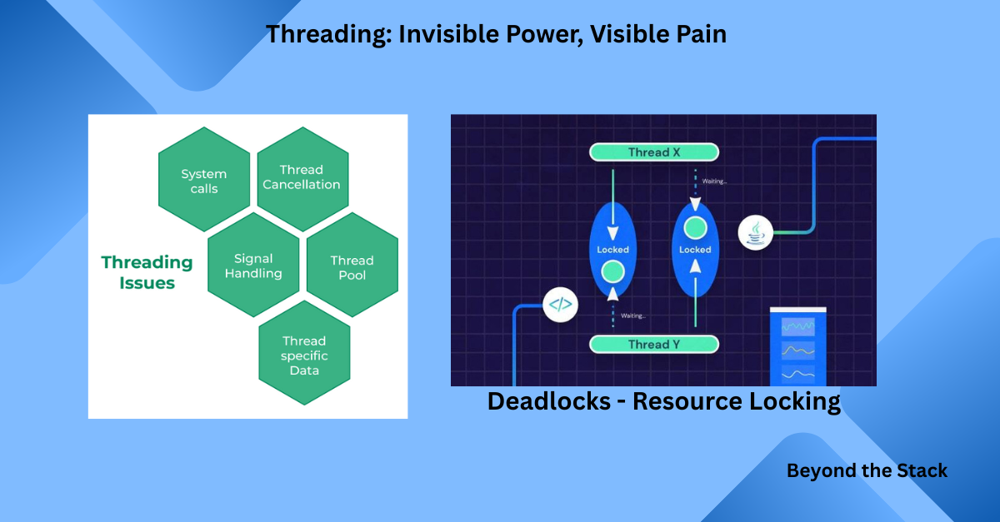
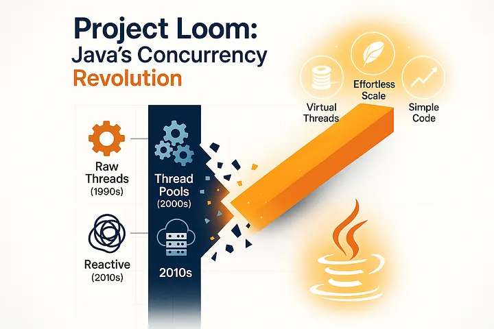
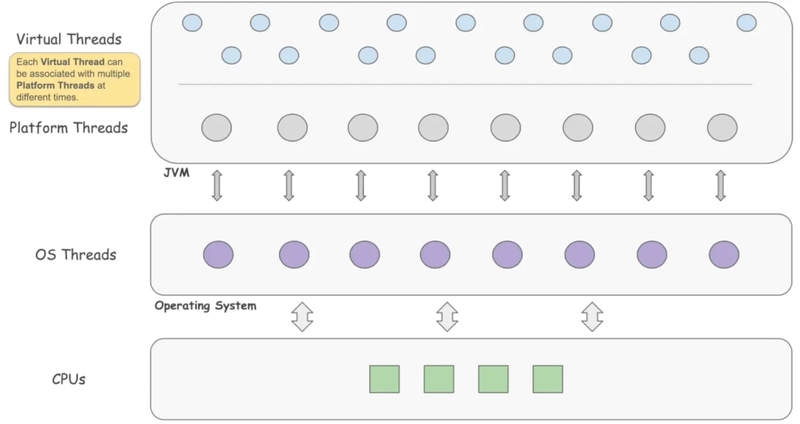
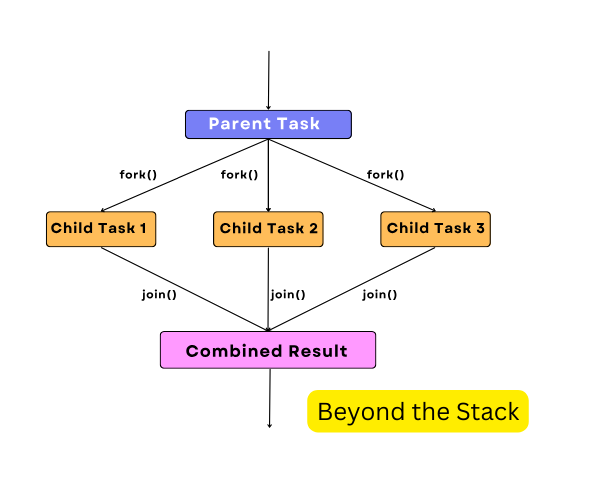

# **🧵 Taming Threads and Scaling Smarter**

*Unlocking Concurrency in the Multicore & Microservices Era*

Threads are the backbone of concurrency in Java, but scaling them efficiently has always been tricky.

Traditional threads are heavyweight, complex to manage, and often bottleneck performance. With Java 21, concurrency has entered a new era — thanks to **Virtual Threads** and evolving concurrency models.

A heartfelt thank you for your comments, shares, and DMs on last week’s edition. Our Beyond the Stack community dives deep into the “**why**” behind system design—and your insights are the backbone.

**How are you or your company tackling Java threading & concurrency?**
💬Drop your story below—or reply/comment directly. The most inspiring stories will get a personal shout-out in the next issue!

---

## ✨ A Glimpse of Past Editions

If you’ve missed earlier editions of  *Beyond the Stack* , here are a few highlights:

* [👋 Why  *Beyond the Stack* ? — My 21-Year Dev Journey](https://www.linkedin.com/pulse/why-beyond-stack-developers-journey-from-code-cloud-pradeep-gupta-1z7pc)
* [🔥 Real World Scaling: How Hotstar handled 50M concurrent viewers](https://www.linkedin.com/pulse/real-world-scaling-how-hotstar-handled-50m-concurrent-pradeep-gupta-zypnc/)
* [📺 Scaling Like Netflix — Lessons from the World’s Most Resilient Streaming Platform](https://www.linkedin.com/pulse/scaling-like-netflix-lessons-from-worlds-most-resilient-pradeep-gupta-x4zfc/)
* [⚡ The Null Heard Around the World — Google’s Outage &amp; Lessons on Resilience](https://www.linkedin.com/pulse/null-heard-around-world-what-googles-outage-teaches-us-pradeep-gupta-mwi8f/)

Each one dives into practical lessons from real-world systems, crafted for developers who want to think **beyond the code**.

Let’s break the Threading Challenge now 👇

---

# 🚦 **Threading: Invisible Power, Visible Pain**

Threads are the invisible gears that keep modern software moving.

From handling millions of requests on Netflix to parallel builds in CI/CD pipelines, concurrency is everywhere.

But here’s the catch: **Threads are deceptively expensive.**

* Each one consumes memory (stack size × thousands = GBs wasted).
* Context switches kill performance.
* Debugging concurrency issues is often worse than debugging production outages.



**The old world of Java concurrency:**

* **Platform Threads (old world):** Each Java thread maps to an OS thread, consuming significant memory (~1 MB each). Scaling thousands of them? **Painful**.
* **Thread Pools:** Introduced to reuse threads and reduce overhead, but tuning them (core size, max pool size, queue size) often feels like **dark magic**.
* **Blocking Calls:** When threads block (I/O, DB queries, APIs), **scalability suffers**.

Are there any solution to these problems?

---

## ⚡ **The Loom Revolution: Virtual Threads (Java 21)**



Java 21’s **Virtual Threads** change the game—making “millions of threads” realistic for high concurrency.

But here’s truth: Locks, deadlocks, and resource contention remain real challenges.

*Scalability isn’t just more threads. It’s smarter design.*

> “**Threads are cheap now. Deadlocks? Still expensive**.”

Virtual threads are:

* Lightweight, compatible with blocking code
* Non-blocking aware—parked threads don’t hog resources
* Drop-in: Legacy code scales better

This is not just a Java upgrade — it’s a ***concurrency mindset shift*** for the  **multicore + microservices era** .

From Netflix’s real-world adoption ([Java 21 Virtual Threads – Dude, Where’s My Lock?](https://netflixtechblog.com/java-21-virtual-threads-dude-wheres-my-lock-3052540e231d)) to community discussions, one lesson is clear: **scalability is not just about more threads — it’s about smarter synchronization.**


---

## The Old World vs The New World

| **Feature**     | Platform Threads (Before Java 21) | Virtual Threads (Java 21)    |
| --------------------- | --------------------------------- | ---------------------------- |
| Management            | OS                                | JVM managed                  |
| Memory per Thread     | ~1 MB                             | Tiny, scalable to millions   |
| Blocking I/O Overhead | High                              | Minimal - threads are parked |
| Max Threads Practical | Hundreds/Low thousands            | Millions                     |



It’s like moving from a *luxury cruise ship* (limited rooms, fancy amenities) to a *fleet of speedboats* (thousands of cheap, disposable rides).

**Example: Virtual Thread Executor**

```
import java.util.concurrent.ExecutorService;
import java.util.concurrent.Executors;public class VirtualThreadDemo {
    public static void main(String[] args) throws Exception {
        try (ExecutorService executor = Executors.newVirtualThreadPerTaskExecutor()) {
            for (int i = 0; i < 10; i++) {
                int taskId = i;
                executor.submit(() -> {
                    System.out.println("Running task " + taskId + " on " + Thread.currentThread());
                    Thread.sleep(1000); // simulate work
                    return taskId;
                });
            }
        } // executor closes, waits for tasks
    }
}
```

✅ *Run thousands (even millions) of tasks—without hitting hardware limits.*

✅ Production-ready in Java 21.

---

## “Dude, Where’s My Lock?”


Virtual threads solve **scarcity** — but not the  **locking problem** :

* **Deadlocks still happen**
* **Pinning (via `synchronized` blocks) undermines scalability**

**Example:**

<pre class="overflow-visible!" data-start="3197" data-end="3269"><div class="contain-inline-size rounded-2xl relative bg-token-sidebar-surface-primary"><div class="sticky top-9"><div class="absolute end-0 bottom-0 flex h-9 items-center pe-2"><div class="bg-token-bg-elevated-secondary text-token-text-secondary flex items-center gap-4 rounded-sm px-2 font-sans text-xs"><span class="" data-state="closed"></span></div></div></div><div class="overflow-y-auto p-4" dir="ltr"><code class="whitespace-pre! language-java"><span><span>synchronized</span><span></span><span>void</span><span></span><span>processOrder</span><span>()</span><span> {
    Thread.sleep(</span><span>2000</span><span>);
}
</span></span></code></div></div></pre>

*1 million virtual threads entering `processOrder()` = a “**slowest queue**” bottleneck!*

The lesson? **Concurrency abundance ≠ synchronization abundance.**

---

## Community Take (via Reddit)

On r/java, developers chimed in with some sharp observations:

> “If you want to use virtual threads, you have to check for usages of `synchronized` and either a) replace them b) wait for Java 23.”

Another developer noted:

> “Pinning does not make an application incorrect, but it might hinder its scalability. Try avoiding frequent and long-lived pinning by revising `synchronized` blocks …”

These insights align closely with what Netflix encountered and underscore that tooling and language-level enhancements (like improved pinning behavior) are needed to fully leverage Virtual Threads.

---

## The AI Angle

If you're building AI-driven apps (e.g., chatbot APIs), Virtual Threads can  *skyrocket throughput* . But **shared resource bottlenecks** still bite:

* Parsing LLM responses? Don’t lock the parser.
* Writing to a DB? Use connection pools wisely.
* Calling external APIs? Prefer async I/O where possible.

Virtual Threads give you  **concurrency abundance** , but AI workloads often have **data dependency scarcity** — design accordingly.

---

# 🔮 **Structured Concurrency — The Future, In Preview**

Java 21 also introduces **`StructuredTaskScope`** as a Preview feature. It’s part of Project Loom’s vision: simplifying how we fork and join tasks, propagate errors, and cancel subtasks automatically.



⚠️ But note: it’s  **not production-ready yet** . Think of it as a sneak peek at where Java concurrency is headed.

---

## 🔗 Full Demo Code

I’ve put together runnable demo classes for:

* Classic **ExecutorService**
* **Virtual Threads**
* Preview: **StructuredTaskScope**

👉 Explore them here: [GitHub Repo — TamingTheThreads](https://github.com/pradeepngupta/TamingTheThreads)

Clone and run to see the differences first-hand.

> `CompletableFuture` was Java’s go-to model for async concurrency before Virtual Threads.

> It scales well, but the mental overhead of chaining and exception handling adds complexity.

> Virtual Threads allow the same parallelism but with  **direct, readable code** .

💡 **Closing Insight**

*The future of Java concurrency is near—but not evenly distributed yet.*

*Virtual Threads are production-ready today, while Structured Concurrency and Scoped Values are still maturing in preview.*

*The smart move? Start experimenting now so you’re ready when they land in the next LTS after Java 21.*

🚀 **Beyond the Stack**

At  *Beyond the Stack* , I don’t just cover Java features—I connect them to system design, scalability, and the bigger engineering picture.

If you found this edition useful, subscribe and follow along for more deep dives that help you design systems that go beyond just “working code.”

---

## Best Practices for the Virtual Thread Era

1. **Avoid Coarse-Grained Locks** — Lock only the essential section.
2. **Prefer Thread-Safe, Non-Blocking APIs** — e.g., `ConcurrentHashMap` over synchronized variants.
3. **Treat Virtual Threads as Ephemeral** — Avoid storing in `ThreadLocal`s unless necessary.
4. **Audit & Refactor `synchronized` Usage** — Especially in legacy code or third-party libraries.
5. **Test at Realistic Scale** — Simulate high thread counts in dev to catch surprises before production.
6. **Stay Updated on Loom Features** — Watch for updates in JDK 23+ around pinning and synchronized handling.
7. **Explore Structured Concurrency (Preview)** — Java 21’s `StructuredTaskScope` is a promising model for cleaner fork/join and cancellation, but it’s still in preview. Keep an eye on it for production readiness in future JDKs.

---

## 🚀 Why It Matters for Modern Systems

* **Microservices world:** Each incoming request can get its own virtual thread, avoiding thread pool bottlenecks.
* **Blocking APIs:** Old JDBC calls no longer block OS threads, boosting throughput.
* **Developer sanity:** Less fighting with pools, queues, and rejected tasks.

This is concurrency at  *human scale* .

---


## 📚 References for Further Reading

Want to dive deeper? These are great starting points:

* [Project Loom: Virtual Threads]()
* [JEP 444: Virtual Threads]()
* [Inside the ForkJoinPool]()
* Brian Goetz’s talks on concurrency and Loom

## 📅 Coming Up in Future Editions

Here’s a preview of upcoming editions, each tackling a critical facet of modern system design

* **CompletableFuture Demystified — Async Without the Headaches**
* **SLAs, SLOs & the True Measure of Reliability**
* **Designing for Delight — DX in Infra**
* **Self-Healing Systems**
* **Security by Design**
* **Kafka Deep Dive Series** (ISR, Consumer Groups, Consumer Lag)
* **The Couch Potato & the Bouncy Bunny** — a fun system design story on lazy vs eager execution

*Hit “Subscribe” so you never miss these essential deep dives! See someone struggling with concurrency? Share this edition.*

## Final Take: **Scaling Smarter Is a Mindset Shift**

Concurrency is no longer a “backend-specialist” problem.

It’s now a **core skill for every developer** building apps that scale.

Java 21 Virtual Threads aren’t just a language feature — they’re **a paradigm shift** — from managing scarce, heavyweight threads to orchestrating lightweight, abundant virtual ones.

Build your system thinking there’s  **infinite worker capacity** , but remember —  *one slow shared resource can bring the whole party to a halt* .

As engineers, our challenge is to harness this power responsibly:

* Architecting for abundance
* Embracing structured concurrency
* Relentlessly questioning shared state

> 👉 **Scaling smarter means thinking beyond locks—design richly concurrent, resilient systems.**


---


# 🔔 **Subscribe & Stay Ahead!**

Did you find value here?

* **Subscribe to *Beyond the Stack*** for deep tech dives tailored for the modern developer.
* **Follow me on LinkedIn** for practical insights, demos, and system design stories.
* **Share or comment** —it boosts the community and helps others conquer their concurrency challenges.

*Let’s learn, build, and scale together—beyond just code.*
