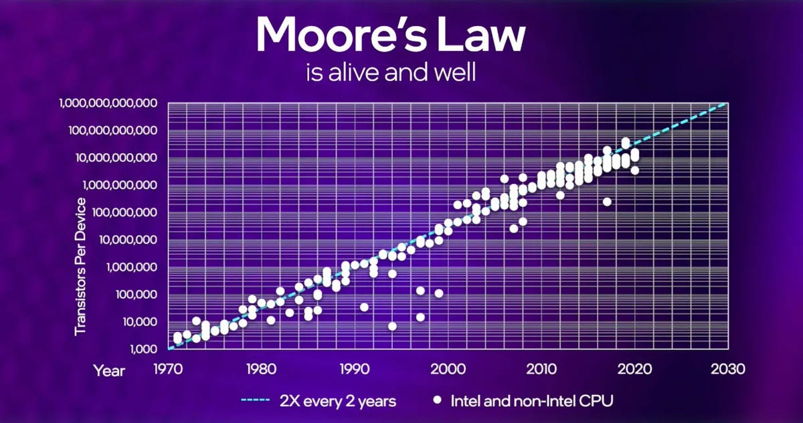
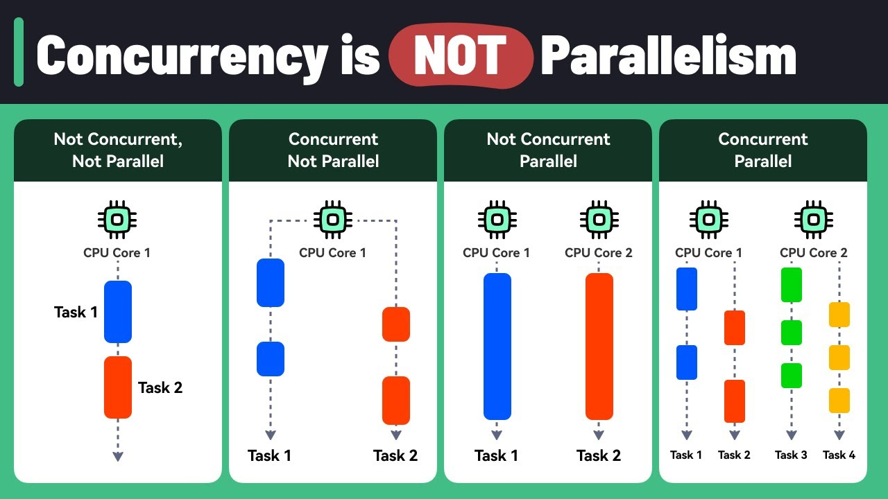
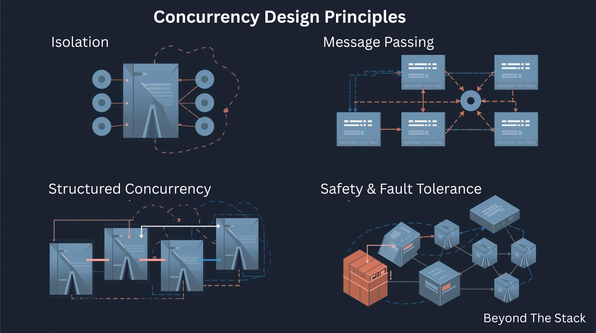
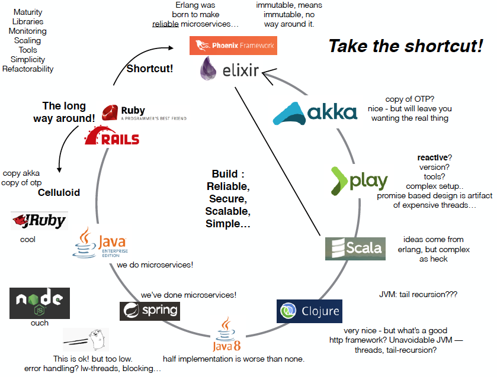
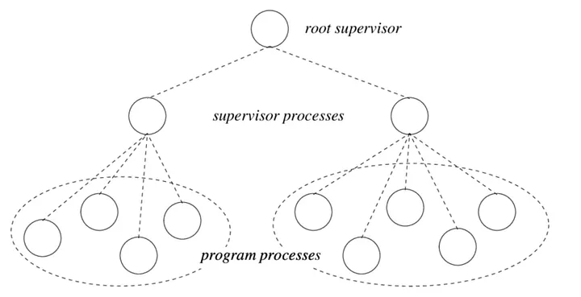
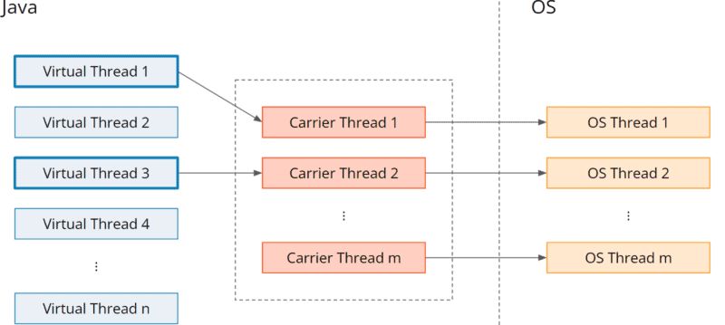

# 🧵 From One Brain to Many Minds: The Evolution of Concurrency

*Concurrency isn’t just a programming tactic—it’s a fundamental language spoken by modern systems at scale.*

If concurrency was a sport, Erlang would be the wise veteran, Go the energetic young athlete, and Java the late but determined challenger.

Concurrency models have shaped the way we build scalable systems, but each language has approached the problem differently:

Welcome to  **Beyond the Stack** , where we go beyond code to explore the principles driving tomorrow’s technology.
A huge thank you for your amazing support on the last edition!

Inspired by a sharp insight from Ajay, a college friend, on how Golang handles concurrency and why it’s a favorite among startups and MAANG scale companies, this edition dives deep into concurrency’s epic evolution.

📩 What’s your concurrency story? Have you tried Virtual Threads in production, or are you still living in goroutine land? Share your thoughts—I’d love to hear!

## ✨ A Glimpse of Past Editions

If you’ve missed earlier editions of  *Beyond the Stack* , here are a few highlights:

* *👋* [My 21-Year Dev Journey - why Beyond the Stack?](https://www.linkedin.com/pulse/why-beyond-stack-developers-journey-from-code-cloud-pradeep-gupta-1z7pc)
* *[Taming Threads &amp; Scaling Smarter](https://www.linkedin.com/pulse/taming-threads-scaling-smarter-pradeep-gupta-b81rc/)*
* *[How I Scaled a Startup with Scripts](https://www.linkedin.com/pulse/from-scripts-startup-story-behind-touchless-billing-solution-gupta-eg7rc/)*
* *[Scaling Spring Boot Apps on the Cloud](https://www.linkedin.com/pulse/how-i-scale-java-spring-boot-apps-cloud-cost-resilience-pradeep-gupta-7bmgc/)*
* *[How a Missed Notification Caused a Sales Loss](https://www.linkedin.com/pulse/how-missed-notification-caused-sales-loss-real-lessons-pradeep-gupta-c7ric/)*

Each edition dives into practical lessons from real-world systems and is crafted for developers eager to think  **beyond the code** .

Back in the 1950s, computers had a single brain and a simple rhythm: **one task at a time, done before moving on**.

Fast-forward to today—our machines boast dozens of cores and billions of transistors, yet many developers still write code as if it’s 1955.

**Concurrency has evolved** from a simple performance trick to the very language of modern computing.

Let’s take a journey through that evolution.

---

## ⚙️ The Dawn: Sequential Machines and the Birth of Computing

In the early days, computers had a single CPU that could execute only one instruction at a time. Naturally, developers thought sequentially because the hardware was fundamentally  **single-threaded** .

Then, in 1965, **Moore’s Law** predicted that the number of transistors on a chip would double roughly every two years, driving performance to soar exponentially.

For decades, software could rely on this rapid hardware improvement to get “*faster for free*.”

But by the mid-2000s, Moore’s Law began hitting physical limits. Clock speeds plateaued, power consumption soared, and heat dissipation became a serious bottleneck.

In response, hardware makers shifted to  **multicore architectures** —packing multiple CPUs onto a single chip instead of pushing for faster single cores.

This seismic shift flipped the software world upside down. Since performance gains no longer happened automatically, developers had to start explicitly designing for  **concurrency** .

---

## 🌍 *Concurrency Awakens: Designing for the Multicore Era*

As Joe Duffy reflects in  *15 Years of Concurrency* , concurrency soon became the defining challenge of modern systems. Developers needed abstractions to:

* **Scale with multicore processors** —making efficient use of every core
* **Simplify programming** —because writing correct concurrent code is notoriously hard
* **Ensure safety** —avoiding deadlocks, race conditions, and unpredictable behavior

This led to a set of core **Concurrency Design Principles** (inspired by Baeldung and system design research):

1. **Isolation** — keep concurrent tasks independent, avoiding shared mutable state
2. **Message Passing** — prefer communication over locking mechanisms
3. **Structured Concurrency** — logically group tasks and manage their lifecycles
4. **Composability** — design concurrent components that work well together
5. **Safety & Fault Tolerance** — build systems that survive partial failures gracefully

---

## 🌐 *Scaling the Web: Concurrency’s Game-Changing Moment*

When the internet exploded in the 90s and early 2000s, concurrency went from a neat trick to an *absolute must-have*.

Servers juggling thousands of simultaneous requests couldn’t just sit idle waiting—they had to handle it all, ***fast***.

Languages stepped up with bold new models:

* **Erlang (1986):** Ahead of its time, birthed the Actor Model—message-driven, fault-tolerant, lightweight processes perfect for telecom-grade reliability.
* **Java (1995):** Turned threads into the go-to tool for enterprise power.
* **Go (2009):** Made concurrency accessible with lightning-fast goroutines managed seamlessly by the runtime.
* **Node.js (2009):** Revolutionized scaling with its single-threaded event loop and non-blocking async IO.

> ***Concurrency wasn’t just important anymore—it became the backbone of everything that scales.***

Now, let’s dive into how these ecosystems turned concurrency theory into practice..

---

## 🐪 *Erlang’s Legacy: Concurrency for Resilience and Telecom*

In the demanding world of 1980s telecom, Ericsson required **five 9s (99.999%)** uptime — nearly flawless reliability.

Joe Armstrong’s solution?  **Erlang** : a functional language designed with concurrency at its core.

**Core principles:**

* *Isolation:* Processes never share memory
* *Message Passing:* Asynchronous communication via mailboxes
* *Fault Tolerance:* “Let it crash” philosophy—supervisors restart failed processes

Erlang proved concurrency is about **more than speed** — it’s about **building resilient, message-driven systems**. Its actor-model inspired today’s distributed platforms.

---

## 🌀 *Go’s Goroutines: Making Concurrency Simple and Accessible*

When Google created Go, multicore CPUs were standard, but concurrency APIs remained complex and error-prone.

Go’s breakthrough? **Goroutines**—**lightweight, cheap, and easy-to-use concurrent functions** managed by a runtime scheduler.

**Key principles:**

* *Isolation:* Goroutines steer clear of shared mutable state (channels control communication)
* *Message Passing:* Channels enable safe, synchronized data flow
* *Structured Concurrency:* Context cancellation cleanly propagates shutdown signals
* *Composability:* Select statements elegantly orchestrate goroutine coordination

Go made concurrency  **accessible to every developer** , transforming it from a niche skill into a core programming tool.

See an example in work: [go playground link](https://go.dev/play/p/BdZLYXTcpZX)

---

## ☕ *Java’s Virtual Threads: Democratizing Concurrency*

Despite dominating enterprise, Java long struggled with concurrency:

* **Threads** mapped 1:1 to OS threads — heavy and resource-intensive
* **Executors and thread pools** helped but added complexity
* **Reactive frameworks** introduced a steep learning curve

Enter **Project Loom** (Java 21) and its game-changer: **Virtual Threads** — lightweight, JVM-scheduled threads that are cheap to create and manage.

**What Java Virtual Threads bring:**

* *Structured Concurrency:* APIs to manage task lifecycle with clear scoping
* *Isolation:* Use familiar `Thread` APIs but scale to thousands of threads
* *Safety:* Reduced blocking complexity, closer to natural sequential coding

With Virtual Threads, Java marries **Erlang’s resilience and Go’s simplicity** into true universality—making concurrency feel natural for every developer.

---

## 🎯 *The Power of Structure: Managing Concurrency Safely*

Running millions of threads isn’t enough—you must  **manage them with care** .

* **Erlang** gave us **supervision trees**: when a process crashes, a supervisor restarts it immediately.
* **Go** introduced `context.Context` for cancelling and timing out Goroutines—while useful, sometimes feels tacked-on.
* **Java’s** Virtual Threads champion  **structured concurrency** : child tasks tie directly to parents, making cancellation and cleanup  **predictable and reliable** .

This evolution is as foundational as Virtual Threads themselves—it transforms concurrency from a chaotic jungle into a  **well-tended garden.**

---

## 🔎 *Concurrency Across the Ecosystem: Python, .NET, C++, and Node.js*

* **Python:** `asyncio` enables cooperative multitasking, but the **Global Interpreter Lock (GIL)** limits true parallelism. Best suited for I/O-bound concurrency tasks.
* **.NET:** Combines `async/await` with the **Task Parallel Library (TPL)** to provide structured concurrency for both I/O and CPU-bound operations.
* **C++:** Offers powerful, low-level concurrency primitives (`std::thread`, `std::async`, atomics) delivering high performance—but with increased complexity and risk of errors.
* **Node.js:** Uses a single-threaded event loop model with non-blocking asynchronous I/O, enabling high concurrency for network applications with minimal thread overhead.

Together, these ecosystems reflect the balancing act between  **control, safety, simplicity, and developer ergonomics** —each making different tradeoffs to address unique concurrency challenges.

---

## 🤔 *Concurrency in the AI Era: More Relevant Than Ever*

In today’s era of AI and agentic systems, concurrency remains absolutely foundational. Whether it’s AI agents, LLM-powered applications, or massive distributed training systems, all **rely on concurrent execution** to achieve true scale.

Concurrency has evolved beyond clever coding tricks—it’s now about architecting systems that can  **think and act in parallel** .

---

## 🚀 *The Future of Concurrency: Scaling Human Trust in Systems*

At its core, concurrency is a story of  **evolving abstractions** :

* Erlang showed us that *concurrency ≠ speed—it’s resilience.*
* Go proved that *concurrency ≠ complexity—it can be simple.*
* Java Virtual Threads demonstrated that *concurrency ≠ specialization—it can be for everyone.*

The real takeaway?

> **Concurrency isn’t just about how many tasks you can run, but how safely and predictably you can manage them.**

Whether you champion Erlang’s fault tolerance, Go’s elegance, or Java’s mass adoption, one truth holds: **scaling smart always beats scaling hard.**

Looking ahead, with AI agents, event-driven systems, and serverless architectures, concurrency will move beyond technical detail—it will become the very fabric enabling autonomous system collaboration.

---

### 📚 Further Reading & References

If you’re eager to explore the rich history, foundational principles, and cutting-edge practices of concurrency, here are some excellent resources that informed this edition:

1. **Historical & Conceptual Foundations**
   * *A Brief History of Concurrency in Programming Languages* – [HAL Open Archive](https://hal.science/hal-03162635/document?utm_source=chatgpt.com)
   * *15 Years of Concurrency* by Joe Duffy – [joeduffyblog.com](https://joeduffyblog.com/2016/11/30/15-years-of-concurrency/?utm_source=chatgpt.com)
   * *The Art of Concurrency* by Clay Breshears — Comprehensive book covering concurrency concepts and patterns.
2. **Erlang and Actor Model**
   * *Let’s Talk Concurrency with Joe Armstrong* – [Erlang Solutions Blog](https://www.erlang-solutions.com/blog/lets-talkconcurrency-with-joe-armstrong/?utm_source=chatgpt.com)
   * *Programming Erlang* by Joe Armstrong — A definitive guide to Erlang’s concurrency model.
3. **Concurrency Principles & Best Practices**
   * *Concurrency Principles and Patterns* – [Baeldung](https://www.baeldung.com/concurrency-principles-patterns?utm_source=chatgpt.com)
   * *Java Concurrency in Practice* by Brian Goetz — Essential reading on Java concurrency best practices.
4. **Moore’s Law & Multicore Evolution**
   * *Moore’s Law* — Gordon Moore’s seminal 1965 paper and insightful analyses available through [Intel Archives](https://www.intel.com/content/www/us/en/history/museum-gordon-moore-law.html)
   * *The Free Lunch Is Over* by Herb Sutter — A pivotal article discussing the shift to multicore and implications for software design.
5. **Language-Specific Concurrency Models**
   * *The Go Programming Language* by Alan Donovan & Brian Kernighan — Detailed coverage of goroutines and channels.
   * *Project Loom* — Official Oracle documentation and blogs about Java’s Virtual Threads.
   * *Node.js Event Loop Explained* — [Node.js official docs](https://nodejs.org/en/docs/guides/event-loop-timers-and-nexttick/) for async concurrency in JavaScript.
6. **Advanced & Emerging Topics**
   * *Structured Concurrency* — [Structured concurrency research paper by Nathaniel J. Smith et al.](https://www.cs.princeton.edu/~g326/concurrency.pdf)
   * *Concurrency in Distributed Systems* — *Designing Data-Intensive Applications* by Martin Kleppmann, a must-read for modern distributed concurrency.
   * *AI & Concurrency* — Research on concurrency challenges in large-scale AI systems, such as distributed training and agent coordination, e.g., [Google DeepMind papers](https://deepmind.com/research).

These resources collectively provide a solid foundation and advanced insights—perfect for developers, architects, and researchers aiming to master concurrency in today’s evolving tech landscape.

---

## 📅 Coming Up in Future Editions:

Here’s a peek into what’s brewing in the upcoming issues — each exploring a crucial facet of modern system design:

* *Async Without the Headaches* *- CompletableFuture Demystified*
* *Lazy vs. Eager Execution: Couch Potato Meets Bouncy Bunny*
* *Kafka Deep Dive: Consumer Groups & Lag Demystified*
* *Self Healing Systems*
* *Security By Design*
* *Reliability Measures*

---

## 📣 Stay Ahead of the Curve

📩 **Which concurrency model fires you up the most**—Erlang’s fault-tolerant processes, Go’s lightweight goroutines, or Java’s game-changing Virtual Threads? Share your thoughts below! 👇

📩 **Got a concurrency story to tell?** Have you experimented with Virtual Threads in production, or are you still deep in goroutine-land? I’d love to hear your experiences!

👉 Next time you write code that “just runs in sequence,” pause and ask yourself: *Am I still thinking like it’s 1955?* Because the world has already moved from **one brain** to  **many minds** .

✉️ If you enjoy deep dives like this, you’re in the right place.

✨ *Beyond the Stack* is more than just technology—it’s about the timeless principles shaping the future of software systems. Concurrency began in the ’50s, but its story is far from over.

🧵 Follow **Beyond the Stack** now for expert insights and actionable architectural wisdom.

👉 [Subscribe Here](https://www.perplexity.ai/search/i-am-writing-the-tech-newslett-SrDh_1i3QsywEtLB2qUmTw#) and never miss an edition!
