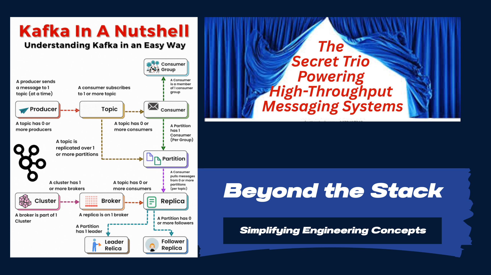
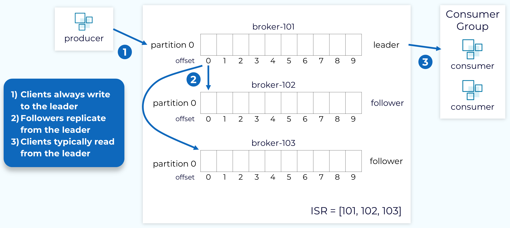
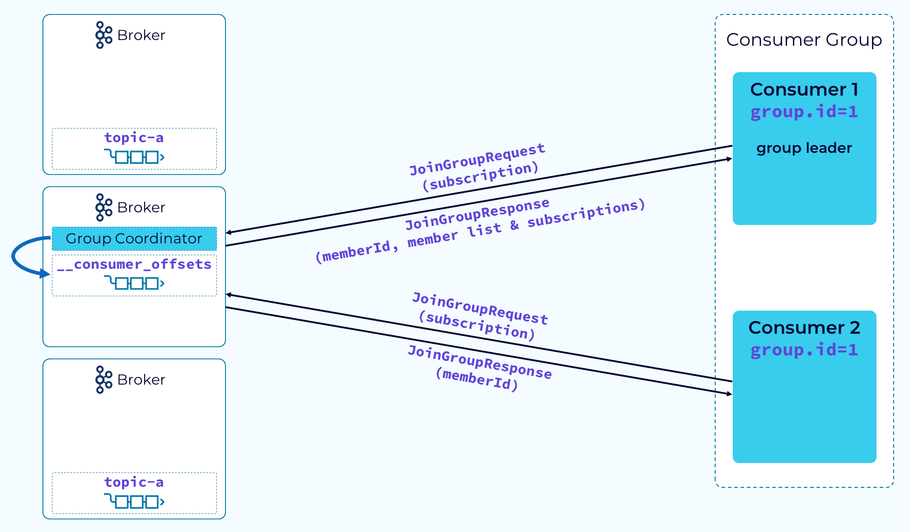
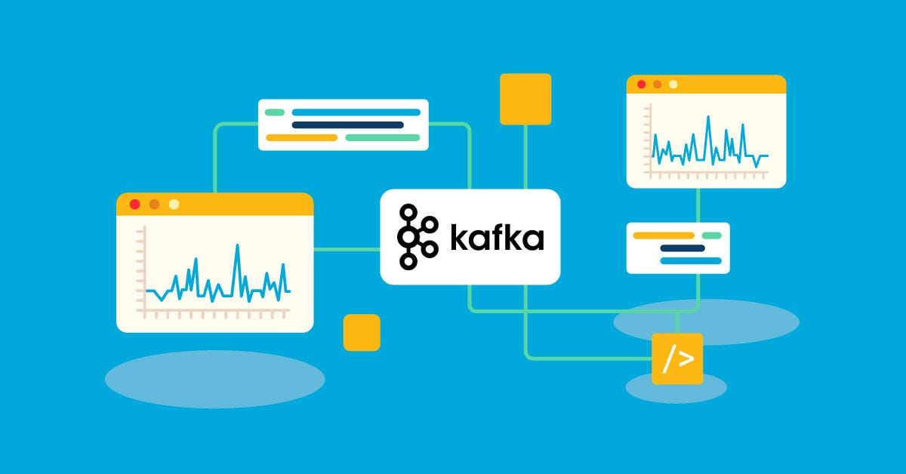

# 🧱 **Behind Kafka’s Curtain: The Secret Trio Powering High-Throughput Messaging Systems**

What if I told you that Kafka’s magic doesn’t just lie in its simple publish-subscribe model, but in a well-orchestrated trio of mechanisms working silently behind the scenes—ensuring **data durability, fault tolerance, and efficient scaling?**

Welcome to  **Beyond the Stack** , where we go beyond code to explore the principles driving tomorrow’s technology.
A huge thank you for your amazing support on the last edition!

In this edition, we’re peeling back the layers of Kafka to reveal the inner workings of  **Storage with In-Sync Replicas (ISR)** ,  **Consumer Group Protocol** , and the often-overlooked mystery of  **Consumer Lag** .

Have an interesting story to share in the community? Share your story, I'll give you a shoutout in my next edition!

## ✨ A Glimpse of Past Editions

If you’ve missed earlier editions of  *Beyond the Stack* , here are a few highlights:

* *👋* [My 21-Year Dev Journey - why Beyond the Stack?](https://www.linkedin.com/pulse/why-beyond-stack-developers-journey-from-code-cloud-pradeep-gupta-1z7pc)
* *[Real World scaling: Use case of Hotstar](https://www.linkedin.com/pulse/real-world-scaling-how-hotstar-handled-50m-concurrent-pradeep-gupta-zypnc)*
* *[How I Scaled a Startup with Scripts](https://www.linkedin.com/pulse/from-scripts-startup-story-behind-touchless-billing-solution-gupta-eg7rc/)*
* [What’s Your Message Really Riding On?](https://www.linkedin.com/pulse/whats-your-message-really-riding-pradeep-gupta-ontgc/)
* *[Kafka-Powered Audit Service](https://www.linkedin.com/pulse/stop-logging-everything-kafka-already-has-truth-pradeep-gupta-mu2gc/)*

Each edition dives into practical lessons from real-world systems and is crafted for developers eager to think  **beyond the code** .

Let’s unravel how the trio magic come together to make Kafka the streaming powerhouse that drives real-time data pipelines across the world.

---

## 📚 **1. Kafka’s Durability Engine: In-Sync Replicas (ISR)**



At first glance, Kafka appears as a simple log-based system where producers push messages, and consumers pull them.

But the real challenge lies in  **how Kafka ensures data isn’t lost when a broker fails** .

Imagine a banking app that processes financial transactions. When sending money, the app doesn’t just rely on a single database copy—it maintains synchronized backups on several secure servers.

Kafka’s **ISR (In-Sync Replicas)** work the same way: every message is stored not only on one broker, but also on multiple backup brokers that remain continuously up-to-date.

👉 Every topic in Kafka is partitioned. Each partition has one **Leader** and multiple  **Followers.** When a producer publishes a message, it writes to the partition’s leader. The leader then replicates the message to followers.

```properties
#Minimum number of replicas that must acknowledge a write
min.insync.replicas=2

#Enable unclean leader election only if necessary (usually false for data safety)
unclean.leader.election.enable=false
```

Setting `min.insync.replicas` ensures messages are only acknowledged once at least 2 replicas confirm writes, strengthening durability as highlighted in the ISR section

> A message is only acknowledged to the producer when written to ISR, ensuring durability.

> Design producers to rely on ISR durability guarantees by setting `acks=all` to ensure messages are committed only when replicated, preventing data loss at the source.

⚡ **Why does it matter?**

If a follower falls behind and drops out of the ISR, it won’t be considered for leader election, preventing the risk of serving stale data.

This delicate balance ensures Kafka’s strong durability guarantees without sacrificing performance.

> ISRs: Your data’s fortress—ensuring every message survives, even if a broker drops offline.

> *Tip:* Monitor ISR size and follower lag metrics. Tune `replica.lag.time.max.ms` and increase broker resources to reduce lag.

**How have ISRs saved your data in a critical outage?** Share your story!

---

## 🎯 **2. Kafka Fault Tolerance and Effortless Scalability: Consumer Group (CG)**



**Kafka’s true power is in scalable, fault-tolerant data consumption**

Picture millions of fans tuning in to a major live sports final online.

To deliver every thrilling moment without glitch or delay, the streaming platform doesn’t route every video segment through one server; instead, it seamlessly distributes incoming viewers across a coordinated team of servers. Kafka **consumer groups** mirror this setup.

* A **Consumer Group** is a set of consumers that share the work of consuming partitions of a topic.
* The magic lies in  **partition assignment** : Kafka assigns partitions dynamically, ensuring seamless scaling as consumers join or leave.

```java
Properties props = new Properties();
props.put("group.id", "my-consumer-group");
props.put("bootstrap.servers", "broker1:9092,broker2:9092");
props.put("enable.auto.commit", "false");
KafkaConsumer
```

⚡ **Why does it matter?**

This approach makes Kafka incredibly scalable: you can process high volumes of data by just adding more consumers to the group, without worrying about manually coordinating the load distribution.

> Consumer Groups: Effortless scale—add a new consumer and instantly multiply your processing power.

> There is a catch here - Frequent rebalances on consumer join/leave can cause temporary unavailability.
> Use static group membership (`group.instance.id`) to minimize disruptions and rebalance frequency.

**Ever tackled a scaling crisis with Kafka?** We’d love to hear how you did it.

---

## ⏳ **3. Performance’s Hidden Signal (Consumer Lag)**



Ever wondered how you can measure if your consumers are keeping up with the data flow?

Think of a city’s highway system. If traffic piles up and the cars can’t move swiftly, congestion occurs—delaying travelers and risking gridlock.

**Consumer lag** in Kafka is like that traffic jam: if consumers don’t process messages fast enough, the message queue grows, threatening system slowdown.

👉 Consumer Lag is simply the difference between the latest offset in a partition and the consumer’s committed offset.

Smart cities use intelligent traffic signals to monitor congestion and react in real time, clearing jams before they get worse.

Similarly, tracking Kafka’s consumer lag allows engineers to spot slow-downs early and adjust resources for smooth, timely data delivery—keeping data pipelines as efficient and predictable as modern urban traffic control.

**Monitoring Consumer Lag via JMX**

```jmx
kafka.consumer:type=consumer-fetch-manager-metrics,client-id=*,name=records-lag-max
```

⚡**Why is it critical?**

A growing lag indicates that the consumer is not processing messages fast enough—possibly due to slow processing logic, GC pauses, or resource bottlenecks.

📊 Monitoring consumer lag helps you:

* Detect performance bottlenecks early.
* Prevent message pile-ups that could lead to OOM (Out of Memory) errors.
* Ensure low-latency processing in real-time pipelines.

> Consumer Lag: Instant insight—catch pipeline slowdowns before they become costly pileups

**What tools do you use to monitor consumer lag?** Any challenges you’ve faced?

---

## 🌐 The Trio in Action: Kafka’s Pipeline

Let me summarize how these three forces interconnect:

1. **ISR keeps your data safe and consistent** , ensuring no data is lost even in broker failures.
2. **Consumer Group Protocol scales consumption horizontally** , making Kafka a true streaming powerhouse.
3. **Consumer Lag reveals the health of your pipeline** , giving you actionable insights into performance.

Without any one of these mechanisms, Kafka wouldn’t be able to handle the scale and reliability modern data-driven companies demand.

> Master these metrics and run Kafka pipelines at blazing, rock-solid reliability

Love diving deep into tech? ***Subscribe now*** to join 2,000+ curious engineers powering real-time systems

---

## 📚 Further Reading & References

1. Replication basics explained – [https://kafka.apache.org/documentation/#replication](https://kafka.apache.org/documentation/#replication)
2. How to scale consumption – [https://kafka.apache.org/documentation/#consumerconfigs](https://kafka.apache.org/documentation/#consumerconfigs)
3. The ultimate Kafka reference book – [https://www.oreilly.com/library/view/kafka-the-definitive/9781491936153/](https://www.oreilly.com/library/view/kafka-the-definitive/9781491936153/)
4. Visualize Kafka’s design thinking – [https://www.confluent.io/resources/kafka-fast-data-streaming-platform/](https://www.confluent.io/resources/kafka-fast-data-streaming-platform/)
5. Kafka internals in one video – [https://www.youtube.com/watch?v=2AZd4_r_fIs](https://www.youtube.com/watch?v=2AZd4_r_fIs)
6. Fix and track consumer lag issues – [https://www.confluent.io/blog/kafka-consumer-lag/](https://www.confluent.io/blog/kafka-consumer-lag/)
7. Your go-to Kafka monitoring checklist – [https://www.datadoghq.com/blog/monitoring-kafka-performance-metrics/](https://www.datadoghq.com/blog/monitoring-kafka-performance-metrics/)
8. Quick ISR tuning tips – [https://dev.to/devopsfundamentals/kafka-fundamentals-kafka-mininsyncreplicas-4f40](https://dev.to/devopsfundamentals/kafka-fundamentals-kafka-mininsyncreplicas-4f40)
9. Use-cases: When Kafka fits best – [https://www.upsolver.com/blog/apache-kafka-use-cases-when-to-use-not](https://www.upsolver.com/blog/apache-kafka-use-cases-when-to-use-not)
10. Deep-dive: ISR for high durability – [https://datafloq.com/read/understanding-in-sync-replicas-isr-in-apache-kafka/](https://datafloq.com/read/understanding-in-sync-replicas-isr-in-apache-kafka/)
11. Ace system design interviews with Kafka – [https://www.hellointerview.com/learn/system-design/deep-dives/kafka](https://www.hellointerview.com/learn/system-design/deep-dives/kafka)
12. Tools for monitoring lag – [https://www.entechlog.com/blog/kafka/monitoring-kafka-consumer-lag/](https://www.entechlog.com/blog/kafka/monitoring-kafka-consumer-lag/)
13. Java consumer API essentials – [https://www.baeldung.com/java-kafka-consumer-api-read](https://www.baeldung.com/java-kafka-consumer-api-read)
14. Consumer lag explained clearly – [https://dattell.com/data-architecture-blog/kafka-consumer-lag-explained/](https://dattell.com/data-architecture-blog/kafka-consumer-lag-explained/)
15. Tune consumers for high throughput – [https://strimzi.io/blog/2021/01/07/consumer-tuning/](https://strimzi.io/blog/2021/01/07/consumer-tuning/)
16. Enterprise metric exporting guide – [https://docs.redhat.com/en/documentation/red_hat_streams_for_apache_kafka/2.7/html/using_streams_for_apache_kafka_on_rhel_in_kraft_mode/assembly-kafka-exporter-str](https://docs.redhat.com/en/documentation/red_hat_streams_for_apache_kafka/2.7/html/using_streams_for_apache_kafka_on_rhel_in_kraft_mode/assembly-kafka-exporter-str)
17. Open-source lag exporter tool – [https://github.com/seglo/kafka-lag-exporter](https://github.com/seglo/kafka-lag-exporter)
18. Compare monitoring solutions fast – [https://middleware.io/blog/kafka-monitoring/](https://middleware.io/blog/kafka-monitoring/)
19. Practical guide: monitoring lag step-by-step – [https://risingwave.com/blog/step-by-step-guide-to-monitoring-kafka-consumer-lag/](https://risingwave.com/blog/step-by-step-guide-to-monitoring-kafka-consumer-lag/)


* **Core Kafka Concepts**

  * Replication basics explained – [https://kafka.apache.org/documentation/#replication](https://kafka.apache.org/documentation/#replication)
  * Deep-dive: ISR for high durability – [https://datafloq.com/read/understanding-in-sync-replicas-isr-in-apache-kafka/](https://datafloq.com/read/understanding-in-sync-replicas-isr-in-apache-kafka/)
* **Kafka Consumer Group & API Deep-Dive**

  * Ace system design interviews with Kafka – [https://www.hellointerview.com/learn/system-design/deep-dives/kafka](https://www.hellointerview.com/learn/system-design/deep-dives/kafka)
  * Tune consumers for high throughput – [https://strimzi.io/blog/2021/01/07/consumer-tuning/](https://strimzi.io/blog/2021/01/07/consumer-tuning/)
* **Consumer Lag Monitoring & Troubleshooting**

  * Fix and track consumer lag issues – [https://www.confluent.io/blog/kafka-consumer-lag/](https://www.confluent.io/blog/kafka-consumer-lag/)
  * Practical guide: monitoring lag step-by-step – [https://risingwave.com/blog/step-by-step-guide-to-monitoring-kafka-consumer-lag/](https://risingwave.com/blog/step-by-step-guide-to-monitoring-kafka-consumer-lag/)
* **Monitoring Kafka at Scale**

  * Your go-to Kafka monitoring checklist – [https://www.datadoghq.com/blog/monitoring-kafka-performance-metrics/](https://www.datadoghq.com/blog/monitoring-kafka-performance-metrics/)
  * Compare monitoring solutions fast – [https://middleware.io/blog/kafka-monitoring/](https://middleware.io/blog/kafka-monitoring/)
* **Visual & Interactive Learning**

  * Kafka internals in one video – [https://www.youtube.com/watch?v=2AZd4_r_fIs](https://www.youtube.com/watch?v=2AZd4_r_fIs)
  * Visualize Kafka’s design thinking – [https://www.confluent.io/resources/kafka-fast-data-streaming-platform/](https://www.confluent.io/resources/kafka-fast-data-streaming-platform/)


---

## 📅 Coming Up in Future Editions:

Here’s a peek into what’s brewing in the upcoming issues — each exploring a crucial facet of modern system design:

* *Async Without the Headaches* *- CompletableFuture Demystified*
* *Lazy vs. Eager Execution: Couch Potato Meets Bouncy Bunny*
* *Self Healing Systems*
* *Security By Design*
* *Reliability Measures*

**Want more exclusive insights?** Hit Subscribe. Share this with your network and help us demystify modern engineering together!

## ✅ **Final Thought: Kafka Is More Than Just Messaging**

Most developers think of Kafka as just a message queue.

But in reality, it’s a complex symphony of  **distributed consensus (ISR), group coordination (Consumer Groups), and monitoring (Lag tracking)** —all designed to provide an elastic, fault-tolerant, and real-time data platform.

📈 Next time you design or debug a Kafka pipeline, remember this trio working silently to keep your data flowing.

---

🔥 If you found this deep-dive useful, don’t forget to share it with your team or LinkedIn circle.

💬 What’s your biggest Kafka headache today? Reply back and let’s tackle it together in the next edition.

---

🚀 *Beyond the Stack* | Simplifying Complex Engineering Concepts for the Curious Developer
