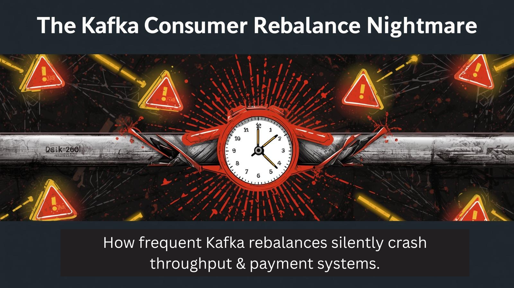
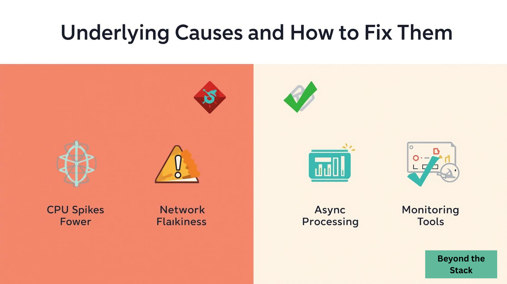
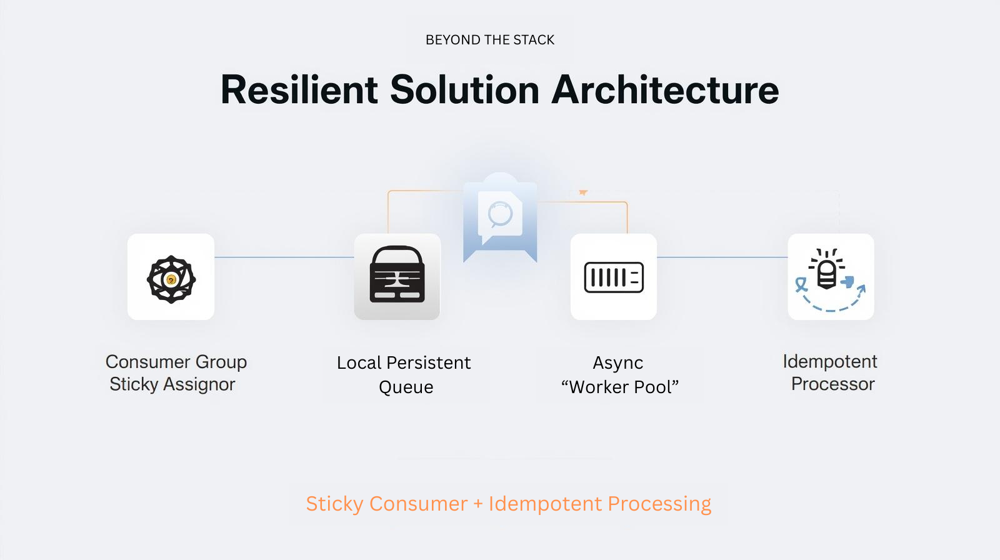

# Why Kafka Consumer Rebalances Can Ruin Your System — And How I Engineered Resilience Against It

🔥 Imagine this:

Your payment system is handling millions of transactions every hour without a hiccup… until suddenly, everything grinds to a complete stop.

No errors. No warnings.

Just Kafka consumer group rebalances… happening every 30 seconds.

😱 A developer’s worst nightmare.

That was my reality at  **3 AM** , when the system teetered on the edge of collapse.

Welcome to **Beyond the Stack** — the place where we strip away frameworks and dive deep into the real, hard-hitting challenges shaping tomorrow’s tech.

🙏 Thank you for the incredible support on the last edition!

👉 In today’s edition, we’ll explore one of the most insidious issues a dev team can face with Apache Kafka:

⚡ Frequent Consumer Rebalances — how they silently destroy throughput, crash critical workflows, and turn reliability into a myth.

Got your own Kafka horror story or a resilient solution that saved the day?

💬 Share your experience in the comments or DM me — and I’ll feature your story in the next edition, giving you the spotlight you deserve.

👉 Don’t miss out. Let’s unravel this together.

## ✨A Glimpse Into My Kafka Journey

Over the past months, I’ve been sharing deep, practical insights from my experience building and troubleshooting real-world systems — all in the spirit of helping technologists think  **beyond the code** .

Here are some of the most popular editions from my Apache Kafka series, packed with lessons you won’t find in documentation:

* *👋* [My 21-Year Dev Journey - why Beyond the Stack?](https://www.linkedin.com/pulse/why-beyond-stack-developers-journey-from-code-cloud-pradeep-gupta-1z7pc)
* [What’s Your Message Really Riding On?](https://www.linkedin.com/pulse/whats-your-message-really-riding-pradeep-gupta-ontgc/)
* [Kafka-Powered Audit Service](https://www.linkedin.com/pulse/stop-logging-everything-kafka-already-has-truth-pradeep-gupta-mu2gc/)
* [Kafka Interceptor Deep Dive](https://www.linkedin.com/pulse/kafka-interceptors-power-tool-most-devs-overlook-lifecycle-gupta-fsdzc/)
* [Kafka Secret Trio](https://www.linkedin.com/pulse/behind-kafkas-curtain-secret-trio-powering-messaging-systems-gupta-n2hef/)

👉 Missed earlier editions?

🔔 Subscribe to **Beyond the Stack** and never miss a deep dive again:

[🔗 Subscribe Now](https://www.linkedin.com/newsletters/beyond-the-stack)

💡 Each edition is designed for engineers who want to go beyond syntax and frameworks, and start mastering the architectural principles that make systems resilient, scalable, and future-proof.

Let’s now dive back into today’s critical topic:

⚡ The Kafka Consumer Rebalance Nightmare — and the battle-tested solution to stop the domino effect.

---

## ⚡ The Problem Statement: When Kafka Consumer Rebalances Turn Into a Nightmare

An e-commerce platform’s payment system, handling millions of transactions every hour, built on the promise of scalability and reliability thanks to Apache Kafka.

But one day, right in the middle of peak processing hours, something went terribly wrong.

🔴 **Kafka consumer group rebalances were happening every 30 seconds… for over an entire hour.**

What did that look like in the real world?

👉 Incoming payment requests stopped processing.

👉 Customer transactions timed out, causing frustration and failed purchases.

👉 System throughput plummeted by 80%.

👉 The entire platform was on the verge of collapse.

This wasn’t a trivial bug in Kafka.

It was a brutal **wake-up call** exposing **a critical flaw** in how we had designed our distributed architecture.

💡 Have you ever been blindsided by Kafka rebalances in production?

💬 Hit Like, share your story in the comments, and help our community learn from real-world battle scars.

---

## ⚠️ The Domino Effect: How Frequent Kafka Rebalances Bring Your System to Its Knees

In a previous edition, we talked about how **Kafka’s consumer rebalance is actually a powerful mechanism** that enables fault tolerance, keeping systems resilient in the face of failures.

But as with everything in life…

> ⚡ **Too much of a good thing becomes a disaster.**

When rebalances happen too frequently, they don’t just slow things down — they trigger a chain reaction of system failures.

Here’s what happens during each rebalance:

1. 🚫 **Temporary Processing Pause**

   All consumers stop consuming until the rebalance completes.
2. ❌ **In-flight Message Abandonment**

   Messages already being processed get dropped mid-way, with no guarantees on delivery or order.
3. ⏱ **Latency Spikes & Timeouts**

   Critical workflows—like payments—start failing as timeouts kick in.
4. 📉 **Throughput Collapse**

   Messages keep piling up. Consumer lag balloons uncontrollably.
5. 🔧 **Increased Broker Load**

   Extra metadata exchanges and coordination flood Kafka brokers, adding to the instability.

This isn’t just a minor inconvenience for developers.

🚨 It’s **a catastrophic failure for production systems** that demand low latency and rock-solid availability.

👉 Want to build Kafka systems that actually survive production?

💬 Like this section, share it with your network, and repost to help others avoid this silent killer.

---

## 🛠 The Real Reasons Behind Frequent Rebalances — And How to Fix Them for Good

After digging deep into the symptoms, the next step is understanding the root causes behind frequent Kafka consumer rebalances.

And more importantly, how to solve them in a way that doesn’t just patch the surface, but builds lasting resilience.

| 🚨 Cause                                                | ✅ Practical Solution                                                                        |
| ------------------------------------------------------- | -------------------------------------------------------------------------------------------- |
| ⚡ Low `session.timeout.ms`&`heartbeat.interval.ms` | Tune configs to prevent false positives—give your consumers enough breathing room.          |
| 🖥 Consumer node instability (CPU spikes, GC pauses)    | Optimize JVM settings, offload heavy work, and actively monitor node health.                 |
| 🌐 Network flakiness                                    | Add intelligent retries, increase request timeouts, and colocate consumers near brokers.     |
| 👥 Too few consumers vs. many partitions                | Scale your consumer group to balance partition assignments and spread the load.              |
| ⏳ Long message processing blocking heartbeats          | Separate polling from processing—handle messages asynchronously so heartbeats keep flowing. |

👉 But here’s the real insight:

Fixing these causes one by one helps… but it doesn’t stop the domino effect when failure strikes.

💡 The true game-changer?

Building a **Resilient Architecture** that treats rebalance as a first-class failure mode—so your system survives it gracefully, rather than collapsing.

🚀 In the next section, we’ll look at what that architecture looks like in practice.

*💬 Found these solutions useful? **Hit Like, share with your network**, and help others build systems that just don’t break under pressure*

---

## 🚧 Resilient Solution Architecture: How We Stopped the Domino Effect in Its Tracks

Here’s the architecture that transformed our Kafka nightmare into a rock-solid, production-grade solution:

<pre class="overflow-visible!" data-start="388" data-end="535">

<code class="whitespace-pre! language-plaintext">Kafka Broker → Consumer Group (with Sticky Assignment) → Local Persistent Queue → Async Worker Pool → Idempotent Payment Processor
</code>

</pre>

👉 **Why this works so well:**

✅ **Decouples Consumption from Processing**

By introducing a local persistent queue, we ensure that Kafka message consumption doesn’t directly depend on message processing success. Even if rebalances happen, no data is lost.

✅ **Absorbs Rebalance Disruptions Gracefully**

The local queue acts as a buffer that holds unprocessed records safely, so consumers can resume processing once the rebalance completes.

✅ **Processes Asynchronously for Maximum Stability**

Messages are picked from Kafka by a lightweight consumer thread and handed off to a worker pool for processing in parallel.

This keeps heartbeats flowing uninterrupted and prevents long-processing tasks from blocking Kafka coordination.

✅ **Guarantees Idempotent Processing**

Each message is processed in a way that ensures the same outcome even if it’s retried, preventing data duplication or corruption.

✅ **Monitors System Health Proactively**

We track consumer lag and rebalance frequency, triggering alerts well before things spiral out of control.

---

🔧 **Pro Tip for Kafka Experts:**

To stabilize partition assignments and minimize unnecessary rebalances, always configure:

<pre class="overflow-visible!" data-start="622" data-end="718">

<code class="whitespace-pre! language-properties">partition.assignment.strategy=org.apache.kafka.clients.consumer.StickyAssignor
</code>

</pre>

This keeps partition-to-consumer assignments stable unless absolutely necessary to rebalance.

---

💬 Are you already applying patterns like this in your system design?

Or would you like me to share a ready-to-use sample implementation in the next edition?

👉 Drop a comment and let’s make resilient distributed systems the new norm.

🚀 Don’t forget to like, repost, and subscribe so we can build stronger systems together.

---

## 📚 Further Reading & References

* [Understanding Kafka Consumer Rebalancing]()
* [Designing Resilient Systems with Kafka]()
* [Idempotent Message Processing Best Practices]()

👉 Bookmark and share this with your engineering team to spread the knowledge.

---

## 🔮 Coming Up Next in Beyond the Stack

Here’s a peek into what’s brewing in the upcoming issues — each exploring a crucial facet of modern system design:

* *Async Without the Headaches* *- CompletableFuture Demystified*
* *Lazy vs. Eager Execution: Couch Potato Meets Bouncy Bunny*
* *Self Healing Systems*
* *Security By Design*
* *Reliability Measures*

**Want more exclusive insights?** Hit Subscribe. Share this with your network and help us demystify modern engineering together!

🔔 [Subscribe to Beyond the Stack](https://www.linkedin.com/newsletters/beyond-the-stack)

---

## 🎯 Final Thoughts: Designing Systems That Don’t Break

> In distributed systems, failures aren’t just possible — they’re inevitable.

Kafka’s consumer rebalance is a powerful feature designed for fault tolerance, but when mismanaged, it becomes a silent disruptor that can take down even the most well-intentioned architecture.

The key takeaway?

✅ Don’t treat rebalances as rare events.

✅ Design for them as if they happen every day.

By combining smart configuration, proactive monitoring, and a resilient architecture that decouples consumption from processing, you can stop the cascading domino effect before it starts.

💡 Systems don’t need to be fragile masterpieces.

They can be battle-tested, self-healing, and built to survive the chaos of real-world traffic.

👉 If this edition gave you actionable insights, hit Like, share it with your network, and subscribe to **Beyond the Stack** to get more deep, practical lessons straight to your inbox.

🔔 [Subscribe to Beyond the Stack](https://www.linkedin.com/newsletters/beyond-the-stack)

📢 Let’s build a community of developers who design for resilience, not just functionality.
