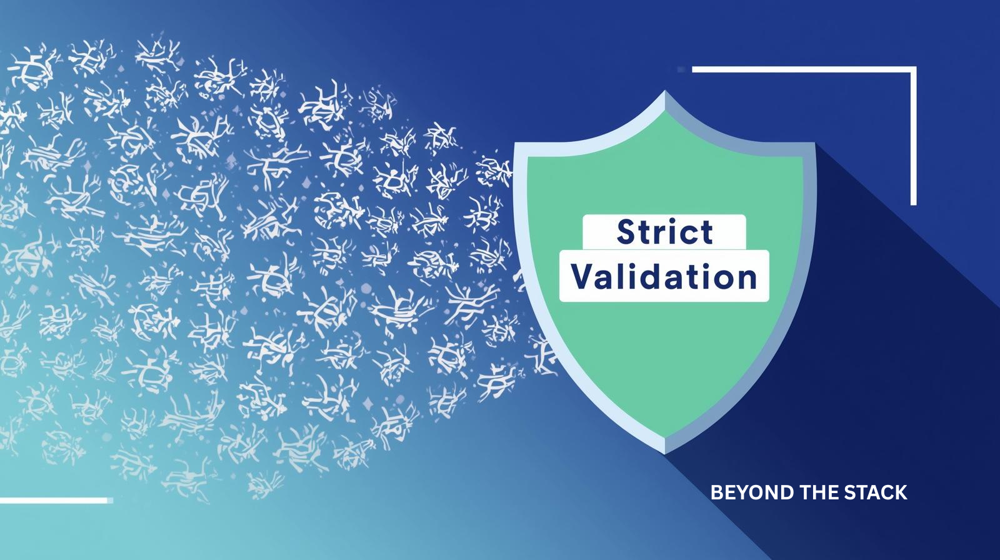
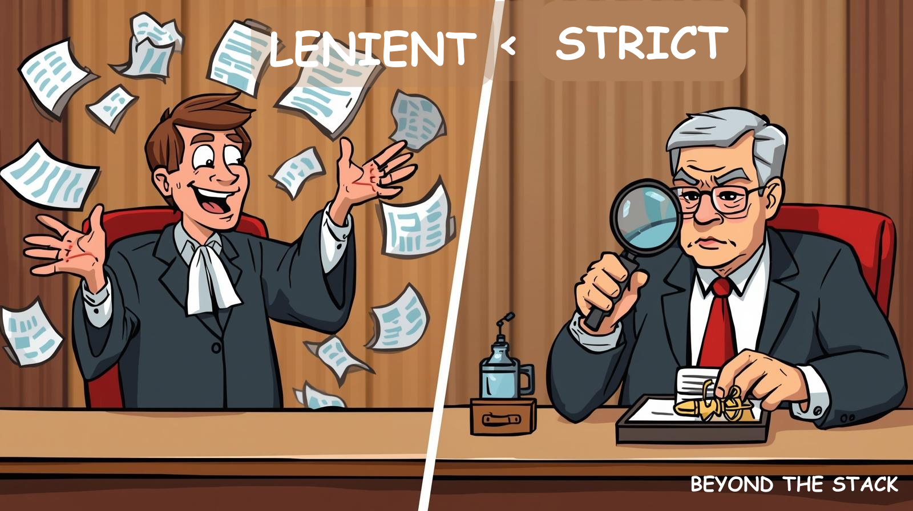
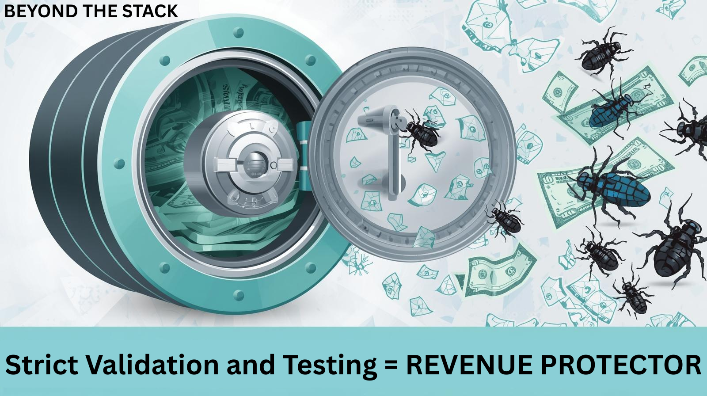

# 100% Test Coverage. Still Broken in Production

What if I told you that  **100% unit test coverage could still cost you millions** ?

Coverage isn’t protection—it’s a false sense of security. In today’s complex systems, lenient validations hide in plain sight, waiting to break production when you least expect it.


We had 100% test coverage (BDD). Everything was green. Confidence was sky high.

And then, on go-live day, production broke. That’s when I learned the hard way:  **coverage ≠ correctness** .


Welcome to **Beyond the Stack** — the place where we strip away frameworks and dive deep into the real, hard-hitting challenges shaping tomorrow’s tech.

🙏 Thank you for the incredible support on the last edition!

> **Subscribe to my newsletter** to never miss insights like this.

## ✨ A Glimpse of Past Editions

Check out my past editions for more lessons  *Beyond the Stack* :

* *👋*[My 21-Year Dev Journey - why Beyond the Stack?](https://www.linkedin.com/pulse/why-beyond-stack-developers-journey-from-code-cloud-pradeep-gupta-1z7pc)
* [🎥Scaling Like Netflix — Lessons from the World’s Most Resilient Streaming Platform](https://www.linkedin.com/newsletters/beyond-the-stack-7318612377875161089/)
* [🧵 From One Brain to Many Minds: The Evolution of Concurrency](https://www.linkedin.com/pulse/from-one-brain-many-minds-evolution-concurrency-pradeep-gupta-osmlc/)
* [🧭 The Missing Map: Why Your Systems Are Failing Silently](https://www.linkedin.com/pulse/missing-map-why-your-systems-failing-silently-pradeep-gupta-5zenc/)
* [🧠 The Origination of Agentic AI Systems — A New Era of Modular, Composable, and Communicative Intelligence](https://www.linkedin.com/pulse/origination-agentic-ai-systems-new-era-modular-composable-gupta-mkvic/)

I also started writing on Medium Platform:

* 📈 [From Code Monkey to System Architect: The Critical Shift Every Developer Needs to Make](https://medium.com/@pradeepngupta/from-code-monkey-to-system-architect-the-critical-shift-every-developer-needs-to-make-7c4b58cbc29f)
* [Stop Thinking in Requests. Start Thinking in CAR and STREAM](https://medium.com/@pradeepngupta/stop-thinking-in-requests-ad241ed76238)

🔗 Click to **read and subscribe** to get notified for new editions.

Let's dive into today's issue: **How could 100% coverage still miss the bug?**

The answer lies in one dangerous habit: **Lenient Validation.**

---

## 🧩 The Day Confidence Met Reality

We were adding a new feature to our project. The rules were clear:

* Do not modify existing feature files or test code.
* Add new feature files and new step definitions for the new functionality.

Development went smoothly. All new feature tests were green. Everything looked perfect.

Then production hit. And suddenly, a bug surfaced— **on a scenario that was already covered in our existing tests.**

We thought we were playing it safe. Clean and simple. But safety is an illusion when your tests are too lenient.

**Comment below** if you’ve faced a similar scenario in your project.

---

## ❌ The Culprit: Lenient Validation

> *The feature file was flawless. But the enemy was hiding in plain sight — **a single lenient check in our step definition**.*

**Example:**

**Feature File (correct):**

```Gherkins
When Trade T1 received with 500 qty.
Then App persisted the trade T1 with 500 qty
When Trade T1 modified to have 50 qty
Then App persisted the trade T1 with 50 qty
```

**Step Definition (problematic):**

```java
double persistedQty = {qty retrieved from db};
boolean result = persistedQty.contains(n);
```


Here, the `contains` method caused the test to pass incorrectly:

* `500` **contains** `50` → test passes.
* But the persisted value was wrong.

**The test didn’t fail, it silently passed with lenient validation. The bug went live.**

**Share this** with your QA or test automation team to **discuss strict validation**.

---

## ⚡ The Lesson

**Test validation should be strict, not lenient.**

* Never trust high coverage alone. Lenient tests give a *false sense of safety* .
* Strict tests force precision and catch subtle bugs.
* Your tests should act like **adversaries**, not cheerleaders.



---

## ⚡ The Mindset Shift: Strict > Lenient

* **Lenient validation** → assumes the happy path.
* **Strict validation** → assumes the  *system will be attacked, misused, or broken* .

Your tests should behave like an **adversary**, not a friend. They should push boundaries, mutate inputs, and force edge cases.



**Rule of thumb:**

> 👉 *If your validation logic feels generous, your attackers (or bugs) are already winning.*

**Follow me** on [LinkedIn ](https://www.linkedin.com/in/pradgupt/)and [Medium ](https://medium.com/@pradeepngupta)for more practical lessons from real projects.

---

## 🔍 Why Lenient Validation Creeps In

* Developers often aim for “quick green” in test runs.
* Step definitions are reused across scenarios, leading to  **generic validations** .
* Deadlines and pressure make teams prioritize *quantity over quality* of assertions.

> **Share this** with a colleague to **discuss team testing practices and best testing practices.**

---

## ⚖️ Strict vs. Lenient — A Quick Comparison

| Scenario     | Lenient               | Strict                           |
| ------------ | --------------------- | -------------------------------- |
| Qty check    | `contains(50)`      | `== 50`                        |
| String check | `startsWith("abc")` | `equals("abc123")`             |
| List check   | `list.size() > 0`   | `list.size() == expectedCount` |

> **Follow me** to get more actionable coding tips.

---

## 🛡️ Catching Lenient Validations Early: Static Code Analysis

Human reviews miss things — I learned that the hard way. **Static analysis is your automated gatekeeper**, flagging dangerous patterns before they ever reach production.

* Flag dangerous patterns such as `.contains()` where `.equals()` is expected.
* Integrate these rules into your CI/CD pipeline so no lenient validation slips through.
* Tools like  **SonarQube, PMD, Checkstyle** , or **custom lint rules** can enforce strict validation automatically.

Strict validation isn’t just a mindset—it can be  **enforced programmatically.**

> **Share** this tip with your Dev, QA or DevOps team.

---

## 🧠 Future-Proofing with AI Mutation Testing

If mutation testing is a crash test dummy, LLMs are the reckless driver — thinking like a hacker, a careless dev, and a distracted user all at once. They **expose edge cases** you’d never script yourself.

Instead of just `> vs >=`, they generate conditions like:

* “What if `cardNumber` is 15 digits, not 16?”
* “What if `amount` is a floating-point string?”
* “What if `expiryDate` is ‘00/00’?”

This isn’t coverage. This is  **resilience engineering at test time.**

*Would you trust your production to lenient tests in the AI era?* **Comment** below your views.


---

## 🚀 Why It Matters

* 🔥A fintech firm using LLM mutation testing saw **340% more critical bugs** caught before production.
* 🔥They cut fraud-related losses by  **67% in six months** .
* 🔥And all this, at speeds **250× faster than human-designed tests.**

Testing is no longer a cost center—it’s **a revenue protector.**

> **Share this** with your network to **spread awareness on strict testing**.



---

## 🎯 Key Takeaway

* Coverage ≠ correctness
* Strict > lenient validations
* Automate strictness with static analysis
* Mutation testing pushes resilience further

> **Comment below** your biggest dev testing lesson.

---

## 📚 Further Reading & References

* [Writing Better Gherkins](https://cucumber.io/docs/bdd/better-gherkin/) — because a poorly written scenario is as dangerous as a lenient validation.
* [Cucumber Best Practices](https://kailash-pathak.medium.com/cucumber-best-practices-to-follow-for-efficient-bdd-testing-b3eb1c7e9757) — hard-earned lessons from teams who’ve been burned by sloppy BDD.
* [SonarQube Static Analysis](https://www.sonarsource.com/products/sonarqube/) — your spellchecker for catching dangerous patterns before they escape.
* [Mutation Testing with PIT](https://pitest.org/) — the crash test dummy for your test suite; if it survives, your tests are too weak.
* [LLM-Powered Test Generation](https://www.infoq.com/news/2025/02/meta-ach-tool/) — how AI is already out-thinking developers and finding the bugs you never imagined.

> 🔗 **Check out** these references to level up your testing practices.

---

## 📌 Upcoming Edition

🎬 Coming Soon on  *Beyond the Stack* — each exploring a crucial facet of modern system design:

* *Async Without the Headaches* *- CompletableFuture Demystified*
* *Lazy vs. Eager Execution: Couch Potato Meets Bouncy Bunny*
* *Self Healing Systems*
* *Security By Design*
* *Reliability Measures*

**Want more exclusive insights?** Hit Subscribe. Share this with your network and help us demystify modern engineering together!

---

## 🙌 Before You Go

Your coverage report may say 100%. But is it strict enough to catch the real bugs? Rethink before your next release.

Your comments and shares keep this newsletter alive. If today’s insights made you rethink your testing strategy:

* **Subscribe** to my newsletter for more deep dives.
* **Follow** me on LinkedIn for regular updates.
* **Comment** with your own experiences or lessons.
* **Share** with your network to help more engineers learn.

---

🚀 *Beyond the Stack* | Simplifying Complex Engineering Concepts for the Curious Developer
