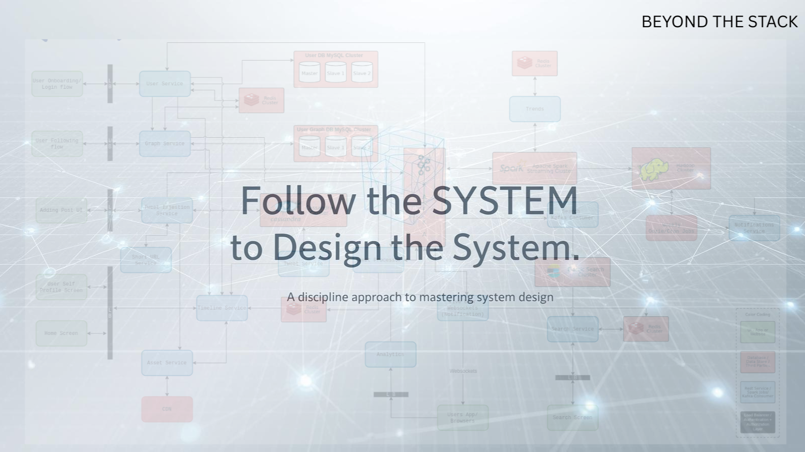
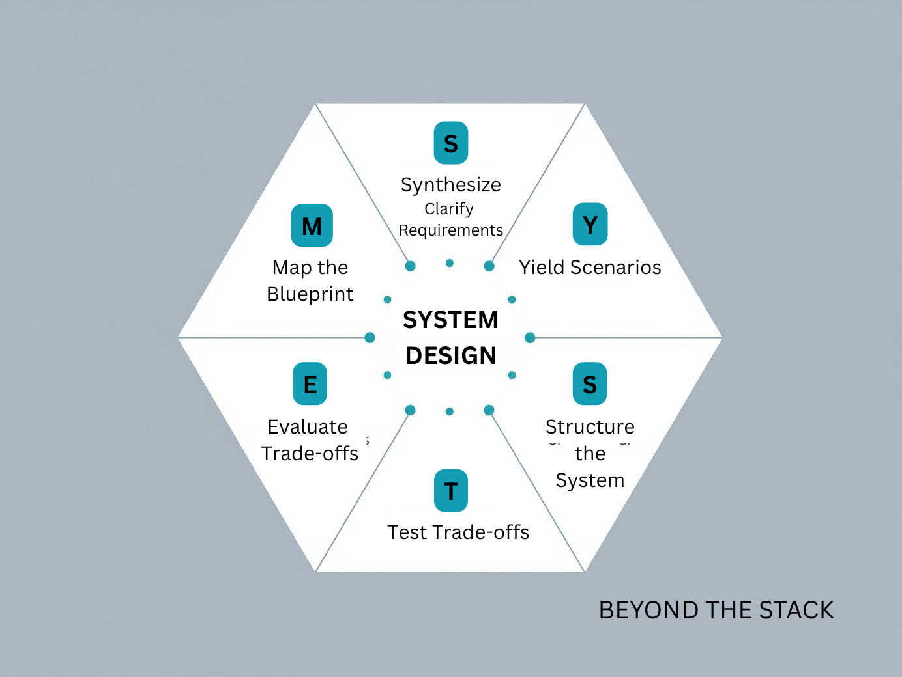

# 🧩 The SYSTEM Behind Every Great System

Everyone talks about  *the system* . Few realize that designing one requires following another.

🧩 **“You need to follow the SYSTEM to design the system.”**

Most engineers approach system design like a puzzle — jump in, draw a few boxes, connect lines, and hope it scales.

But great architects don’t start with boxes — they start with  *principles* .

Welcome to **Beyond the Stack** — the place where we strip away frameworks and dive deep into the real, hard-hitting challenges shaping tomorrow’s tech.

Thank you for patiently waiting for my next edition. A lot happens during these 2-3 weeks. View my post to check these happenings:

[https://www.linkedin.com/posts/pradgupt_careergrowth-cloudcomputing-terraform-activity-7379688544795201537-B_2m](https://www.linkedin.com/posts/pradgupt_careergrowth-cloudcomputing-terraform-activity-7379688544795201537-B_2m)

---

### ✨ A Glimpse of Past Editions

Check out my past editions for more lessons *Beyond the Stack* :

* 👋[**My 21-Year Dev Journey - why Beyond the Stack?**](https://www.linkedin.com/pulse/why-beyond-stack-developers-journey-from-code-cloud-pradeep-gupta-1z7pc)
* 🎥[**Scaling Like Netflix — Lessons from the World’s Most Resilient Streaming Platform**](https://www.linkedin.com/newsletters/beyond-the-stack-7318612377875161089/)
* 🧵 [**From One Brain to Many Minds: The Evolution of Concurrency**](https://www.linkedin.com/pulse/from-one-brain-many-minds-evolution-concurrency-pradeep-gupta-osmlc/)
* 🧭 [**The Missing Map: Why Your Systems Are Failing Silently**](https://www.linkedin.com/pulse/missing-map-why-your-systems-failing-silently-pradeep-gupta-5zenc/)
* 🧠 [**The Origination of Agentic AI Systems — A New Era of Modular, Composable, and Communicative Intelligence**](https://www.linkedin.com/pulse/origination-agentic-ai-systems-new-era-modular-composable-gupta-mkvic/)

I also started writing on Medium Platform:

* 📈 [**From Code Monkey to System Architect: The Critical Shift Every Developer Needs to Make**](https://medium.com/@pradeepngupta/from-code-monkey-to-system-architect-the-critical-shift-every-developer-needs-to-make-7c4b58cbc29f)
* [**Stop Thinking in Requests. Start Thinking in CAR and STREAM**](https://medium.com/@pradeepngupta/stop-thinking-in-requests-ad241ed76238)
* [100% Test Coverage. Still Broken in Production](https://medium.com/@pradeepngupta/100-test-coverage-still-broken-in-production-c444d02fe01e)

> 🔗 Click to **read and subscribe** to get notified for new editions.

Let's dive into today's article for SYSTEM engineering discipline.

System design isn’t a guessing game; it’s an art of reasoning under constraints. The problem isn’t knowledge — it’s chaos. Without a clear  *method* , even the smartest minds lose direction midway.

That’s where **SYSTEM** comes in — not as a buzzword, but as a disciplined approach to break down any complex design challenge into clarity and control.

> If you’ve ever fumbled in a system design round or over-engineered a feature, **stay with me** — this will completely reset how you think about architecture.

In this edition of  *Beyond the Stack* , we’ll decode the **SYSTEM approach** to design systems that scale — not just technically, but thoughtfully. And we’ll test it against a classic: **building a URL shortener** that can handle massive read/write traffic without collapsing under pressure.

---

### ⚙️ The SYSTEM Approach: A Discipline for Clarity in Chaos

**SYSTEM** is a mnemonic for how seasoned engineers reason through design challenges: it’s a loop of  **Synthesize → Yield → Structure → Test → Evaluate → Manifest** .

Let’s decode each one — not as rigid steps, but as a mental rhythm.

---

### S → Synthesize

Start by ***understanding what you’re solving*** — not what you’re building.

* Gather clarity: What are the core requirements?
* What’s optional, what’s critical, what’s unknown?
* What assumptions need validation?

> Example: “We need a service that shortens URLs, handles 10M requests/day, avoids collisions, and optionally provides analytics.”

**This stage aligns everyone on *the same problem* — not ten different versions of it.**

---

### Y → Yield Scenarios

Yield to  **context, constraints, and trade-offs** . Break the system into use cases and edge cases.

Every design operates within boundaries — time, budget, scale, or technology. Yielding doesn’t mean giving up; it means acknowledging your playing field before making a move.

Ask:

* Who are the users?
* What does the happy path look like?
* What about errors, retries, or abuse?
* What’s the expected traffic pattern?
* Is latency more important than consistency?
* What trade-offs are acceptable?

> Example: User shortens a link  **(happy path)** . User browses short URLs that redirect to long URLs  **(happy path)** . System detects duplicate or malicious URLs  **(edge case)** . Analytics requests hit read replicas  **(optimization path)** .

The above corresponds to:

> “We’ll prioritize read performance over absolute consistency, since users mostly fetch existing short links.”

**Yielding builds realism into your design — not perfectionism.**

---

### S → Structure

Now comes the visible part —  **structure the system** . Break it into core components and define responsibilities clearly.

For a URL shortener, that’s:

* API Gateway (handles requests)
* URL Hash Generator (creates short codes)
* Database Layer (stores mappings)
* Cache Layer (accelerates lookups)
* Analytics Collector (optional, event-based)

Ask,

* *How do these interact?*
* *What scales first?*

> Example: 1. API Layer → Application Service → Cache → Database.            2. Optional: Async Analytics Pipeline via Message Queue

**Structure turns clarity into architecture. You’re no longer guessing — you’re reasoning.**

---

### T → Test

No design is perfect. Every decision costs something — latency, complexity, or maintainability. Bring empirical reasoning: compare consistency vs. availability, SQL vs. NoSQL, REST vs. gRPC.

Testing in system design isn’t about unit tests — it’s about *stress-testing your thinking.*

Ask:

* What happens if 1M new URLs come in at once?
* What if a key database node crashes?
* How does latency scale under load?

Model, simulate, and validate assumptions before the first line of code.

> For example, test the collision probability of your hash function using real-world data patterns. If your algorithm breaks at scale, fix it now — not after launch.

**Trade-offs are where design maturity shines.**

---

### E → Evaluate

After testing, **evaluate your trade-offs** with evidence. Quantify scale and validate choices with real numbers. QPS, throughput, replication lag, or cost estimation — metrics make your design grounded and defendable.

Ask:

* Did the system meet its goals?
* What metrics define “good enough”?
* What’s the cost of scaling each component?

> Example: “Expecting 10M requests/day? That’s ~115 QPS — feasible for a single region, 10x traffic growth? Add partitioning or sharding later.”

**Metrics make your design defendable — because numbers beat assumptions.**

---

### M → Manifest (Map the Blueprint)

Finally, **manifest your reasoning** — communicate your design clearly.

Architecture isn’t complete until it’s  *understood* . Manifesting means documenting assumptions, visualizing data flows, and aligning stakeholders.

> In interviews, this means walking the interviewer through your thought process.

> In teams, it means creating artifacts others can reason about tomorrow.

**This is your storytelling moment.**

> How you *present* the system is as important as how you *build* it.

**👉 If this resonated, tap 👍 to help more engineers design with discipline.**

We’ve walked through each layer of SYSTEM — now, let’s step back and see why this framework truly matters.

---

### 💡 Why SYSTEM Works

Because  **discipline beats memorization** .

> The SYSTEM framework doesn’t tell you *what* to build — it guides you *how* to think.

* It **slows down chaos** — forcing clarity before creativity.
* It turns **engineering into storytelling** — every step justifies itself.
* It helps you  **think like an architect** , not a coder.
* And most importantly, it’s **industry-agnostic** — this discipline applies to software, hardware, business systems, and even organizations.

It’s not about knowing all the answers — it’s about knowing *how to navigate the unknown systematically.*

**👉Comment below if you found the SYSTEM discipline even slightly valuable — I’d love to hear your take.**

---

### 📚 Further Reading

If you want to go beyond intuition and build  *engineering discipline* , here are a few gems worth exploring:

1. **[“System Design Primer” (GitHub by Donne Martin)](https://github.com/donnemartin/system-design-primer)** — a goldmine of real-world design problems.
2. **[Netflix Tech Blog](https://netflixtechblog.com/)** — practical insights on scaling, caching, and microservices evolution.
3. **[Gergely Orosz: The Pragmatic Engineer](https://www.pragmaticengineer.com/)** — deep dives into how big tech companies make architectural decisions.
4. **[“Designing Data-Intensive Applications” by Martin Kleppmann](https://www.oreilly.com/library/view/designing-data-intensive-applications/9781491903063/)** — the ultimate guide for modern system design thinking.
5. **[Uber Engineering Blog](https://www.uber.com/en-IN/blog/engineering/)** — for data, observability, and microservice scaling narratives.

💡 **Tip for readers:** Use these resources to **reinforce the SYSTEM discipline** — think systemically, rely on evidence, analyze methodically, and always communicate your thinking clearly.

By now, you’ve probably noticed — SYSTEM isn’t a checklist. It’s a discipline.

Pause for a moment — when was the last time you designed a system *without realizing* you were following a method like SYSTEM? Share your thoughts below! 👇

---

### 🧠 Closing Thoughts

System design isn’t an art of guessing. It’s the art of reasoning — one step at a time.

So next time you’re designing something complex — from a URL shortener to a real-time analytics engine — don’t panic or doodle aimlessly, remember:

> 🧩 **You need to follow the SYSTEM to design the system.**

Because when you design *with* the system — you’re not just building software; you’re architecting clarity, communication, and confidence.

Senior engineers who follow this structured approach often notice three clear benefits:

1. **Clarity under pressure** — interviews or design reviews feel structured, not chaotic.
2. **Better trade-off articulation** — design choices feel data-backed, not opinion-driven.
3. **Confidence in communication** — you explain architecture, not just draw boxes.

If this edition made you rethink how you approach system design — **share it with a peer** who’s preparing for their next big architecture discussion or interview.

---

### ✨ Upcoming Editions of Beyond the Stack

🎬 Coming Soon on *Beyond the Stack* — each exploring a crucial facet of modern system design:

* Async Without the Headaches *- CompletableFuture Demystified*
* Lazy vs. Eager Execution: Couch Potato Meets Bouncy Bunny
* Self Healing Systems
* Security By Design
* Reliability Measures

**📬Don’t just read about systems — grow with one. Follow *Beyond the Stack* today to keep building your architecture muscle, one mindset at a time.**

---

### 🙌 Before You Go

Every scalable system starts with a scalable thought process. When you apply SYSTEM thinking, you don’t just design software. You design **clarity, predictability, and trust** — the hallmarks of great engineering.

📩 **Got a System Design experience to tell?** Have you interviewed with System Design anytime? How did you tackle it? I’d love to hear your experiences!

✉️ If you enjoy my SYSTEM discipline for System Design, you’re in the right place.

🚀 Apply SYSTEM in your next system design challenge — subscribe to *Beyond the Stack* for more frameworks, examples, and engineering insights.

✨ *Beyond the Stack* is more than just technology—it’s about the timeless principles shaping the future of software systems.

👉 [Subscribe Here](https://www.perplexity.ai/search/i-am-writing-the-tech-newslett-SrDh_1i3QsywEtLB2qUmTw#) and never miss an edition!

---

🚀 *Beyond the Stack* | Simplifying Complex Engineering Concepts for the Curious Developer
