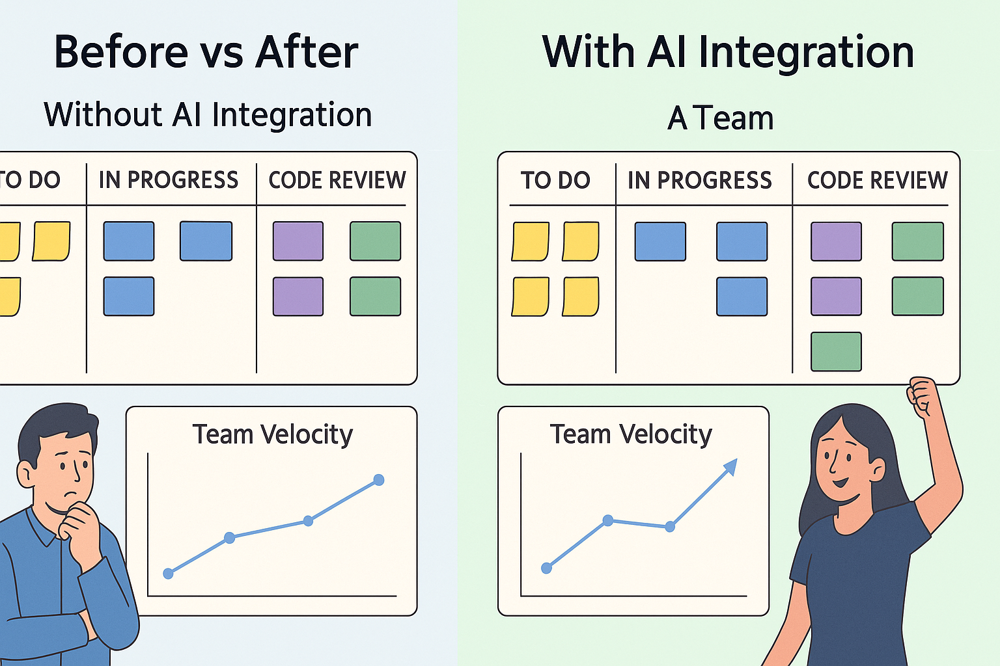

# 🧠 How I’m Integrating AI in Spring Boot Projects to Boost Developer Productivity

Welcome to the *Third edition of the* **Beyond the Stack** newsletter!

First of all, **A BIG THANK YOU** to all of your for all *your love and *support** on the first two editions.

If you missed reading them, you can always catch up via the newsletter archive.

> **Tip**: Subscribe to the newsletter so you’ll receive all future editions directly in your inbox!

🔗Newsletter link: [https://www.linkedin.com/newsletters/beyond-the-stack-7318612377875161089/](https://www.linkedin.com/newsletters/beyond-the-stack-7318612377875161089/)

## 🧠 How I’m Integrating AI in Spring Boot Projects to Boost Developer Productivity

**From debugging smarter to designing faster, AI has become an integral part of our development stack.**

Not long ago, our Java + Spring Boot workflow felt like a well-oiled but linear machine. 

Developers would write code, test, review, debug, deploy — repeat. 

It was efficient, but it wasn’t  *smart* . 

That’s where AI came in — not to replace developers, but to *amplify* them.

In this edition of  *Beyond the Stack* , I’m sharing how we’ve been integrating AI tools into our Spring Boot projects — and the productivity wins that followed.

## 1️⃣Copilot + IntelliJ: A Game Changer on the Developer’s Machine

We started experimenting with **GitHub Copilot** inside  **IntelliJ IDEA** , our go-to IDE for Spring Boot projects development. 

Initial impressions? Impressive.

But after a few months of structured usage, the results were clear:

### 📌 Real-world Use Cases:

* **Boilerplate generation** : REST controllers, DTOs, JPA repositories
* **Test creation** : JUnit + Mockito test scaffolding
* **Regex & utility methods** : Copilot became our go-to for tricky one-liners
* **Code transformation** : Refactoring loops to streams, or imperative code to reactive programming

### 📊 Measured Impact:

* **~25% reduction in repetitive coding time**
* **~15-20% faster TDD cycles** (thanks to auto-generated test stubs)
* **Fewer context switches** , leading to better developer flow

While Copilot still needs human review, its speed and intuition have helped developers ship smarter — not harder.

## 2️⃣ Python Integrations That Bring Intelligence into the Java Stack

Java is amazing for scalable services — but Python truly shines when it comes to AI and data tooling. Rather than choosing one over the other, we *bridged the two* .

### 🧠 Our Hybrid Strategy:

* **Log summarization** : shipping logs to a shared location, parse them using Python + OpenAI, and generating human-readable incident summaries
* **Incident analysis** : Using pandas + NLP, we analyze failure trends and correlate them with system-level events
* **Real-time alert enrichment** : Python scripts tag alerts with metadata using AI classification models

These Python utilities run either as sidecars in the Spring Boot pods or as standalone cron-based microservices.

## 3️⃣ Designing & Developing with OpenAI

Beyond observability and monitoring, **OpenAI** has become our design-time ally. 

Whether it's prototyping, writing code snippets, or crafting documentation — GPT-powered tools have become integral to our workflow.

### ⚙️ Common Workflows:

* **Swagger → Model Generator** : Feed an OpenAPI spec and generate DTOs & POJOs
* **“Rubber Duck” Debugging** : Describe an issue in natural language and receive structured hypotheses
* **Comment-to-Code** : Developers write pseudo-code as comments, AI fills in the function bodies

Even complex architectural trade-offs are explored first with GPT-based tools to brainstorm and validate decisions.

## 🧱 AI in Spring Boot Is Just Getting Started

This isn't just a trend - it's a transformational shift.

AI tools are helping us:

* Reduce development friction
* Shorten feedback loops
* Improve documentation & onboarding
* Detect issues before they become problems

Most importantly, they’re allowing developers to focus on what truly matters — *business logic, design, and delivering value*.

The result?

📈 **A** **continuous increase in the team velocity.**

## 🏁 Final Thoughts

AI won’t write the next billion-dollar app for you -

but it will help you get there *faster, cleaner, and smarter*.

In our case, the combination of **Copilot + Python + OpenAI** has revolutionized the developer productivity. And we’re just scratching the surface.

**Coming Soon:**

We’re currently experimenting with *natural language deployment pipelines* and  *AI-assisted test coverage analysis.*

If they succeed, you’ll read about it here first.

## 📚 Further Reading & Resources

🛠 **GitHub Copilot for IntelliJ**

[Official Plugin Page](https://plugins.jetbrains.com/plugin/17718-github-copilot) — Supercharge your IntelliJ development with AI-assisted coding.

🛠 **CodiumAI - IntelliJ Plugin**

[CodiumAI for IntelliJ](https://plugins.jetbrains.com/plugin/19944-codiumai) — Generate meaningful tests automatically with AI-driven insights.

🧠 **Prompt Engineering for Developers**

[Guide to Prompt Engineering for Software Developers](https://github.com/dair-ai/Prompt-Engineering-Guide#software-development) — Best practices on crafting effective prompts to integrate AI into your coding workflow.

🔍 **LangChain for Java (early explorations)**

[LangChain4j GitHub Repo](https://github.com/langchain4j/langchain4j) — If you’re curious about building intelligent apps with Java + LLMs, this is worth bookmarking.

## 🔜 Next Edition Preview:

**Edition 4: From Scripts to Startup — The Story Behind a Touchless Billing Solution**

🚀 How a weekend side project became a production-grade billing platform

🧩 The tech stack that powered a frictionless payment experience

🎯 Lessons learned while scaling from an MVP script to startup-ready microservice

(if you love real-world tech journeys, this one's for you.)

### 🎁 Subscriber-Only Content (This Edition)

**Spring Boot + OpenAI Developer Prompt Kit** (exclusive link via subscriber email)

➡️Fill this short form to receive it: [https://forms.gle/TQ6JxDCXBqeQZXDP6](https://forms.gle/TQ6JxDCXBqeQZXDP6)

---

## 🙏 Thank You!

Thanks to the amazing support from  **300+ subscribers** , *Beyond the Stack* is growing faster than I ever imagined.

Your feedback is what makes these editions even more meaningful.

💬 Are you using AI tools in your development workflow? I’d love to hear what's working (or not) for you!

📣 Share this newsletter with your team, your curious dev buddy, or even that skeptical architect who's still allergic to Copilot. 😉

🔁 Follow the newsletter,

💌 Share it with your network,

🧠 And let's continue going *Beyond the Stack* together!

[**Published Date**: April 29, 2025]
