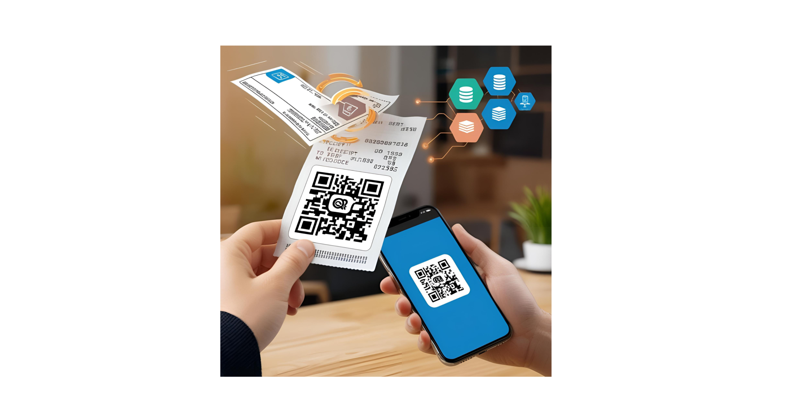

# From Scripts to Startup: The Story Behind a Touchless Billing Solution

Welcome to the *Fourth edition of the **Beyond the Stack** newsletter! I am very much excited to share an interesting story on my startup journey!

> ***If you love real-world tech journeys, this one's for you!***

First of all, **A BIG THANK YOU** to all of your for all *your love and* support on my each and every editions.

If you missed reading them, you can always catch up via the newsletter archive.

> **Tip** : Subscribe to the newsletter so you’ll receive all future editions directly in your inbox!

🔗[**Newsletter link**](https://www.linkedin.com/newsletters/beyond-the-stack-7318612377875161089/)

## From Scripts to Startup: The Story Behind a Touchless Billing Solution

Innovation doesn’t always start in a boardroom.

Sometimes, it begins with a small discomfort—in our case, it was  *thermal paper* .

We asked ourselves:

*“In a world that was rapidly going touchless during COVID, why were we still handing out thermal receipts with harmful BPA chemicals?”*

That single question lit the spark.

### **A Quick Fix with a Big Vision**

We wanted to  **deliver bills to mobile phones** —but without asking for their numbers. And without disrupting the existing billing systems.

So we built a **rapid prototype** using:

* Microsoft’s in-built **virtual printer**
* A **batch script** and **task scheduler**
* **File watcher + transfer utilities**
* A **dynamic QR code page** in HTML + JS

The result?

A working pipeline that generated a digital copy of the bill, encoded it behind a QR code, and sent it to the scanned device— **all automatically.**

### 🚀 From Prototype to Platform

Once our PoC proved the concept, we doubled down with a full-fledged engineering effort.

We gradually replaced makeshift tools with a robust, scalable stack built from the ground up:

* 🔧**Custom Virtual Printer**developed using WPF in C# (.NET)
* 👁️**File Watcher**built with Electron.js
* 🔄**WebSocket-Based File Transfer Utility**for seamless handoff
* 📱**Native Android App**(Kotlin) for scanning and receiving bills
* 📷**Static QR Codes**paired with**secure socket listening**
* ☁️**Microservices**deployed on**Google Kubernetes Engine (GKE)**(we also experimented with AWS Lambda, SQS, and CloudWatch)
* 🗃️**Firestore & PostgreSQL**for flexible backend storage
* 🖥️**React.js Admin Panel**for real-time monitoring and configuration

Each piece was designed as an independent microservice—letting us isolate and scale specific components as needed. This modular approach gave us the freedom to mix our own code with third-party services where it made sense, while still retaining full control and scalability over the critical pieces.

### 🧩 Real-World Challenges We Had to Solve

Like any startup journey, ours came with its fair share of obstacles. Here are just a few key challenges we tackled:

1️⃣**Plug-and-Play with Any POS System**Every billing setup has its own quirks—different printers, formats, and configurations. Our promise?*Don’t touch the existing system.*Instead, we built a solution that seamlessly integrates with**any**POS system, enabling touchless billing**without disrupting**the current setup. We weren’t replacing POS software—we were enhancing it.

2️⃣**Resiliency and Reliability at Scale**Making something work once isn’t hard. Making it work**every single time**is the real test. We had to account for edge cases like:

* ❌ What if the file transfer fails midway?
* 🕒 What if the QR code is scanned before the bill is ready?
* 🔐 How do we prevent unauthorized access (e.g., random QR scans)?
* 🛡️ How do we rate-limit and protect our services from potential DDoS attacks?

3️⃣**Code Quality in a Distributed Architecture**With a growing codebase spanning multiple microservices, maintaining **code quality** , enforcing best practices, and keeping everything in sync became a challenge of its own.

But every challenge made our platform stronger, leaner, and more scalable.

> These challenges helped shape the product's maturity and resilience.

### **The Takeaway**

It started as a **simple script** to avoid BPA paper, but evolved into a  **full-fledged startup stack** .

Because sometimes, the only way to validate a big idea... is to start  *small and smart* .

---

### 🔜 Next Edition Preview

In the next edition of this newsletter, I’ll take you behind the scenes of one of the **most complex challenges** we faced while scaling our touchless billing platform:

**“How we addressed security, device compatibility, and user experience across hundreds of devices.”**

When you’re building a solution meant to work across a wide range of devices—different Android versions, various screen sizes, multiple QR scanners, and diverse network environments—you quickly realize that **a one-size-fits-all approach doesn’t work** .

➡️ In the next issue, I’ll unpack the exact design decisions, code strategies, and UX tweaks we used to make it all work—reliably and securely.

**Stay tuned. And if you’re not subscribed yet, now’s the time to hit that button.**

🛎️*Subscribe, repost, and share your thoughts—we’re building in public!*

### 🎁 Viewer’s FREE Content

Because sharing knowledge sparks innovation, here are**two open resources**you can explore today:

---

### 🗂️ Folder Watcher Service (PowerShell)

> 📌 Written by me over 5 years ago, this lightweight script still stands strong!

This service monitors a designated folder for changes (like new bill files being printed) and triggers automated actions—ideal for building file-based integrations or notifications. It’s a great example of how simple scripting can solve real-world automation problems with minimal overhead.

🔗**Explore on GitHub:**[github.com/pradeepngupta/FolderWatchService](http://github.com/pradeepngupta/FolderWatchService)

---

### 📱 Cross-Browser QR Code Generator (JavaScript)

> 🔍 No dependencies. Just plug-and-play.

If you're looking to embed QR code functionality into your HTML/JS prototype, this tiny but powerful JavaScript library is all you need. It works flawlessly across modern browsers and lets you convert URLs (or bill references) into scannable QR codes in seconds.

🔗**Try the Live Demo:**[davidshimjs.github.io/qrcodejs](http://davidshimjs.github.io/qrcodejs)

---

These tools can jumpstart your touchless billing experiments or inspire your own automation ideas.

---

### 🙏 Thank You!

With over **400 subscribers and counting** ,*Beyond the Stack*is growing faster than I ever imagined—and it's all thanks to your support and encouragement.

Your feedback fuels every edition and helps shape the kind of content that matters.

💬 Are you working on an idea that’s evolving into a SaaS platform? I’d love to hear the story behind it—your challenges, pivots, and breakthroughs!

📣 If you’ve enjoyed this edition, consider:

🔁 Following the newsletter

💌 Sharing it with your team or fellow builders

🧠 And joining me as we keep pushing boundaries—**Beyond the Stack**

Thanks again for reading.

Until next time—**Stay curious. Stay lean. Build boldly.**

**– Beyond the Stack**
