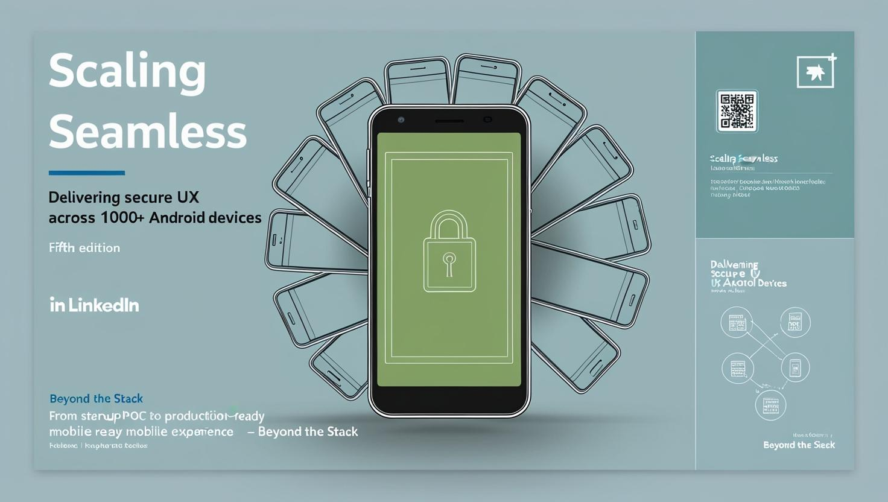

# 🧱 Scaling Secure and Seamless: How We Delivered Across 100+ Devices

Welcome to the *Fifth edition* of the **Beyond the Stack** newsletter! 

I'm truly overwhelmed by all the kind messages, questions, and encouragement I've received over the past few editions.

A **BIG THANK YOU** to each of you for your continued support!

If you missed any of the previous editions, you can always catch up in the archive:

🔗 [**Newsletter link**](https://www.linkedin.com/newsletters/beyond-the-stack-7318612377875161089/)

Today, I’m continuing the journey behind my startup—specifically how we deployed our Android mobile app  **across 1000+ unique devices** .

> *If you're into real-world mobile tech challenges, this one's for you!*

In the last edition, I shared how a simple PoC—meant to eliminate thermal paper—evolved into a full-stack platform that delivered  **touchless digital bills via QR codes** .

But launching the first prototype was just the beginning.

The real challenges came next:

**Security. Device compatibility. User experience.**

All across a fragmented Android ecosystem.

Here's how we tackled each:

---

## **1. Security First**

.

When anyone can scan a QR code, how do you ensure only the **intended user** receives the bill?

We implemented layered safeguards:

* **Token-based pairing** between app and session
* **Time-bound QR validity** and one-time-use links
* **File encryption** during transit
* **Signature verification** on delivery to ensure file integrity
* **Rate limiting and throttling** to prevent abuse or DDoS-like behavior

Each layer was designed to enhance trust—without sacrificing user experience.

---

### **2. Device Compatibility Across Android Ecosystem**

.

Every Android device is slightly different—and we had to account for that.

Here’s how we approached it:

* Selected a **minimum SDK version** to support 90%+ of active devices
* Used **responsive layouts** and **adaptive rendering** for screen flexibility
* Accounted for common issues:
  * Camera permissions on older Android versions
  * Network instability on budget devices
  * Lack of autofocus in entry-level phones
* Built **fallback flows** for devices without WebSocket support or with restricted browser environments

We tested extensively—both on emulators and physical devices—to minimize surprises in production.

---

### **3. Designing for Seamless User Experience**

.Our goal:  **No friction** . Just clarity.

* **One-scan flow** : QR → Auto download → Notification → Open bill
* Clean, intuitive UI with **2-click access**
* **Dark mode support** (yes, it was requested!)
* **Lightweight APK** to ensure smooth installs on budget devices
* **Offline support** : downloaded files are stored and synced when online

And most importantly—we listened.

User feedback shaped every iteration.

But just when we thought we had nailed the perfect flow— **a curveball from Android** .

🚧 **A UX Surprise from Android Updates**

We had a seamless user journey in place… until Android introduced a change requiring **explicit location permission** for certain Bluetooth and file-sharing features.

This seemingly small update broke the flow entirely.

We now had to request permissions in a new way—causing friction, hesitation, and even drop-offs.

💡 It was a reminder that  **perfect UX is a moving target** —especially when you're building on top of constantly evolving platforms.

---

### **Takeaway**

Building a touchless billing platform wasn’t just a technical problem.

It was about  **empathy** —understanding the diversity of devices, environments, and user behaviors.

✅ Security without friction

✅ Compatibility without complexity

✅ Experience without extra effort

That’s what true scale demands.

---

### 👀 Coming Up Next

In the next edition, we’ll shift gears and explore:

🧠 **“The Role of AI in Cricket — Especially in the IPL”**

From player heatmaps to real-time stat overlays, you’ll see how AI is reshaping the game—and what we, as technologists, can learn from it.

Thanks again for being part of this journey.

Until next time,

**Stay curious. Stay lean. Build boldly.**

Let’s keep going *Beyond the Stack* 🚀
