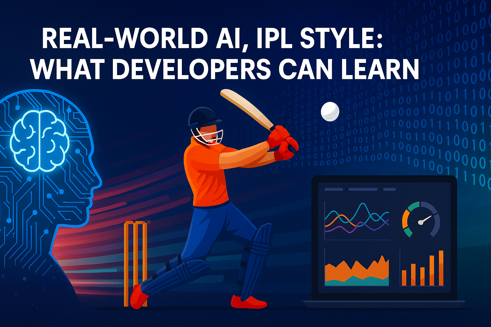

# 🏏 Real-World AI, IPL Style: What Developers Can Learn

Welcome to a special edition of  *Beyond the Stack* , where we step outside the IDE for a moment—and into the stadium.

This IPL 2025 season, the boundaries between tech and sport are blurring faster than ever. From **real-time analytics** to  **AI-powered experiences** , the way cricket is being played and broadcast mirrors the principles we use every day in modern software engineering.

**Why IPL for this edition?**
IPL 2025 resumes today after a week-long break, and I want to make this session more interesting and exciting by spotlighting the tech that makes the IPL **smarter, faster, and more predictive-powered by AI.**

This edition, I am presenting you the five use cass where as per my opinion AI have created most impacts to the IPL teams / franchises this year.

---

## Why Cricket? Why IPL?

IPL is not just a sporting event — it's a high-stakes, high-volume, globally followed phenomenon.
With millions of fans, hundreds of matches, real-time betting, fantasy leagues, and OTT broadcasting, the IPL is also a goldmine for data.

And ***where there’s data, there’s AI**.*

## ⚙️ Real Use Cases of AI in the IPL

### 1. Strategic Decision Making & Team Selection

AI systems analyze vast amounts of match data, player statistics, pitch conditions, and opposition strengths to recommend optimal team compositions and match strategies.

AI also analyzes a player’s historical data — batting average, strike rate, performance under pressure, pitch types, weather — to predict:

* The best playing XI
* Matchups (e.g., how Rashid Khan performs against left-handers)
* Impact players in a given game scenario

> ***Teams now rely on AI-driven insights rather than gut instincts alone.***

> ***"You’re no longer cheering just for a team—you’re cheering for predictive data models that make the game smarter."***

**Top two Real world Examples:**

*Example 1:*

***Even before AI became a buzzword, teams like KKR used SAP HANA in IPL 7 (2014) to gain a data-driven edge — analyzing player matchups, pitch data, and live conditions to guide match strategies. It was an early but powerful application of decision intelligence in sports.***

Today, such systems are evolving with real-time ML, computer vision, and LLMs to go beyond prediction — towards personalized, dynamic fan and player experiences.

source: [https://www.superheuristics.com/how-sap-hana-helped-the-kolkata-knight-riders/#:~:text=The%20tool%20had%20two%20parts,Hana%20helped%20in%20keeping%20calm](https://www.superheuristics.com/how-sap-hana-helped-the-kolkata-knight-riders/#:~:text=The%20tool%20had%20two%20parts,Hana%20helped%20in%20keeping%20calm).

*Example 2:*

**Delhi Capitals (DC)** used AI to win the **auction game of the decade**, landing **KL Rahul for ₹14 crore** . The model projected that shifting him from opener to middle-order anchor would increase his win contribution by **31%** , making him worth every rupee.

Source:https://www.crictracker.com/cricket-appeal/rishabh-pants-ipl-2025-auction-ai-predicts-team-and-final-bid-price/

### 2. Fan Engagement & Digital Experiences

> **Fans enjoy more immersive and personalized viewing experiences; broadcast partners gain deeper audience engagement; teams and leagues build stronger connections with their supporters.**

Platforms like **Fanisko** enhance viewer experience through personalized content, interactive features, and augmented viewing options.

In 2018, Chennai Super Kings partnered with Fanisko to **offer Augmented Reality to over 20 million fans worldwide**.

Fanisko uses **computer vision** and **machine learning** to create realistic digital experiences, bringing fans closer to the action-even when watching remotely.

> This technology was especially valuable during pandemic-era cricket when in-person attendance was restricted.

Source: https://aithority.com/technology/augmented-reality/fanisko-named-online-augmented-reality-partner-for-ipls-chennai-super-kings/

In 2025, innovations like the AI-enabled robot dog in stadiums collected unique content, conducted interviews, and provided 360-degree broadcasts, while AI-driven analytics delivered deeper engagement for fans and sponsors

Source: https://www.thehindu.com/sport/cricket/ipl-2025-robot-dog-camera-pet/article69467281.ece

### 3. Umpiring & Decision Support

> Match officials gain confidence in difficult decisions; players receive fairer outcomes; the sport maintains higher integrity with fewer controversial calls affecting results.

Remember the 3rd Umpire? Everyone focuses on the replay in slow motion and from different angles.

Computer vision and tracking systems that provide objective data to support umpiring decisions, reducing human error in critical match situations.

While the DRS (Decision Review System) is well-established, companies like **Hawk-Eye Innovations** continue to refine their technology for cricket applications. Their ball-tracking system uses multiple high-frame-rate cameras and sophisticated algorithms to predict ball trajectory, providing critical data for LBW decisions during IPL matches.

**This year, the IPL adopted Hawk-Eye technologies to judge off-side and head-high wide deliveries.**

Source: https://www.espncricinfo.com/story/ipl-2025-hawk-eye-tech-to-judge-off-side-and-head-high-wides-1477444

The technology combines computer vision with predictive algorithms to determine where the ball would have traveled if not interrupted by the batsman's body.

### 4. Training & Simulation

Virtual reality and simulation tools allow players to practice against virtual opponents, preparing for specific match situations without physical constraints.

> Players gain additional training opportunities; teams can prepare for specific opponents without revealing strategies; players can train against scenarios that would be difficult to replicate in physical practice.

**iB Cricket** has developed a **VR cricket simulation** that allows players to practice in a virtual environment against different bowling styles and match situations.

While experiencing iB Cricket, the Hon’ble President of India remarked:

> **"This is so excellent. In which stadium am I in?"**

iB Cricket has partnered with multiple teams to offer fans an immersive VR experience of playing cricket with their favorite cricketers.

The technology behind iB Cricket combines VR, IoT, blockchain, and AI.

### 5. Injury Prevention & Workload Management

.AI and analytics platforms monitor player injuries through workload, movement patterns, and stress indicators, collecting metrics from wearables or high-speed cameras with AI analysis.

> Players extend their careers through reduced injury risk; teams maintain player availability throughout tournaments; medical staff can make data-backed decisions about player readiness.

The **KinaTrax** markerless motion capture system, originally developed for baseball, has been adapted for cricket as well.

While there’s no public news of KinaTrax in the IPL yet, similar technologies are being explored in cricket and IPL training camps to:

* Analyze **bowling biomechanics** to reduce injury risk
* Break down **batting techniques** like backlift angle and reaction time
* Guide **rehabilitation and return-to-play** decisions
* Track **fielding reflexes** and agility drills

These systems use **high-speed cameras + AI-powered pose estimation** to capture a player’s full-body motion in real-time-no wearables or suits needed.

> Think of it as an intelligent coach that sees what the human eye can’t — in 3D, from all angles.

> It helps IPL franchises  **protect athlete health**,  **optimize technique** , and  **personalize training**, turning elite performance into a science-backed pursuit.

---

## Developers takeaways

While there are many use cases where AI makes cricket smarter, faster, and more predictive, I’ve highlighted the top five impacts in this area.

Cricket and code may seem worlds apart, but this IPL season proves otherwise.

AI, observability, personalization, scalability-they’re  **everywhere** , whether you're deploying microservices or chasing a total.

Each Usecase i mentioned in this edition in itself is a separate topic for discussion and new editions.

Every use case here reflects real-world tech like:

* Event-driven architecture
* Real-time data pipelines
* Edge + cloud hybrid systems
* AI/ML inference at scale
* System design under pressure

> *So the next time you watch cricket, think about what technology is being used, how you can contribute to making it smarter and more predictable, and think like a system designer.*

Because the real MVP? It’s not just Kohli or Cummins. It’s the AI, APIs, and infrastructure running quietly behind the scenes.

## 📚 Further Learning & Resources — Curated for Curious Minds

Whether you're a developer, system designer, or just tech-curious, here’s a list of **actionable reads and tools** that go deeper into the tech that powers real-world AI, IPL-scale systems, and platform thinking.

---

### ⚙️ 1. **Event-Driven Architecture (EDA)**

Build systems that react in real time — just like match events in the IPL.

* 🧵 **[Event-Driven Architecture by Martin Fowler](https://martinfowler.com/articles/201701-event-driven.html)**

  A foundational explanation of event-driven systems, patterns, and use cases.
* 📘 **[Building Event-Driven Microservices (O&#39;Reilly)](https://www.oreilly.com/library/view/building-event-driven-microservices/9781492057888/)**

  Learn how to build decoupled systems using Kafka, EventBridge, and more.
* 🧪 **[AWS EventBridge Tutorial](https://aws.amazon.com/blogs/compute/building-an-event-driven-application-with-amazon-eventbridge/)**

  Practical examples of setting up EDA in the cloud — useful for IPL-style concurrency.

---

### 🧠 2. **AI in Production / Sports / Scalable Systems**

Real-world blueprints for how AI fits into systems at scale.

* 🧱 **[Build Intelligent Apps with Microsoft AI Services](https://medium.com/@Brian.johnson_62680/build-intelligent-apps-with-microsoft-ai-services-5037e7f40b1d)**

  Learn how cloud-native microservices and Azure AI offerings can orchestrate intelligent decisioning in apps — from sports to retail.
* .🔎 **[Advancing AI in Sports Analytics – NVIDIA x Sky Engine](https://developer.nvidia.com/blog/advancing-ai-sports-analytics-through-the-data-driven-sky-engine-ai-platform-and-rtx/)**

  A powerful showcase of how edge devices + NVIDIA RTX GPUs power real-time player tracking, pose estimation, and broadcast overlays.

---

### ⚙️ 3. **Data Collection from Wearables / Sensors**

For those inspired by Spektacom, Hawk-Eye, or KinaTrax-style motion capture.

* 🔗 **[Open mHealth Schemas](https://www.openmhealth.org/)**

Learn how wearable data can be structured and transmitted securely and efficiently.

* 📊 **[How to Build a Full-Stack Sports Analytics Platform](https://towardsdatascience.com/build-a-full-stack-sports-analytics-platform-7a2c6c5d6e1d)**

A beginner-friendly walkthrough of collecting, storing, and visualizing sports data — from APIs to dashboards.

* **[⌚ Edge AI for Sports Wearables – Arm Developer](https://blog.nordicsemi.com/getconnected/how-next-gen-wearables-and-edge-ai-improve-sports-performance-analytics)**

Discover how low-power AI on the edge makes real-time decisions in wearables and stadium devices.

---

## 🎯 For Non-Tech Readers: Sales, Ops & Fan Engagement

Great tech doesn’t matter if it can’t be explained. These are for those driving strategy, user experience, and business outcomes.

### 🤖 1. **AI for Everyone (Google)**

* [Google’s AI Education Hub]()

  Learn what AI is, where it fits, and how it applies to business, product, and customer engagement — without a single line of code.

### 💼 2. **AI in Sales, CRM & Campaigns**

* [HubSpot: AI in Sales Guide](https://blog.hubspot.com/sales/ai-in-sales)

  Discover how sales pros use AI for smarter targeting, lead qualification, and personalized outreach.

### 🏟️ 3. **Sports + Strategy**

* 🎤 **[MIT Sloan Sports Analytics Conference Talks](https://www.sloansportsconference.com/content)**

  Deep business discussions on how analytics drive performance — great for marketing/sponsorship teams.🔜 Next Edition Preview

## 🔜 Next Edition Preview

In the upcoming edition of  *Beyond the Stack* , I’ll take you behind the scenes of one of the most **jaw-dropping feats** in **streaming technology**:

**“How Hotstar Scaled to 50+ Million Concurrent Viewers During IPL 2025”**

Did you know that during IPL 2025’s opening weekend, JioHotstar shattered all records with a peak concurrency of **34 million simultaneous viewers** and over  **137 crore views** ? The platform handled an unprecedented **2,186 crore minutes** of watch time in just the first three matches - a staggering achievement in live streaming at scale.

How did they do it? What system design principles, cloud architectures, and real-time scaling strategies powered this massive digital audience? That’s exactly what we’ll explore in detail.

This next edition is a **must-read for system designers, developers, and tech enthusiasts** who want to understand how to build resilient, scalable platforms that serve tens of millions of users simultaneously - without breaking a sweat.

---

**Stay tuned.**

If you haven’t subscribed yet, now’s the perfect time to hit that button.
🛎️ *Subscribe, repost, and share your thoughts-let’s unravel the secrets of world-class system design together!*

## 🔬 Want More?

Curious to dive deeper? Let me know if you’d love a **deep dive** into any of these technologies, or want to see real-world case studies on how similar systems are built and scaled in other industries.

💬 **I’d love to hear from you:**

* What’s your favorite tech analogy from the IPL?
* Are you experimenting with similar AI systems in your organization or side projects?

Your insights, questions, and feedback are the heartbeat of this community. Every comment, like, and share inspires me to bring you more relevant, actionable, and exciting content.

As we wrap up this edition, I want to express my heartfelt gratitude for your support and enthusiasm. It’s your curiosity and passion for learning that make this journey so rewarding. Together, we’re building a vibrant space to explore the latest in System Design, AI, Cloud Engineering, and programming languages like Python and Java Spring Boot.

Thank you for being an essential part of  *Beyond the Stack* . Here’s to pushing boundaries, learning together, and making tech more accessible and fun for everyone.

🏏 Let’s go  *Beyond the Stack* … and beyond the boundary!
