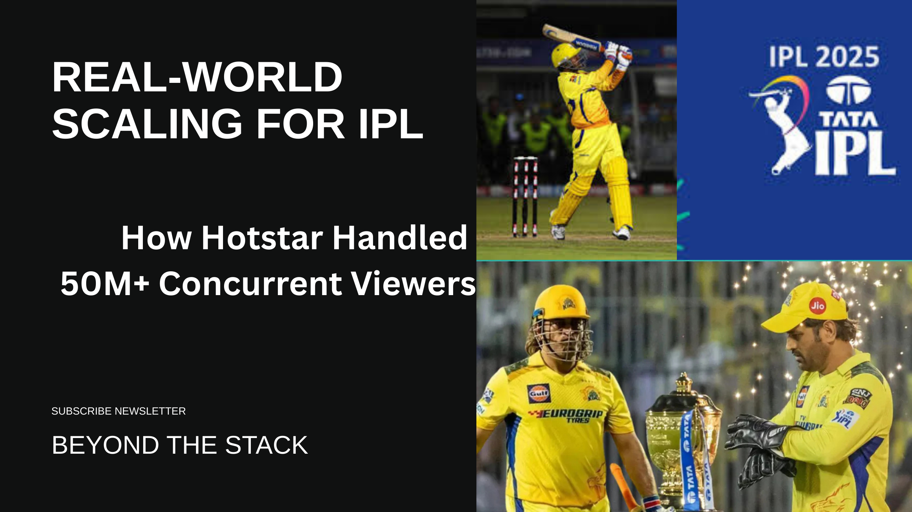
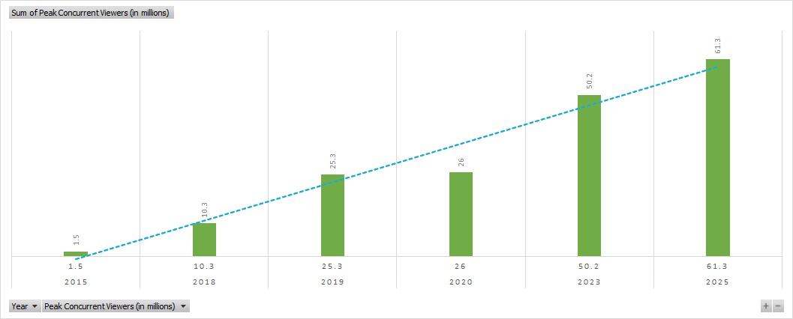
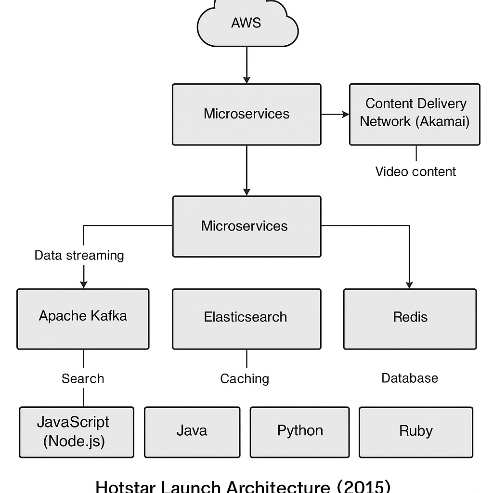
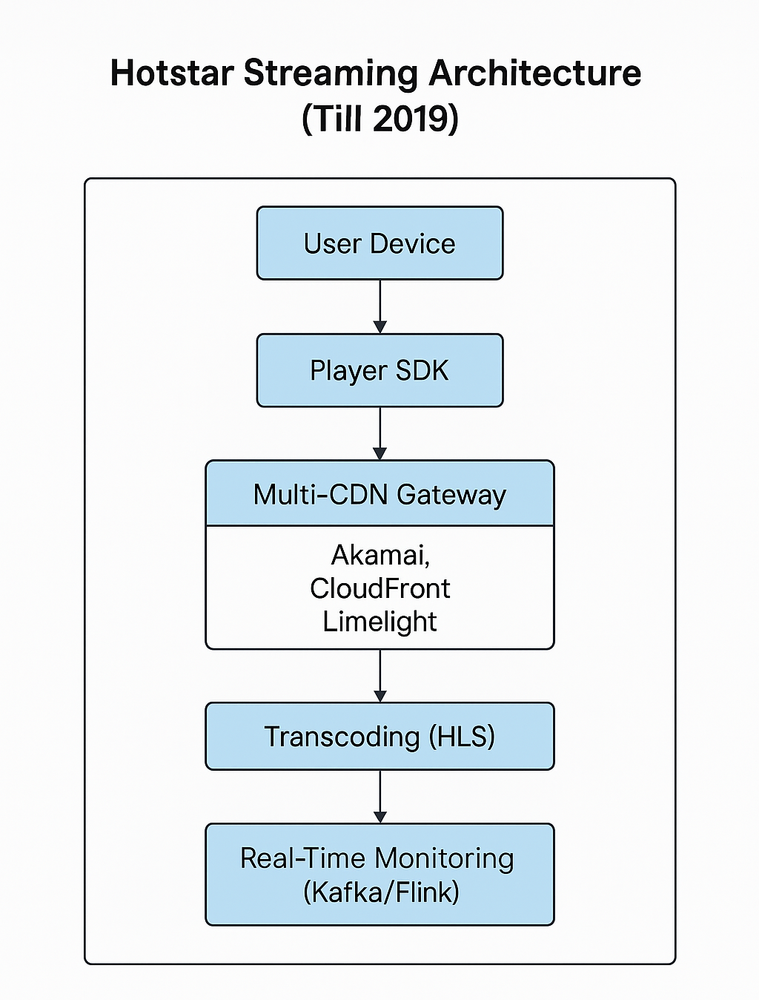
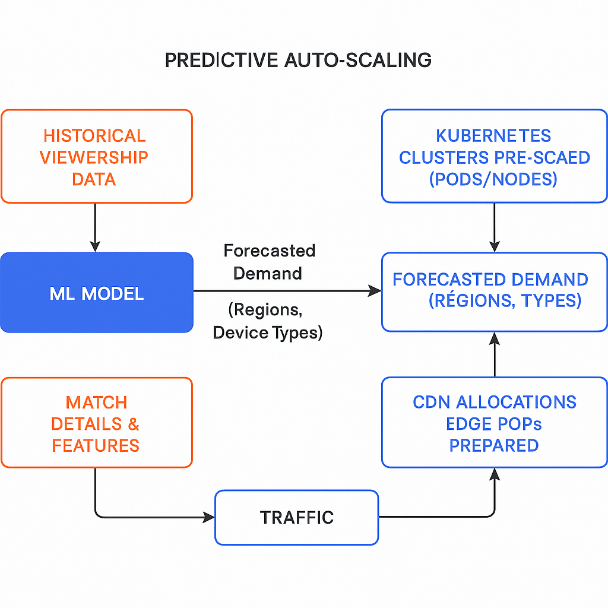
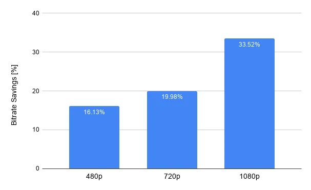
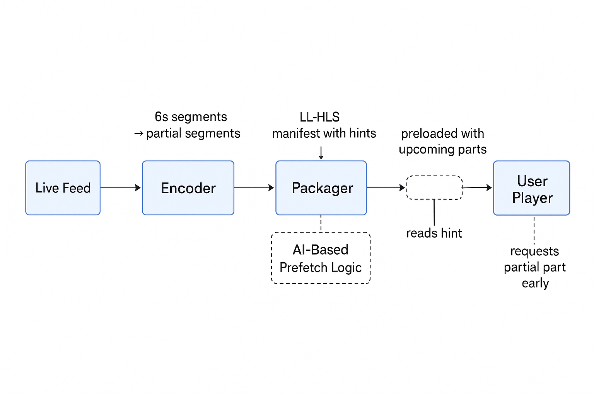
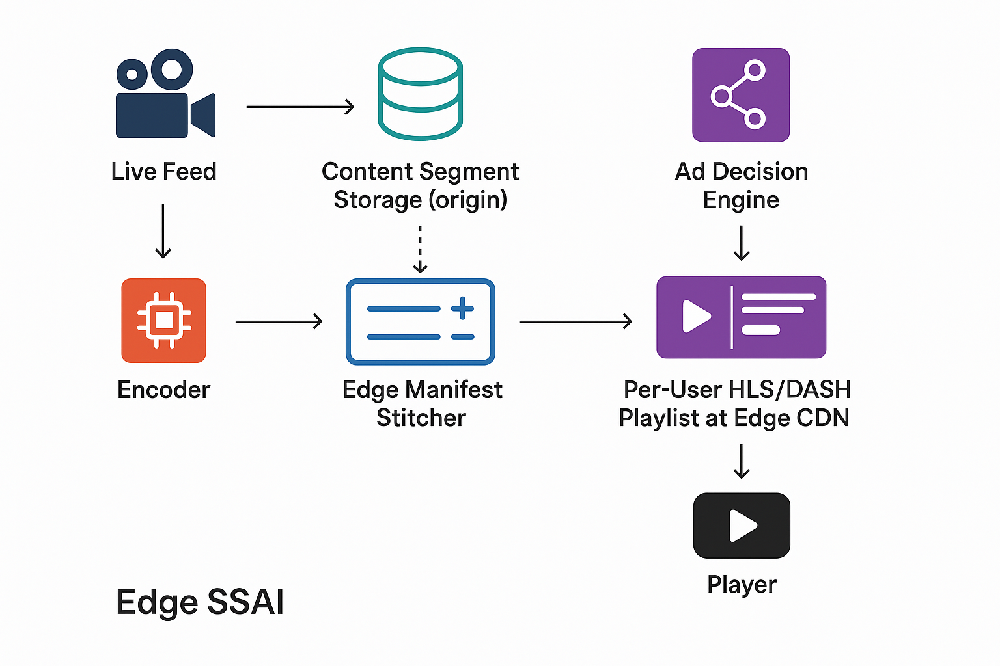
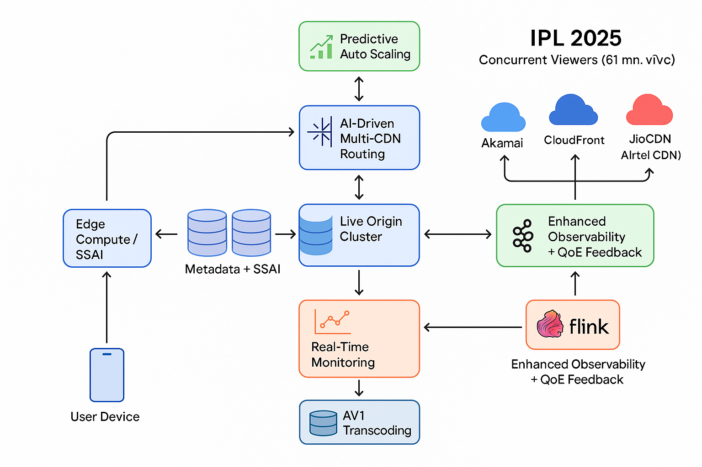

# 🏏 Real-World Scaling: How Hotstar Handled 50M+ Concurrent Viewers During IPL

Welcome to the **seventh edition** of *Beyond the Stack* — practical insights and real-world takeaways on Java, Spring Boot, Cloud Engineering, and AI for curious developers.

First, a **big thank you** to all of you for the overwhelming response to the last few editions. My inbox has been flooded with questions and feedback — it means a lot!

If you missed any of the previous editions, you can always catch up via the archive:

🔗 [Newsletter Link](https://www.linkedin.com/newsletters/beyond-the-stack-7318612377875161089/)

In this edition, we're diving into one of the biggest real-time streaming challenges ever handled — and yes, it involves cricket.

I'm not an avid cricket watcher, but the  *technology behind IPL streaming fascinates me* . Let's explore **how Hotstar scaled to handle over 50 million concurrent users .**

## 🏁 The Evolution of Hotstar: From Launch to JioHotstar

Hotstar’s journey has been nothing short of phenomenal:

* **2015** : Launched by Star India as a mobile-first streaming app
* **2019** : Acquired by Disney as part of its 21st Century Fox purchase
* **2020** : Rebranded as Disney+ Hotstar
* **2024** : Disney and Reliance announced a JV merger worth $8.5B
* **2025** : Rebranded again as  **JioHotstar** , combining JioCinema and Disney+ Hotstar

From there, it quickly evolved into one of the **most scaled OTT platforms** globally.

With every milestone on that timeline, Hotstar achieved significant breakthroughs in live streaming scalability.

## 🏗 Flashback: Hotstar Architecture in 2015 (Powered by Accenture AVS)

Hotstar initially launched with support from Accenture’s **AVS (Accenture Video Solution)** — a microservice-based, cloud-native platform on AWS.

Key components:

* **Live Ingest & Encoding** : Real-time feeds from Star were processed by Elemental Live encoders
* **HLS Packager** : Just-in-time packaging with SCTE markers for SSAI
* **Multi-CDN Strategy** : Akamai + CloudFront with AVS traffic-manager for failover
* **Client SDKs** : ABR players for 7,000+ device types
* **Real-Time Analytics** : Kafka → Spark → Vertica for QoE tracking

✅  *Result* : **25M video views** during IND–PAK match in the **2015 World Cup** — ***without in-house streaming engineering***!

Each of these AVS components, combined with Hotstar’s strategic decisions, offers a valuable case study for startups looking to build their own streaming platforms.

## 🔄 From Outsourced to In-House (2016–2019)

Hotstar gradually transitioned away from AVS to internal infrastructure and engineering. By 2019:

* **Compute** : EC2 → K8s with autoscaler
* **CI/CD** : Jenkins → GoCD with GitOps
* **Observability** : Prometheus + Grafana replacing AVS dashboards
* **Edge** : Custom Golang-based traffic manager (multi-CDN)
* **Data Plane** : Kafka + Flink powering real-time personalization & ads

✅  *Result* : **25.3M concurrent viewers** during the **2019 Cricket World Cup**.

### ⚡ IPL 2023 — Scaling to 50.2M Concurrent Viewers

#### 🎯 Business Objectives

* <2.5s average startup time
* <2 rebuffering events per 10 min
* 99.999% availability across devices

#### 🔥 Key Innovations

**1. Predictive Auto-Scaling**

Hotstar *didn't* rely on *autoscaling* to handle traffic spikes. Because it took time for a newly provisioned server to become healthy. The observed time range was 90 seconds.

Instead they prewarmed their infrastructure *ahead* of major sports events. i.e Pre-scaled K8s clusters, CDN allocations, edge PoPs.

They did it by estimating the peak concurrent traffic using ML models forecasted regional peaks and device types.

> Example: If a model forecasts 3.5M viewers in Tamil Nadu for an RCB vs CSK game, the system pre-scales edge servers in Chennai and Coimbatore, increases video processing pods, and boosts CDN throughput for Jio/Airtel users in the region.

**2. Real-Time Multi-CDN Routing**

Hotstar follows **Multi-CDN strategy** i.e Routes distributed to Akamai, CloudFront, JioCDN, Airtel CDN, based on real-time and predicted load and with **Geo-based splitting** : e.g., Maharashtra traffic → JioCDN; Tamil Nadu → CloudFront

Hotstar used an **AI-based CDN routing system** (uses **Go** for lightweight, fast decision engine) to dynamically select the **best-performing CDN** per user/session, every few seconds. This routing engine balanced:

* Viewer experience (QoE) -> **Redis Cache** is used to store QoE scores, ISP metrics, and past decisions.
* Cost
* Regional ISP performance -> **Apache Flink** processes real-time QoE streams and aggregates metrics by region, ISP, and CDN to inform dynamic routing decisions.
* CDN health and load

  Impacts:

  | Metric                      | Value                    |
  | --------------------------- | ------------------------ |
  | Average start time reduced  | From 3.1s → 1.7s        |
  | Buffering rate improved     | 22% reduction            |
  | CDN cost optimization       | ~18% cost saving         |
  | Real-time rerouting latency | <100ms decision + switch |

**3. VP9 Codec + ABR Optimization**

**VP9** (Video Picture 9) is an open and royalty-free video codec developed by  **Google**, designed to be a successor to **H.264** and a competitor to  **HEVC/H.265** .

For  **IPL-scale live streaming** , Hotstar moved ahead with **VP9 and Enhanced ABR**, due to:

* Support for real-time encoding
* Broad device compatibility
* Lower infrastructure cost at 50+ million concurrency

Below are the bitrate savings using VP9 Compression:

Hotstar uses:

* **VP9 for HD/UHD users** (much better than H.264)
* **H.264 for compatibility fallback** (SD/older devices)
* **Multi-profile ABR ladders** :
  * VP9 ladder: 240p to 1080p @ ~100–1400 kbps
  * H.264 ladder: 240p to 720p @ higher bitrates (~150–2500 kbps)

Hotstar internally evaluating AV1 **(AOMedia Video 1)** which is a **next-gen, royalty-free video codec** developed by the Alliance for Open Media. It provides **~30–50% better compression** compared to H.264 or VP9  **without sacrificing quality** .

**4. LL-HLS + Edge Preloading**

**LL-HLS + Edge Preloading** is a powerful combination used by Hotstar and other major streaming platforms to **drastically reduce live streaming latency** while maintaining quality and scale.

**LL-HLS** stands for  **Low-Latency HTTP Live Streaming** .

It’s an extension of Apple's HLS protocol designed to reduce end-to-end live streaming latency from the usual **8–30 seconds** down to  **2–5 seconds** , without breaking compatibility with existing HLS infrastructure.

How LL-HLS works with Edge CDN pre-loading?

1. **Hotstar origin server** generates LL-HLS manifests and segments.
2. **AI-based prefetch logic** (running in cloud or edge PoPs):
   a) Predicts which segments/parts will be needed next

   b) Pushes them into CDN edge caches
3. So when the viewer requests the next part:

   a) It's already sitting at the **nearest edge**

   b) No trip back to origin needed → **ultra low latency**

**5. Edge SSAI (Server-Side Ad Insertion)**

Delivering ads in live streaming with such a scale is Highly challenging but essential for monetization.

Ads in live streaming can be inserted either on the client side or the server side.

Client Side Ad Insertion (CSAI) usually becomes challenge with the prevalence of ad blockers.

Hotstar uses Server side Ad Insertion (SSAI) along with the preferences of the customer and their demographics, and thereby, using '**Dynamic SSAI**'.

**Server-Side Ad Insertion (SSAI)** refers to dynamically inserting ads **server-side (before delivery to the player)** so the player receives a **seamless stream** that includes both content and ads.

**Edge SSAI** pushes this logic to **CDN edge nodes** — closer to the user — for  **lower latency and higher scale** .

**Edge SSAI Architecture**

#### 🛡 Observability + Resilience

* **Real-time observability stack**: Kafka (event ingestion) → Flink (processing) → Redis (routing cache) → Grafana (dashboard visualization)
* **Chaos Engineering** : Simulated CDN, ASN, and origin failures

#### ✅  *Result Summary* :

| Metric                 | Value                           |
| ---------------------- | ------------------------------- |
| Peak Concurrency       | **50.2 million**          |
| Avg Startup Time       | **<2.5 seconds**          |
| Buffering Ratio        | **<1.2%**                 |
| Avg Bitrate (HD users) | ~2.9 Mbps                       |
| Availability           | **99.999%+**              |
| Infra Failover         | 3 CDN re-routes, no user impact |

## 🔍 JioHotstar 2025 — Streaming at 61.3M Concurrent Viewers

### **Enhanced Observability and QoE Feedback**

**1. AI-Driven Multi-CDN Routing**

* AI-powered traffic allocation by session
* Per-device path optimization

**2. Edge Compute + SSAI**

* Ads stitched at edge without stream disruption
* LL-HLS for 3–4s delay experience

**3. Predictive Auto-Scaling**

* Load balancers, DBs, and CDN nodes scaled proactively
* ML anticipated user demand in 15-minute windows

**4. Observability Layer**

* Kafka + Flink powered QoE-aware dashboards
* Feedback loop between player & infra

## 🧠 Key Takeaways

* **Real-time CDN switching** = critical at 50M+ scale
* **Edge compute** = essential for personalized ad delivery
* **QoE-first design** = better than infra-first scaling
* **VP9 + LL-HLS** = future-proof protocols for OTT

---

#### 📚 Further Reading

#### **📈 Predictive Auto-Scaling**

* [Predictive Scaling for Amazon EC2 – AWS](https://aws.amazon.com/blogs/aws/predictive-scaling-for-ec2-based-on-machine-learning/)
* [Netflix’s Auto Scaling Model]()

#### **⏱️ LL-HLS + Edge Preloading**

+

### 🌐 Real-Time / AI-Driven Multi-CDN Routing

* **[Cloudflare: Load Balancing Across Multiple CDNs]()**
* **[Akamai: AI-Driven Adaptive Media Delivery]()**
* **[Mux: How to Build Real-Time Adaptive Video Delivery]()**

---

### 🎥 AV1 + ABR Optimization

* **[Bitmovin: Why AV1 is the Future of Video Streaming]()**
* **[Netflix: AV1 for Better Compression at Scale]()**
* [Apple’s LL-HLS Overview](https://developer.apple.com/documentation/http_live_streaming/about_http_live_streaming)
* [Mux: Building Low-Latency Live Streaming]()

#### **📺 Edge SSAI (Server-Side Ad Insertion)**

* [AWS: Scalable SSAI Using MediaTailor](https://aws.amazon.com/blogs/media/server-side-ad-insertion-on-aws/)
* [Serverless Edge SSAI Explained]()

#### **🧪 Chaos Engineering**

* [Netflix: The Principles of Chaos]()
* [Gremlin: Chaos Engineering for Streaming Services]()

#### Engineering Blog

* [YouTube Engineering Blog]()
* [Twitch Tech Blog]()
* [Disney Streaming Tech Blog]()

---

## 🔮 Next Edition Teaser

**“Scaling Like Netflix — Lessons from the World’s Most Resilient Streaming Platform”**

From building their own CDN (Open Connect) to deploying chaos monkeys in production, Netflix rewrote the rules of internet-scale architecture.

In the next edition, I’ll dive deep into Netflix’s scalability playbook and share takeaways you can apply in your own backend, cloud, or streaming projects.

*Hint: It’s not just tech—it’s culture too.*

Stay tuned. You won’t want to miss this one. 🚀

---

## 🙏 Thank You!

Thanks to the incredible support from  **450+ subscribers** , *Beyond the Stack* is growing rapidly.

💬 What's your favorite scaling challenge in your org?

📣 Share this newsletter with your tech friends, your curious dev buddy, or even that infra architect who loves chaos engineering.

🔁 Follow the newsletter

💌 Repost it if it helped you

🧠 Let’s keep scaling *Beyond the Stack* together.
