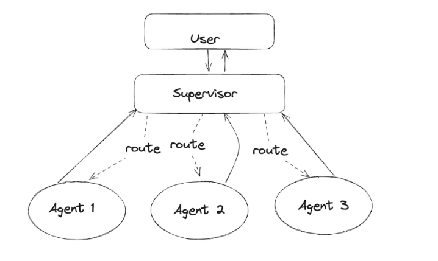

# 🧠 The Origination of Agentic AI Systems — A New Era of Modular, Composable, and Communicative Intelligence

Welcome to the **eigth edition** of *Beyond the Stack* — practical insights and real-world takeaways on Java, Spring Boot, Cloud Engineering, and AI for curious developers.

Thank you to our growing community of 500+ subscribers for your support and enthusiasm. If you missed previous editions, explore the archive here:

🔗 [Newsletter Link](https://www.linkedin.com/newsletters/beyond-the-stack-7318612377875161089/)

## 🚀 Why This Topic Now?

Last week, I attended **AWS Community Day 2025** in Bengaluru.

One session by Mr. Raja, highlighting the  **evolution of Agentic AI Systems** , truly stood out. Paired with insights from [Bhuvaneswari Subramani’s excellent article on Medium](https://medium.com/@bhuvaneswari.subramani/the-agentic-shift-mapping-the-landscape-of-ai-system-design-19e06f99298b), this edition is dedicated to breaking down the origins of  **Agentic AI** , the  **MCP architecture** , and **Agent-to-Agent Communication** — ***the pillars of the next AI evolution***.

## 🧠 From Prompts to Agents: The Shift Begins

We’ve come a long way from basic prompt engineering. In today’s AI interactions (e.g., ChatGPT, Gemini, Meta AI), we’re no longer just prompting — we’re **interfacing with agents** that act as middlemen between users and powerful LLMs.

These interactions formed the basis for  **prompt engineering** , where users enhance prompts with rich contextual data (documents, metadata, user history) to yield more accurate and useful responses.

As @karpathy aptly put it:

> “LLM OS: A new computing paradigm where the LLM is the CPU, and everything else — tools, memory, APIs — are peripherals.”
>
> — [@karpathy](https://twitter.com/karpathy/status/1640196305418080257)

This simple yet powerful analogy reframes how we think about large language models: not just as chatbots, but as central reasoning engines in a broader system.

The LLM becomes the core processor, while tools like vector stores, function calls, and agents act as I/O devices — enabling perception, memory, and action.

## Retrieval Augmented Generation (RAG)

While LLMs are powerful, they still struggle with:

* Generating hallucinated or outdated answers
* Confusing similar terminology
* Relying on non-authoritative data

**RAG** addresses these limitations by **retrieving authoritative knowledge** before sending the prompt to the LLM — effectively enhancing the context.

Frameworks like **LangChain** and **LangGraph** help implement RAG pipelines effectively.

## 🛠️Function Calling Agents

With RAG in place, these was some more advancement in the LLMs or AI Engines.

LLMs like Llama, Mistral or GPT models have been fine-tuned to detect when a function needs to be called and then output JSON containing arguments to call the function. The functions that are being called by function calling will act as Client Agent in the AI application and user can define more than one in a single request.

This advancement provides the base for an Agentic AI System.

**Example:**

User: “What’s the weather in Bengaluru?”
LLM: `call(weather_api, location="Bengaluru")`

## 🔄Model Context Protocol (MCP)

As AI tools expand, models are still limited by siloed data. Each integration is bespoke, brittle, and hard to scale.

**MCP (Model Context Protocol)** proposes a universal way for AI systems to access structured and unstructured data across systems. The result is a simpler, more reliable way to give AI systems access to the data they need.

The **Model Context Protocol** is an open standard that enables developers to **build secure, two-way connections between their data sources and AI-powered tools**. The architecture is straightforward: developers can either expose their data through MCP servers or build AI applications (MCP clients) that connect to these servers.

With MCP, AI apps can fetch, update, and work with context-rich data in a **modular and composable** manner.

## 🤖 Multi-Agent Systems (MAS): Collaboration at Scale

Just like microservices in software, **multi-agent systems (MAS)** allow specialized agents to work collaboratively or independently to solve complex problems.

MAS allows different agent architectures like:

* **Network:** All agents talk to each other.
* **Supervisor:** One master agent directs others.
* **Tool-based Supervisor:** Agents as tools.
* **Hierarchical:** Multi-level delegation.
* **Custom workflows:** Domain-specific routing logic.

Popular tools for MAS include **CrewAI** and **LangGraph** .

## 🧠 Key Takeaways

### ⚙️ Building Blocks of an Agentic System

1. **Autonomous Control Loop**

   Perception → Planning → Action → Reflection — a continuous improvement cycle.
2. **Contextual Memory**

   Agents retain task history and state — enabling continuity and personalization.
3. **Coordination Layer**

   Tools to orchestrate inter-agent workflows. — enabling agents to work in concert without micromanagement.
4. **Tool Integration**

   Agents that call APIs, browse the web, fetch documents, and more.

### 🌍 Real-World Applications & Emerging Potential

Agentic AI systems are already powering:

* **Customer Support Agents** : For dynamic, multi-step conversations
* **AI Research Agents** : That can read, summarize, and analyze papers
* **Code Collaboration Agents** : Planner, Coder, Debugger, and Tester bots working together

The future holds promise for:

* **AI Swarms** that simulate ecosystems.
* **Personalized AI teams** for every user.
* **Distributed Decision Systems** for enterprise workflows.

### 💡 Final Thought: From Models to Minds

The journey from prompting a single model to deploying a **self-coordinating team of AI agents** is not just a technological evolution — it’s a philosophical one.

We're no longer building tools. We're **engineering minds** that:

* Think in parts,
* Learn by doing,
* Talk to one another,
* And adapt over time.

As we embrace the  **Agentic Shift** , we move toward an era where AI is not just smart — it’s collaborative, contextual, and constructively autonomous.

> **Question for you** :
>
> *If every person had their own intelligent agent team, how would your day-to-day work and creativity change?*

## 📚 Further Reading & Resources

Expand your understanding of Agentic AI Systems, MCP, RAG, CRAG, and multi-agent orchestration with these insightful resources:

### 🧠 Foundational Concepts

* **The Agentic Shift: Mapping the Landscape of AI System Design**

  *[by Bhuvaneswari Subramani](https://medium.com/@bhuvaneswari.subramani/the-agentic-shift-mapping-the-landscape-of-ai-system-design-19e06f99298b)*
* **LLM OS — Where LLM is the CPU and Everything Else is a Peripheral**

  *[Tweet by Andrej Karpathy](https://twitter.com/karpathy/status/1640196305418080257)*

  [View Youtube Video](https://www.youtube.com/watch?v=ClB9EI9gPZE)

---

### 🔁 Retrieval Augmented Generation (RAG) & CRAG

* **What is Retrieval-Augmented Generation (RAG)?**

  *[An in-depth guide from Pinecone](https://www.pinecone.io/learn/retrieval-augmented-generation/)*
* **Self-Correcting RAG: An Introduction to CRAG**

  *[Blog post by Cohere](https://docs.cohere.com/docs/retrieval-augmented-generation-rag)*

---

### ⚙️ Function Calling & Tool Use

* **Function Calling with OpenAI’s GPT-4**

  *Official OpenAI documentation*

  [Function Calling Guide](https://platform.openai.com/docs/guides/function-calling)
* **LangChain Cookbook: Agentic Workflows, Tools, and Calls**

  *LangChain Docs*

  [Explore LangChain](https://python.langchain.com/docs/introduction/)

---

### 🌐 Multi-Agent Systems & Frameworks

* **CrewAI: Building Multi-Agent Systems Made Simple**

  [Visit CrewAI GitHub](https://github.com/joaomdmoura/crewAI)
* **LangGraph: Building Agentic Graphs**

  [LangGraph GitHub](https://github.com/langchain-ai/langgraph)
* **AutoGen: Enabling Multi-Agent Conversational Applications**

  [AutoGen Docs](https://microsoft.github.io/autogen/stable/)

---

### 📖 Extra Picks

* **Emerging Developer Patterns for the AI Era**

  *[A16Z Tech Blog](https://a16z.com/nine-emerging-developer-patterns-for-the-ai-era/)*
* **Agent Protocol — A Standard for Agent-to-Agent Communication**

  [Agent Protocol Website](https://agentprotocol.ai/)

## 🔮 Coming Soon - Next few editions Teaser

**“Scaling Like Netflix — Lessons from the World’s Most Resilient Streaming Platform”**

From building their own CDN (Open Connect) to deploying chaos monkeys in production, Netflix rewrote the rules of internet-scale architecture.

In the next edition, I’ll dive deep into Netflix’s scalability playbook and share takeaways you can apply in your own backend, cloud, or streaming projects.

**Bonus:**

Two sneak peeks:

👉 “**How a missed notification caused a sales loss**”

👉 “**How XML can be used to compile Java at runtime**”

*Hint: It’s not just tech—it’s culture too.*

Stay tuned — these stories blend architecture, strategy, and innovation.

## 🙏 Thank You!

Thanks again to  **500+ subscribers** . This newsletter thrives because of your curiosity, feedback, and support.

💬 Share it with your dev friends or curious tech minds.

🔁 Repost if it helped you.

📣 Follow the series to stay in sync with what’s *Beyond the Stack.*

🧠 Let’s keep scaling *Beyond the Stack* together.
