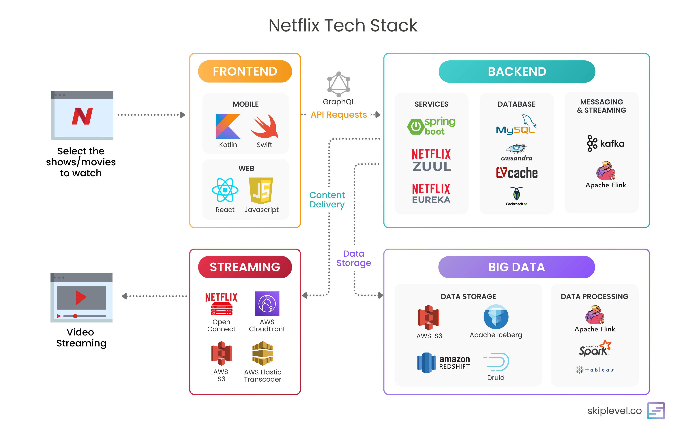
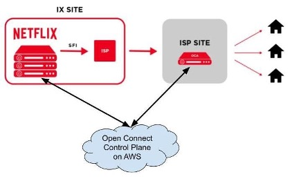
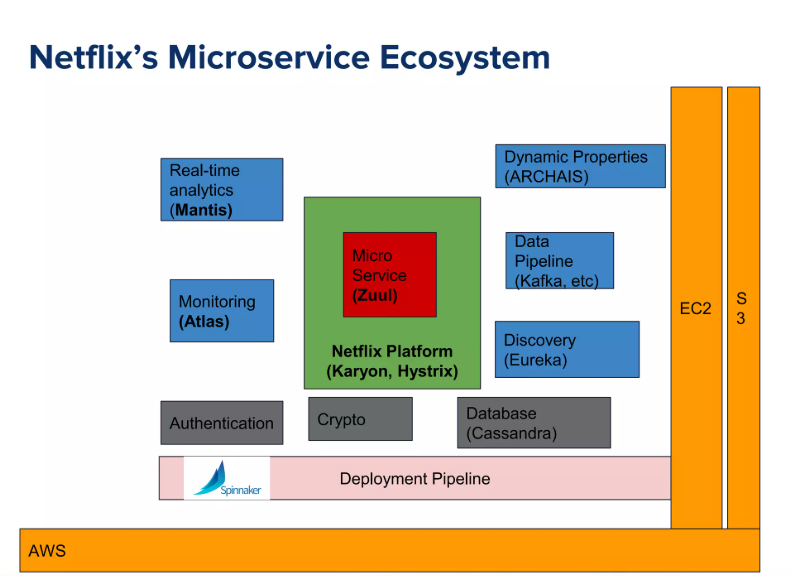
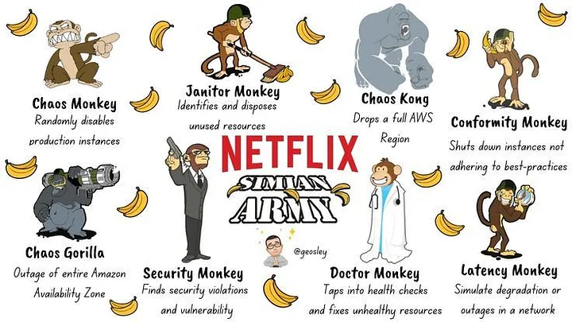
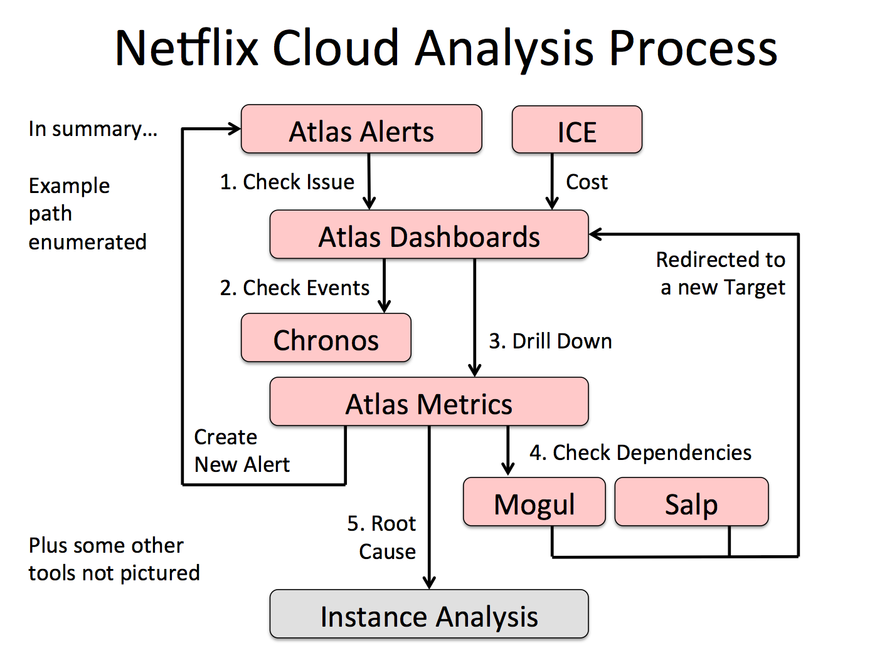
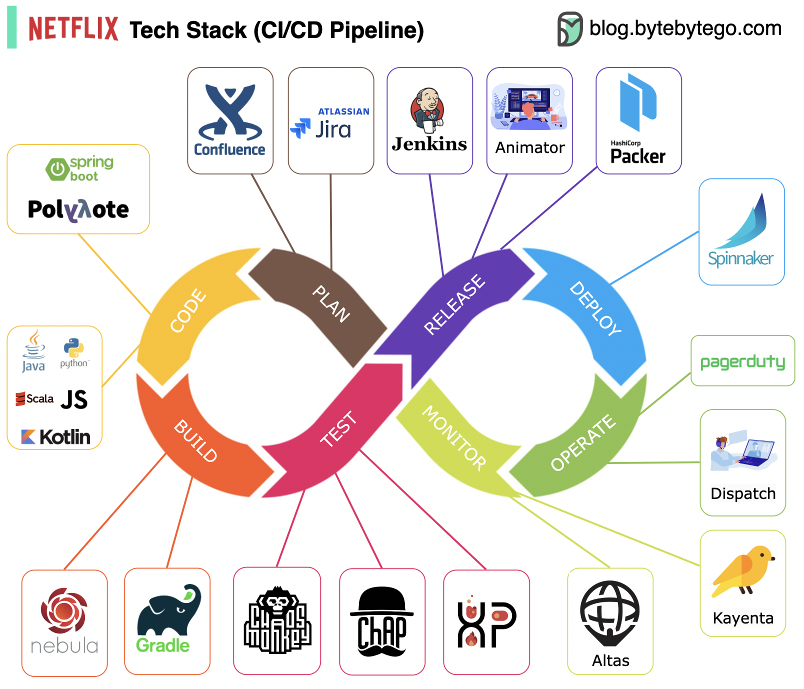
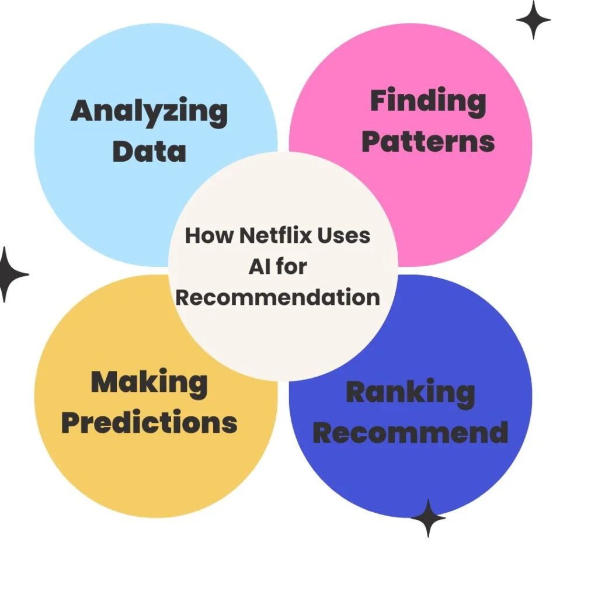

# 🎥 Scaling Like Netflix: Lessons from the World's Most Resilient Streaming Platform

Welcome to the **ninth edition** of *Beyond the Stack* — your newsletter for practical insights across Java, Spring Boot, Cloud Engineering, and AI.

In the  **previous edition**, we explored the foundations of  **Agentic AI Systems** , and how modular, autonomous intelligence is reshaping how developers build.

This time, we're zooming in on an engineering legend —  **Netflix** .

A true trailblazer in  **cloud-native architecture** ,  **AI-powered personalization** , and  **resilience-first design** , Netflix isn't just a streaming platform — it’s a system design masterclass.

Let’s break down how Netflix runs one of the **most reliable, intelligent, and scalable streaming platforms in the world.**

---

## 🌐 From DVDs to Global Cloud-Native Streaming

Netflix started in 1997 as a DVD-by-mail service — but with two major bottlenecks:

1. Shipping delays (1–4 days)
2. Customer bias toward latest releases

Their response?

* Adopted a **subscription-based model** (unlimited movies per month)
* Introduced **movie queues and recommendations**
* Started experimenting with **personalization**

By 2007, Netflix began its **online streaming** journey. In just a year, subscriber count grew by 18%, revenue by 21%, and net income by 36%.

Netflix uses [DRM encryption](https://www.vdocipher.com/blog/2020/12/video-drm/) to protect its content, [NetFlix DRM](https://www.vdocipher.com/blog/2022/05/netflix-drm) is one of the most secured anti-piracy solutions for premium videos.

In terms of [video codecs](https://www.vdocipher.com/blog/video-codecs), [H.264](https://www.vdocipher.com/blog/h.264-advanced-video-coding) high profile and VP9 are the current [Netflix codec](https://www.vdocipher.com/blog/tech-update-netflix-updates-codecs-use-efficient-encoding/), used by them to reach to a large number of users for a smooth streaming experience.

Initially for an year, Netflix partnered with Microsoft for their Video delivery via Microsoft Xbox 360.

But a database failure in 2008 sparked their cloud migration journey. In 2010, Netflix started moving to AWS — and by 2016, they completed it.

They became one of the first major platforms to:

✅ Fully embrace the public cloud

✅ Move to a microservices-based architecture

✅ Integrate chaos engineering into production

---

## 🏢 Netflix’s AWS-Powered Scalable Architecture

Netflix's tech stack is a case study in **resilience and elasticity**, all built on top of AWS infrastructure.

Netflix's architecture is divided into three domains:

1. **Client** – Apps on mobile, smart TVs, web
2. **Backend** – APIs, logic, billing, recommendations
3. **CDN** – Netflix Open Connect for global content delivery

🎯 Key insight: Netflix controls all three domains for **end-to-end quality control** and optimization.

## Scaling Key Components:

* **CDN (Open Connect)**
* **Netflix Edge Services**
* **APIs & Gateway Routing**
* **Backend Services & Caching**
* **Membership & Auth Systems**

## Scaling the Netflix CDN

For any video streaming application, the foremost requirement is to have low latency in delivering the video content, That's where the Content Delivery Network (CDN) plays major role.

Netflix invest heavily at their CDN and launched OpenConnect in the year 2012.

📦 **What makes Open Connect unique?**

* **Localized Caching** — Stores popular titles closer to viewers
* **Adaptive Bitrate Streaming** — Dynamic video quality adjustment
* **Modern Protocols** — QUIC, HTTP/2 for faster streaming
* **Open Connect Appliances (OCAs)** — Deployed directly in ISP datacenters for video storage.

> By controlling its CDN, Netflix cut costs, boosted quality, and scaled globally — all while reducing its reliance on third-party CDNs.

## Scaling the Data Storage

Netflix follows  **polyglot persistence** :

* **Apache Cassandra** – For large-scale metadata
* **MySQL** – For structured, transactional data

💡 All systems are  **distributed** , replicated across AWS regions to ensure availability.

> Your binge-watching doesn’t break—even if a whole data center goes offline.

## Scaling the Netflix Edge

Netflix built its edge using **microservices** hosted on  **EC2 Auto Scaling Groups** , supported by:

* **Zuul** – API Gateway (L7 routing)
* **Eureka** – Service registry for microservices discovery
* **Ribbon** – Load balancer

This enabled **massive horizontal scale** and dynamic routing under high load.

## Resiliency: Preparing for failure

Netflix doesn’t avoid failure — it embraces it with  **controlled chaos** :

* **Hystrix** – Circuit breakers
* **Fallbacks** – Graceful degradation
* **Chaos Monkey** – Random failures to test system resilience

> If your system can’t survive Chaos Monkey, it’s not production-ready.

## Monitoring & Observability

Netflix pioneered **observability at scale** with:

* **Atlas** – Custom metrics system
* **Zipkin** – Distributed tracing
* **Real-time dashboards and alerts** – For proactive troubleshooting

> Netflix processes over 150B time-series metrics every day!

---

## Netflix Streaming Tech Stack - CI/CD Pipeline

---

## 🤖 AI @ Netflix: Personalization at Planetary Scale

AI is not a buzzword at Netflix—it’s the brain behind the business.

### 🔹 **ML for Personalization**

Netflix’s recommendation engine uses:

* View history
* Device type
* Time of day
* Artwork optimization

> **Even thumbnails are A/B tested by AI**

### 🔹 **AI for Encoding Optimization**

* Per-title dynamic encoding using **AI to select best compression settings**
* Network-aware optimization
* Bandwidth-sensitive delivery

### 🔹 **Content Discovery and A/B Testing**

* Hundreds of A/B tests run simultaneously using AI for traffic partitioning and statistical analysis
* Feedback loops feed into new model training, improving experience in near real-time

### 🔹 **Agentic AI in Action**

* While not branded as such, Netflix's system reflects **Agentic principles**:
  * Goal-oriented components
  * Real-time adaptation
  * Intelligent collaboration between models and infrastructure

> *Netflix's recommendation engine is the epitome of agent-like behavior: gathering context, processing intent, and selecting optimal actions.*

---

## 🎓 Key Developer & Architect Takeaways

### 1. **Design for Failure — Proactively**

Netflix’s engineering culture embraces the idea that  *everything will fail, eventually* . They don’t just react to outages; they simulate them in production with tools like **Chaos Monkey** and **Chaos Kong** to ensure services degrade gracefully.

✅ What you can do:

* Implement **circuit breakers** (e.g., Resilience4j, Hystrix) to prevent cascading failures.
* Run **failure injection tests** to observe system behavior under duress.
* Design fallback paths for core services — never assume 100% availability.

---

### 2. **Push Personalization to the Edge**

Netflix doesn't just serve videos — it tailors *what* to show, *how* to show it, and *when* to show it, directly on the client device. By pushing logic closer to users, they reduce latency and improve engagement.

✅ What you can do:

* Use **smart clients** for UI decision-making, caching, and failovers.
* Shift personalization rules to  **configurable APIs or local state** .
* Preload relevant content/assets based on user behavior.

---

### 3. **Measure Everything — Observability is Mandatory**

Netflix monitors *every aspect* of user sessions — rebuffer rate, resolution drop, failovers, and even device capabilities. Their observability stack enables **self-healing systems** and  **informed decisions** .

✅ What you can do:

* Integrate **distributed tracing** (e.g., OpenTelemetry, Zipkin, Jaeger).
* Tag logs/metrics with **correlation IDs** across services.
* Set up alerts based on **business KPIs** (e.g., conversion drop, buffer rate) — not just CPU or memory.

---

### 4. **Apply AI to Boost UX — Not Just Backend Ops**

Netflix shows us that AI is not just for internal optimization — it’s a  **UX engine** . From thumbnails to recommendations to video encoding, AI directly impacts what users see and experience.

✅ What you can do:

* Use **ML for layout or content optimization** (e.g., which component to highlight first).
* Explore **A/B testing + feedback loops** to fine-tune UI/UX continuously.
* Apply **AI in observability** — like log summarization, anomaly detection, and alert deduplication.

---

### 5. **Separate Core Services from Delivery Edge**

Netflix’s architecture ensures backend services (billing, auth, etc.) and edge systems (streaming, personalization, caching) scale  **independently** , with **isolation** to prevent cross-system failures.

✅ What you can do:

* Use **reverse proxies + API gateways** to shield core services.
* **Segment your infrastructure** for flexibility (e.g., use different scaling policies for edge vs. data-heavy services).
* Implement **smart fallbacks at the edge** — like serving cached versions when APIs are slow.

---

## 📚 Further Reading & Resources

### 🏗️ **Netflix Architecture & Scaling**

* [Netflix Technology Blog](https://netflixtechblog.com) — Official engineering blog from Netflix
* [How Netflix Works: The (Hugely Simplified) Architecture of Netflix](https://medium.com/refraction-tech-everything/how-netflix-works-the-hugely-simplified-complex-stuff-that-happens-every-time-you-hit-play-3a40c9be254b) — Simplified view of what happens when you hit play
* [Netflix’s Global Cloud Architecture (InfoQ)]() — Architectural deep dive

---

### 🤖 **AI & Personalization at Netflix**

* [The Netflix Recommender System (ACM)]() — Academic overview of Netflix’s recommendation engine
* [Personalized Artwork at Netflix]() — How AI decides what thumbnail you see
* [Netflix Open Connect CDN]() — Their custom-built global content delivery infrastructure

---

### 🔎 **Observability & Monitoring**

* [How Netflix Monitors Every Service](https://netflixtechblog.com/lessons-from-building-observability-tools-at-netflix-7cfafed6ab17) — Lessons from building observability tools
* [Introducing Atlas: Netflix’s Monitoring Platform](https://netflixtechblog.com/introducing-atlas-netflixs-primary-telemetry-platform-bd31f4d8ed9a) — Netflix's telemetry platform at scale
* [Hystrix: Building Resilient Systems](https://github.com/Netflix/Hystrix/wiki) — Netflix’s open-source circuit breaker library (archived)

---

### ☠️ **Chaos Engineering**

* [The Simian Army]() — Netflix’s suite of failure-inducing tools
* [Learning from Failure at Netflix (InfoQ)](https://www.infoq.com/news/2017/11/resilience-services-netflix/) — Nora Jones on resilience and incident response

---

### ⚙️ **CI/CD & Deployment Practices**

* [Spinnaker: Continuous Delivery at Netflix](https://netflixtechblog.com/global-continuous-delivery-with-spinnaker-2a6896c23ba7) — Behind the scenes of their deployment pipeline
* [Scaling Deployments at Netflix (YouTube)](https://www.youtube.com/watch?v=BE99lIQSGew) — Conference talk on handling Netflix’s global deploys

---

## 📅 Coming Up Next:

**👉 “How a missed notification caused a sales loss"**

A real-world story from the trenches: how poor notification design led to a lost customer — and what you can do to prevent it.

✔️ Lessons in delivery, engagement, fallback, and trust.

👉 “**How XML can be used to compile Java at runtime**”

Unpacking a lesser-known, powerful technique: using XML descriptors and JavaCompiler API to compile and execute dynamic Java code on the fly.

✔️ Use cases in workflow engines, scriptable logic, and rule-based systems.

---

## 🙏 Thank You!

We’re now **500+ subscribers strong!**

Your messages and feedback from the Agentic AI edition were amazing. I hope this edition on Netflix’s scaling journey gives you actionable inspiration.

📍 Share with your team
📅 Follow the newsletter
🚀 Comment below: Which Netflix architecture principle will you apply?

Until next time—stay resilient, think globally, and keep building *Beyond the Stack*. 🚀
