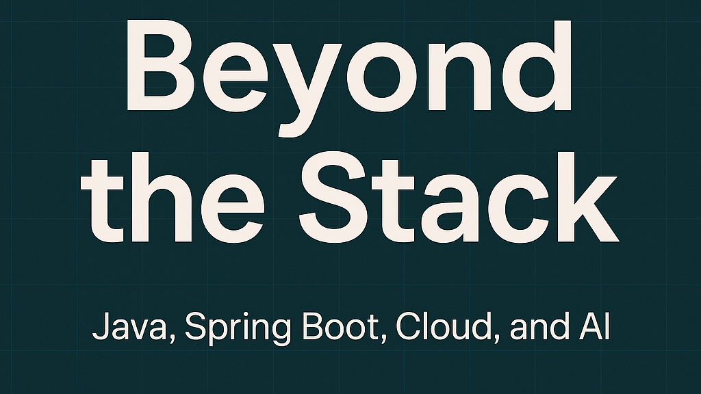

# BeyondTheStack---Newsletter

**Beyond The Stack** - My Newletter on LinkedIn.

*Practical insights and real-world takeaways* on **Java, Spring Boot, Cloud Engineering, and AI** for curious developers.

21 years ago, I was building desktop apps with Java AWT & Swing.

Today, I’m writing prompts, training AI agents, and designing cloud-native systems.

What changed? Everything.

But the passion for building smart, scalable, and meaningful tech solutions stayed the same.
🔥 I'm thrilled to launch my LinkedIn newsletter: Beyond the Stack

My Newsletter [link](https://www.linkedin.com/newsletters/beyond-the-stack-7318612377875161089/)

Get Subscribed and Get to know more about the evolution of tech stack and beyond.
